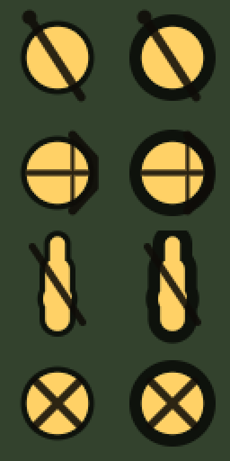
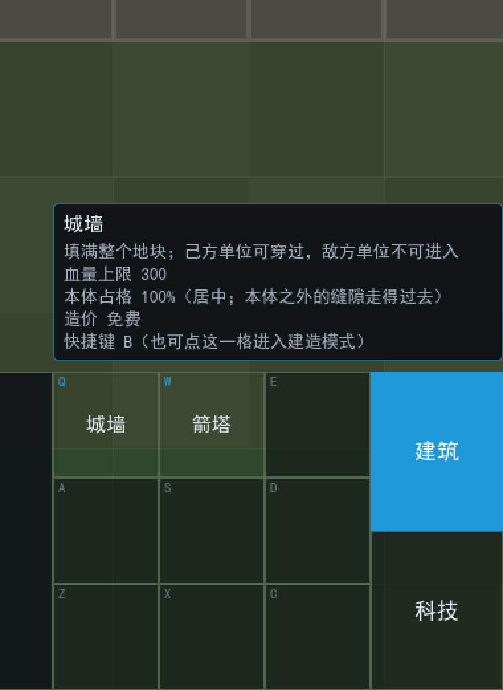
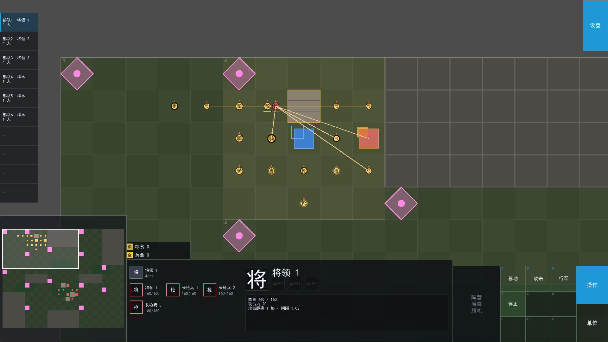

# Godot 版 DAEEM · 开发路线

> 本文是 **Godot 移植的总纲**：先定死已经拍板的取舍，再给出多轮路线与**本轮（第 0 轮）的详细里程碑**。
> 架构细节见 [`architecture.md`](architecture.md)，HTML → Godot 的逐模块对照见 [`porting.md`](porting.md)，
> 已实测踩到的坑见 [`pitfalls.md`](pitfalls.md)。
>
> 原型阶段的旧版（HTML）在 [`../../dev_html/`](../../dev_html/)：
> 玩法见它的 `README.md`，联机设计见它的 `docs/multiplayer.md`。**本项目的玩法规则以那份文档为准** ——
> 我们不重新发明规则，只换一套更合适的工程底座。

---

## 一、一页结论

| 项目 | 结论 |
|---|---|
| 引擎 | Godot **4.7.2 stable · mono(.NET) 版**（`C:\D\GodotEngine\gd4.7.2mono\Godot_v4.7.2-stable_mono_win64.exe`，**未加入 PATH**）。★ 后来加 C# 群体内核时从普通版换成了 mono 版，见 pitfalls 1.1b |
| 项目路径 | `dev_gd_a/daeem/`（`project.godot` 已就绪：Forward Plus / D3D12 / canvas_items 拉伸） |
| 渲染 | **纯 2D 俯视**，一格一格画。逻辑坐标用「格」，渲染时才乘格宽 |
| 本轮范围 | **只做单机**：地图 + 移动/A* + 战斗警戒 + 城墙血量 + 箭塔 + 区块占领 + 资源 + 建造 |
| 本轮不做 | 联机、正式敌人、地图编辑器、战争迷雾、存档、打包发布 |
| 逻辑/渲染 | **分离**：逻辑是纯 `RefCounted` 类，渲染是场景树节点。逻辑层不许 `import` 任何 `Node` |
| 地图与数值 | **JSON**（`res://data/*.json`）。手写、文本可 diff、以后地图编辑器直接吐同一份格式 |
| 最终形态 | **互联网联机**：两台机器经服务器对战，**舍弃反作弊与断线重连**，服务器部署要最简 |
| 为联机预留 | 现在就分出 **命令 / 快照** 边界（见第四节）：本轮的输入也走「命令」这条路 |
| 测试 | **纯逻辑断言测试**（不开窗口，命令行跑，靠退出码判定成败）。已验证可行，见第五节 |
| 本轮验收 | 在编辑器里**单机能完整玩一轮**。不要求导出 exe |

---

## 二、已拍板的取舍（以及为什么）

这一节是本文档最该先读的部分：**取舍本身就是计划**。每条都记「选了什么 / 放弃了什么 / 什么时候要回头改」。

### 2.1 不做联机，但预留边界

- **选**：本轮完全不写联机代码，连一条 `WebSocket` 都不连。
- **放弃**：本轮不能两人对战。想验证「两个玩家打起来」要继续用 HTML 版。
- **但**：逻辑层**只读命令、不读鼠标**。本轮命令由本地输入直接产生，下一轮改成「发到服务器再回来」时，
  逻辑层一行都不用改。
- **回头改的时机**：第 1 轮（加服务器）开始时，如果发现命令边界没分干净，先补边界再写网络代码。

> **为什么现在就要分**：HTML 版的 `docs/multiplayer.md` 第一节写得很直白 ——
> 让每个客户端各跑一局就是「两个人各玩各的」，状态永远不会收敛。
> 那次的教训是**权威必须只有一份**，而且**输入必须是数据（命令）而不是直接调用**，
> 否则「房主代为执行客机命令」这条路上必然出现绕过校验的入口。

### 2.2 纯 2D，而不是 3D 或 2.5D

- **选**：`Camera2D` + 俯视，地形/建筑/单位都是 2D。
- **放弃**：「王朝与帝国」最终想要的美术表现力与地形起伏。
- **为什么**：原型阶段要验证的是**玩法规则**（占点节奏、战斗手感、建造平衡），
  而 2D 迁移成本最低、坐标换算最简单（HTML 版已经在 DPR 坐标上踩过坑，不值得在 3D 里再踩一遍）。
- **回头改的时机**：玩法验证通过、开始做正式美术时。届时**逻辑层不动**，只换 `view/`。

### 2.3 地图与数值用 JSON

- **选**：`res://data/config.json`（全部可调数值）+ `res://data/test_map.json`（地形/出生点/区块）。
- **放弃**：Godot `Resource`（`.tres`）的编辑器友好性与类型检查；`TileMapLayer` 作为权威地图。
- **为什么**：JSON 与现在的 HTML 版**逐字可对照**（迁移时能机械比对），
  纯文本可 diff、可被未来地图编辑器直接生成、Godot 原生支持（`JSON.parse_string`）。
- **回头改的时机**：地图编辑器立项时。**让编辑器输出同一份 JSON**，而不是改格式 ——
  这样编辑器与运行时不需要共享任何代码。

### 2.4 逻辑与渲染分离

- **选**：逻辑层是纯 `RefCounted`（`logic/`），渲染层是 `Node2D`（`view/`）。
- **放弃**：Godot 惯用法「节点即逻辑」（单位直接是 `CharacterBody2D` 脚本）写起来更顺手这一点。
- **为什么**：分离后**不开窗口就能跑逻辑**（这是测试方案的前提），
  而且逻辑层将来能被服务器复用（如果第 2 轮决定用 Godot headless 当服务器）。
- **代价**：要多写一层「把逻辑状态同步到节点」的代码。详见 [`architecture.md`](architecture.md) 第三节。

### 2.5 测试：纯逻辑断言，不开窗口

- **选**：`tools/run-tests.*` 用 `--headless --script` 跑断言，靠退出码判定成败。
- **放弃**：GUT 等第三方测试框架（生态好，但和现在「零依赖」的风格相反）。
- **为什么**：HTML 版的 657 项断言里，**最有价值的全是纯逻辑断言** ——
  文档里记的坑（敌人站出生点发呆、能走直线却走曲线、基地被打爆却还立着）
  没有一个是靠肉眼玩出来的。
- **回头改的时机**：逻辑膨胀到几十个测试文件时再考虑框架。

### 2.6 服务器部署要最简（第 2 轮的目标，现在只需知道约束）

- **选**：继续做**哑中继**（不 import 任何游戏逻辑），部署形态优先考虑「单文件、一条命令起」。
- **放弃**：反作弊、断线重连、状态压缩、客户端预测。
- **为什么**：这套方案在 HTML 版已经被实测过（8 人满员、转发零丢失），
  而且「服务器没有规则」意味着不可能出现「服务端与客户端规则不一致」这类最难查的 bug。

---

## 三、多轮路线

### 第 0 轮（本轮）—— 单机最小可玩原型

**目标**：在 Godot 里把 HTML 版的单机玩法跑通，且玩法手感与规则**与 HTML 版一致**。

详细里程碑见第五节。

### 第 1 轮 —— 局域网/互联网联机

**目标**：两台机器经服务器对战，含准备界面、分阵营战斗、阵亡复活、拆家分胜负。

- 服务器：从 `dev_html/net/serve.py` 的**思路**重写（JSON over WebSocket + 房间 + 两条转发规则）。
  **不直接复制代码**，但协议可以保持兼容 —— 这样 HTML 版和 Godot 版能连同一个服务器，跨界调试很方便。
- 客户端：接上第 0 轮预留的命令/快照边界，房主权威 + 20Hz 快照。
- **验收**：本机两个进程能互相看到并打起来；再换成两台机器（局域网 IP）验证。

### 第 2 轮 —— 正式可玩性

- 正式敌人（出生点、波次、AI）、建造消耗与平衡、单位细化（技能/编队）、
  区块划分改由数据驱动（地图编辑器雏形）。
- 地图编辑器：输出与 `test_map.json` **同一格式**。

### 第 3 轮及以后 —— 部署与美术

- 导出预设（Windows exe）、服务器一键部署脚本（单文件 + 一条命令）。
- 换 2.5D/3D 美术（**只动 `view/`**）。

> **每轮开始的检查单**（借自 HTML 版的成熟做法）：
> 1. 上一轮的验收标准有没有回归？（跑测试 + 手玩一轮）
> 2. 新增的逻辑**离开场景树能不能跑**？（能跑 = 测试和服务器都能用）
> 3. 新增的输入有没有走「命令」这条路？（没有 = 联机时要返工）
> 4. 新增的数值有没有进 `config.json`？（散落在代码里 = 以后调平衡要翻代码）

---

## 四、为联机预留的「命令 / 快照」边界

这是本轮唯一一处**为将来多花一点力气**的地方，所以说清楚。

### 4.1 命令（Command）—— 输入变成数据

逻辑层**永远不读鼠标**。所有玩家意图都先变成一个可序列化的字典/对象：

```
命令 kind         载荷              说明
move              ids, x, y         移动到世界坐标（点到哪走到哪）
build             kind, tx, ty      在格子上建造
demolish          tx, ty            拆除建筑
select            ids               纯本地，不上网（不进命令流）
```

本轮：输入层（`view/input_controller.gd`）产出命令 → 直接交给 `logic/command_processor.gd` 执行。
第 1 轮：同一个函数改成「客机把命令发给服务器 → 服务器盖章转发给房主 → 房主执行」。

**关键约束**：命令里**只放意图，不放结果**。
HTML 版的快照**不发路径**（客机只说「哪些单位、走到哪个像素点」，路径由房主算），
这条要继承 —— 否则会出现路径欺骗，而且房主才知道最新的城墙位置。

### 4.2 快照（Snapshot）—— 世界变成数据

`logic/world.gd` 提供 `to_snapshot()` / `apply_snapshot()` 两个函数，本轮就写好、本轮就有测试，
但**本轮只用来做「存档/回放/调试」的雏形**（不做网络）。

第 1 轮时，快照直接就是网络包体。所以现在就要满足：

- 字段名用短名（`i/f/k/x/y/h`）——省带宽，且迫使自己只同步必要字段
- **只发结果，不发路径**（单位发位置与朝向，不发 `path`）
- 坐标保留 2 位小数
- 缺字段要容忍（HTML 版踩过：一条不含 `match` 字段的旧快照把结算画面打回进行中）

---

## 五、第 0 轮里程碑

> **状态：M0~M5 已全部完成**（本节的验收标准逐条对照过，逻辑部分由自动化断言覆盖，
> 观感与手感部分由手玩验收，清单见 [`README.md`](README.md)）。
> 交付物与约定（**数字按当前代码树重算** —— M5 之后又加了亲兵、手感修正、UI 改版、建筑本体、攻击命令与占领规则）：
> `logic/` **15 个 .gd**（4585 行）+ `view/` **17 个 .gd + main.tscn**（2764 行）
> + `tests/` **12 个套件 + 1 个脚手架**（4601 行 / **997 项断言**），
> 另有 `tools/` 4 个脚本（365 行）与 `project.godot`（31 行）。
> 只算源码（`logic/` + `view/` + `tests/` 的 .gd）是 **45 个 .gd、11944 行**。
> （口径：文本按换行切分、**不含**结尾空行；`.uid` 与 `.godot/` 不计。
> 引用这几个数字前请重跑一遍统计，别手抄 —— 数字对不上就是新的一种「文档说谎」。）
> 本轮**实测踩到的新坑**都记在 [`pitfalls.md`](pitfalls.md) 第五节。
>
> ⚠️ 上表的行数**没有把地图编辑器算进来**（`dev_gd_a/tools/map_editor/`，Python，
> 与 `daeem/` 平级、不进游戏包）；它带来的 Godot 侧改动是 `map_data.gd` 的 `exists`
> 与 `zone.gd` 的 `zones` 网格两条路，另有 `tests/test_map_editor.gd`（73 项断言）。

每个里程碑都是**能跑起来看的东西**，不是「写完某个类」。粒度按「一次坐下来能做完」设计。

### M0 · 工程骨架与测试脚手架（先做这个）

- 建目录结构（见 [`architecture.md`](architecture.md) 第二节）
- 写 `logic/rng.gd`？**不写** —— 原型阶段用不上确定性随机数（HTML 版也没用）
- 写测试脚手架：`tools/run-tests.ps1`（或 `.py`）+ `tests/test_smoke.gd`
- **先只测一件事**：`Vector2i` 网格工具 + `config.json` 能解析

**验收**：命令行一条命令跑完，输出「通过 N 项，失败 0 项」，退出码 0。
故意改坏一个断言，退出码必须变 1。

**已验证的命令**（见 [`pitfalls.md`](pitfalls.md) 第一节，别用错 exe）：

```powershell
C:\D\GodotEngine\gd4.7.2mono\Godot_v4.7.2-stable_mono_win64_console.exe `
  --headless --path C:\Users\yy197\Documents\GitHub\daeem\dev_gd_a\daeem `
  --script res://tests/test_smoke.gd
```

### M1 · 地图与相机

- `data/test_map.json`：地形（草/森林/山）+ 大本营 + 将领出生点（M1 时用的是老图 `map_01.json`，24×16；它已按用户要求删掉）
- `logic/map_data.gd`：载入 + 连通性修正（把走不到的孤岛变成山，**这条要保留**）
- `view/terrain_view.gd`：用 `TileMapLayer` 画地形
- `view/camera_rig.gd`：WASD 平移、滚轮以光标为锚点缩放、F 适应全图

**验收**：能看见地图，能拖着看，镜头缩放正常。地形颜色和 HTML 版一致。

### M2 · 单位与 A* 移动

- `logic/grid.gd`（或复用 `map_data`）：A*（**八方向**，见下面「与 HTML 版的五处有意偏离」）
- `logic/pathfinder.gd`：直线拉平（`segment_clear` + `smooth_path`）+ 拐角圆化（`round_corners`）
- `logic/unit.gd`：连续坐标移动、每帧距离预算、跨拐点带余量
- `view/unit_view.gd`：把逻辑单位画出来（先画圆）
- `logic/command_processor.gd`：`move` 命令 + 左键选中 + 右键下令

**验收**：按 1/2/3 选中将领，右键点哪走到哪；点到山/建筑自动改走最近可达格；
开阔地走直线、绕山时保留拐点。**这三条都要有测试断言。**

> ⚠️ 这个里程碑是**整个原型的风险集中点**。HTML 版在 A* 与拉直上踩的坑最多
> （地块坐标当像素用、`moveTo` 原地不动也返回 true、可达性判定没过滤）。
> **先把这三条写成断言再写实现**，会省下大量返工。

### M3 · 战斗、警戒、建筑

- `logic/building.gd`：大本营 / 城墙（血量）/ 箭塔；`blocks(faction)` 语义
- `logic/combat.gd`：警戒索敌 → 先靠近 → 再开火；追击上限；拆建筑
- `logic/faction.gd`：`is_player_faction` / `same_side` 两条**方向相反**的规则
- `view/building_view.gd`、攻击线、血条、交战标记
- 调试：刷测试敌人（`E` 键）

**验收**：刷一个敌人，它朝大本营推进；被城墙拦住时**贴到墙边一下一下拆**；
拆穿后走进来；将领静止时自动迎战。城墙掉血有血条、挨打闪红。

### M4 · 区块、资源、建造

- `logic/zone.gd`：均分 6×4 区块、每阵营独立进度（`progress_by`）、进度回退
- `logic/economy.gd`：资源按己方地块数增长
- 建造模式（`B`/`T` 放置、`Esc` 退出）、建造校验
- `view/hud.gd`：顶栏资源/地块/区块、侧栏选中面板、事件日志

**验收**：站进无主区块 4 秒占领；资源按地块增长；能建城墙与箭塔；箭塔打范围内的敌人。

### M5 · 收口：手感对齐与文档

- 逐项对照 HTML 版核对数值与手感（速度 2.4 格/秒、警戒 4 格、占领 4 秒……见 `config.json`）
- 补 `docs/README`（玩法与操作，可直接沿用 HTML 版的表述）
- 把本轮新增的坑写进 [`pitfalls.md`](pitfalls.md)

**验收**：**单机能完整玩一轮** —— 建防线、挡敌人、占区块、涨资源、拆掉敌人。
本文档顶部「本轮验收」达成。

---

## 六、风险与不做的事

| 风险 | 说明 | 应对 |
|---|---|---|
| **逻辑层偷偷依赖场景树** | 只要有一处 `import Node`，测试和服务器复用就全废 | 写进 M0 的检查单；`logic/` 里出现 `Node`/`SceneTree` 就是错 |
| **命令边界分不干净** | 输入直接改逻辑状态，第 1 轮必然返工 | 逻辑层不读鼠标；`command_processor` 是唯一入口 |
| **数值散落** | 调平衡要翻代码 | 所有可调数值进 `config.json`，代码里不写字面量 |
| **A*/拉直重踩旧坑** | 见 M2 | 先写断言再写实现 |
| **2D 美术后期不够用** | 观感提升要换 3D | 逻辑层不动，只换 `view/` —— 这也是分离的理由 |

**明确不做**（本轮，以及可预见的几轮内）：

- 反作弊、断线重连、状态压缩、客户端预测
- ~~战争迷雾（HTML 版也没有）~~ → ★ **已在第三十二节做完**（灰色遮罩 + 单位/建筑视野 + 山脉挡视线 +
  敌方建筑「见过一次就永久记住」）
- 存档 / 读档
- 地形高低差、寻路代价的复杂化（森林减速够了）
- 单位与地块的「一格一单位」占用（**多个单位仍然可以短暂叠在一格**：
  碰撞是「软分离」，只保证不长期重叠，不做格子占位 —— 那会连带改动寻路与建筑规则）
- 群体共享一条路径（SC2 那套「先把队伍摊在一条路线上」；现在仍是每个单位各算一条）
- 编队队形、转向避让（steering）、单位之间互相阻挡**寻路**

---

## 七、与 HTML 版的五处**有意偏离**（都是手玩反馈驱动的）

移植总原则是「不重新发明规则」，但第 0 轮做完、手玩验收之后，
有五处偏离是**刻意**的。每条都留了开关或断言，也都记在 [`pitfalls.md`](pitfalls.md) 第五节。

| 项 | HTML 版 | Godot 版 | 为什么 | 怎么退回去 |
|---|---|---|---|---|
| **连通性** | 四连通 | **八方向** | 四连通在斜向绕障时必然走成阶梯，拉直只能部分补救 | `config.json` 的 `path.diagonal = false`（方向集、连通性修正、octile 启发式会一起切回四连通，已有断言盯着） |
| **对角穿角** | 不存在这个概念 | **禁止**（与四连通语义一致） | 放开会让斜着错开的墙挡不住人，等于悄悄削弱所有防御工事 | `path.diagonal_corner_cut = true` |
| **拐角手感** | 到路点才转向（单帧转角 58°） | **拐角圆化**（细分成 8 段，实测 8.5°） | 「拐角生硬」是手玩报出来的问题 | `path.corner_round_enabled = false` |
| **单位重叠** | 多个单位可以随便叠在一格（文档明说「有意的」） | **软分离**：允许最多重叠 30%，且**有命令的单位推得动待命的** | 叠成一坨看不出谁在哪、也失去「队伍」的感觉；但硬碰撞会卡死，所以留了 30% 余量 | `unit.collision_enabled = false`；或把 `unit.overlap_allowance` 调到 1.0（变成硬碰撞） |
| **建筑阻挡** | 建筑**整格**阻挡 | 大本营 / 箭塔**本体小于一格**：本体挡敌方、**不挡己方**，缝能走 | 需求：本体居中缩小、挡敌方但留缝、不挡己方（见第十一节） | 把 `building.base.body_scale` / `building.tower.body_scale` 调回 `1.0`（= 退回整格阻挡，城墙本来就是 1.0） |

> **注意第四条不是「加了个新功能」那么简单**：它改了「单位与地块的关系」这条契约。
> 但**没有**动寻路 —— 单位仍然不进 A*（见 `logic/collision.gd` 顶部那段：
> 把队友当墙会导致两队兵互相判定无路可走而死锁）。这个取舍与 SC2 一致。

> ⚠️ 前三条**不是**玩法重设计，而是「引擎换了、手感要补回来」；第四条（单位重叠）改的是玩法契约本身。
> 但它们确实会影响平衡（尤其第一、二、四条），所以第 2 轮做建造消耗与正式敌人时，
> 要在这个前提下重新过一遍平衡。

---

## 八、第 0 轮之后新增的玩法：亲兵（队长 / 队伍）

需求原话：「为将领 1 设置一些附属单位，初始出生在将领 1 旁边，选中将领 1 时会同步选中这些单位，
右键移动会同步给他们下达指令。」

落点与取舍（三条都是先问过、再实现）：

| 项 | 决定 | 备注 |
|---|---|---|
| 兵种 | 新增 `kind = "subordinate"`（**亲兵**） | 数值独立，比将领弱、比测试敌人强：80 血 / 14 伤害 / 1.1s / 2.4 格每秒；体积 0.065 格（将领 0.1），一眼看出主次 |
| 数量 | 每个将领 3 个 | `config.json` 的 `unit.subordinate.count`，**改成 0 就等于关掉这个功能** |
| 选中 | 点队伍里**任何一个** = 选中整队 | 落地在 `input_controller.select_units()` |
| 跟随 | **不自动跟随**，只在下令时一起动 | 与需求一致，也让行为可预测 |

### 队伍没有「队伍对象」

「队伍」是**算出来的**，没有 `Squad` 类、没有队伍表：
队长 = 没有 `leader_id` 的单位；队员 = `leader_id` 指向队长的那些单位
（`world.group_of()` / `expand_to_groups()` / `retinue_of()`）。

为什么不建对象：那样「单位死了要通知队伍」「队长阵亡要换队长」全都要额外维护，
而这些都能推出来。代价是每次要遍历 `units` —— 几十个单位可以忽略。
队长阵亡后，剩下的亲兵**各算各的**（点它只选它自己），不会凭空造出一个队长。

### 为什么「同步下令」不需要新代码

队伍展开放在**选中那一步**，不是右键那一步：
右键本来就是「给当前选中的全部单位下令」，所以小队一起走是选中集合的自然结果。
反过来做（右键时再展开）会出现「界面只高亮队长、命令却发给一堆没显示的兵」，
玩家看不出自己在给谁下令 —— 而且第 1 轮联机时命令里会混进未经确认的 id。

### 对第 1 轮联机的影响（已预留）

快照新增一个短字段 `ld`（队长 id，空 = 自己就是队长）。
**必须在第 0 轮就带上**，否则客机侧点将领只能选中它自己 —— 单机与联机的选中行为会不一致。

### 顺带发现的一处隐患（已修）

`config.unit_radius_of()` 当时**忽略参数**，而 `unit.hp_max`、战斗数值用的是
「是将领吗？不是就当敌人」这种二元判断 —— 加了第三种兵种之后，
亲兵会**静默拿到测试敌人的数值**（60 血 / 10 伤害），不报错、只是数值不对。
现在统一走 `cfg.unit_hp_of(kind)` / `cfg.unit_speed_of(kind)` / `cfg.unit_combat_of(kind)`，
并且断言里专门有一条「亲兵没有退化成敌人的数值」。
**教训**：凡是 `if A else B` 形式的数值分配，在加第三种类别的那一天就是 bug。

---

## 九、第 0 轮之后新增：UI 改版（照参考图重做，废弃原 HUD）

需求原话：「现在为这个游戏添加 ui，原 ui 需要废弃掉，ui 参考图我已给出……」
参考图是 **1920×1080 的像素稿**（正好等于 `project.godot` 的 viewport 尺寸），所以尺寸可以逐像素抄。
布局常量全部集中在 `view/ui_layout.gd`，**其它文件不写坐标字面量**。

### 9.1 参考图实测（`view/ui_layout.gd` 里就是这些数字）

| 元件 | 位置 / 尺寸 | 本轮做到哪一步 |
|---|---|---|
| 设置 | (1840, 0)，80×160 | 画出来，**点不动**（按需求） |
| 部队 1~10 | x 0..119，y 40..639，10 行 × 60 | 动态生成，可点 |
| 地图（占位） | (0, 680)，400×400 | **只占位**（灰底 + 「地图」二字） |
| 详细信息 | (400, 840)，**1030×240**（参考图直接标了） | 第四轮改版后 = **左右两栏**（左 = 1 + 3×3 共 10 格：展开那支的将领格 + 其余将领 / 这支部队的单位；右 = 选中单位头像 / 名称 / buff / **基础数值两栏**）—— 见[第十八节](#十八详细信息左栏再改版1--33--10-个格子这一轮)，**第五轮按「太拥挤」重排过右栏与左栏行距**，见[第二十节](#二十详细信息再排版治「太拥挤」这一轮) |
| 阵营 / 盾徽 / 旗帜 | (1430, 840)，150×240 | **本轮不做**，只留位置 |
| 命令卡 3×3 | (1580, 840)，每格 80，键位 QWE / ASD / ZXC | 内容随页签实时切换 |
| 单位 / 建筑 / 科技 | (1820, 840)，100×240，每颗 80 高 | 单位、建筑切页；**科技点不动** |

### 9.2 拍板（每条都是先问过再做）

| 项 | 决定 | 备注 |
|---|---|---|
| 左侧部队列表的数据来源 | **现有队伍**（将领 + 亲兵，`world.group_of()` 算出来的） | 不足 10 支队伍的槽显示「…」并置灰、不可点 |
| 每行显示什么 | 「编号 + 队伍名 + 人数」，当前选中的那队高亮 | |
| 点部队行 | **只选中，镜头不动** | 与按 1/2/3 的差别就在「不动镜头」 |
| 小地图 | ~~本轮**只占位**~~ → **已在后续轮次做完**：真小地图（地形 / 建筑 / 单位 + 视野框 + 点击跳转 + 按住拖动），见[第十九节](#十九小地图动起来视野框--点击跳转--按住拖动) | 两次需求：「显示整个地图的内容和玩家当前的视野框」「左键点击地图中的某处时把视角移动过去」「点击小地图后可长按拖动小地图以移动视角」 |
| 命令卡的内容 | **随右侧页签实时切换**，而页签是**按选中对象动态显示**的（第二十二节）：操作页 = 移动(Q)/攻击(W)/行军(E)/停止(A)，单位页 = 占位单位(Q)，建筑页 = 城墙(Q)/箭塔(W)，招募页 = 三个占位将领，科技页 = **九格由 `view/tech_grid.gd` 画**（命令卡本身是空的；见第二十三节） | 单位 / 招募两张表都是数据驱动的（`config.recruit.list`、`config.recruit.zone.list`），建筑页来自 `building.DEFS` 的 `buildable`，科技页来自 `config.tech.list` |
| 九个字母键 | **是真快捷键**：有内容的格优先于其它绑定，空格子让路 | 见 9.3 |
| 单位页 | 显示可招募的单位；招募时在**当前选中的将领**身旁生成 | 没选中将领 → 只给提示、**不发命令** |
| 操作页 | 对**当前选中的部队**下达指令（移动 / 攻击 / 行军 / 停止）：点一格进**命令模式**，再左键点地图 / 点目标下达（第二十二节 22.2） | 命令照旧只走 `command_issued` → `command_processor`，站位与结果在权威侧算 |
| 招募页（区划中心） | 显示三个占位将领；点了排进**这个区划**的招募队列，读条 10 秒后在**区划中心旁**的空地生成（第二十二节 22.3） | 只能在**自己的**区划里招 |
| 招募出来的是什么 | 复用亲兵那一套数值（`config.recruit.list` 里现在只有一项占位） | 走 `recruit` **命令**，站位在权威侧算 |
| 资源与日志 | ~~全部塞进详细信息面板~~（**第三轮改版已按手玩要求删掉**：资源行与事件日志都不在界面上，见第十七节） | 曾计划：右栏 = 资源行 + 8 行日志；左栏 = 选中详情 |
| 配色 | 参考图是线框稿 → **布局照抄，配色沿用原来的深色半透明**，只借它那个蓝 `#1E98D7` 做高亮 | 底栏占屏幕下方 400px，做成不透明会把地图遮死 |

### 9.3 相机：W / A / S / D 被命令卡拿走了

命令卡上的字母是真快捷键，而 W/A/S/D 原本是镜头平移 —— 两者会打架
（建筑页按 W 到底是「建箭塔」还是「向上平移」？）。拍板结果：
**W/A/S/D 从镜头平移里拿掉**，镜头改为**方向键 + 鼠标推到屏幕边缘滚屏**。

### 9.4 顺手修掉的两个坑（都不是新功能，是原来一直坏着的）

1. **边缘滚屏其实一直是死的**：`camera_rig.set_mouse()` 写好了却**从来没有被调用过**，
   `_mouse_inside` 永远是 `false`。现在在 `main.gd` 每帧接上。
   ⚠️ 判定必须用「**可点的控件**」而不是「所有 HUD 面板」：底栏把屏幕下沿整个盖住了，
   若详细信息面板也让路，鼠标就**永远滚不到地图下方**（见 `ui_layout.interactive_rects()`）。
2. **命令产生的事件会被丢掉**：`world.tick()` 原本在**开头** `_events = []`，
   而命令是输入事件触发的、跑在两次 tick 之间 —— 于是建造 / 拆除 / 招募 / 刷敌人这些事件
   在送到 HUD 之前就被清空了。症状是「建好了却没有日志」，而逻辑全对，极难查。
   现在改成**末尾收口**（`tick()` 最后一段），并把「命令事件必须能到日志」写进回归断言。

### 9.5 文件落点

`view/` 新增 6 个文件：

| 文件 | 职责 |
|---|---|
| `ui_layout.gd` | ★ 全部几何常量（参考图像素稿）+ 贴边规则 + 「哪些地方要拦鼠标」 |
| `ui_style.gd` | 配色与 StyleBox 工厂（面板 / 部队行 / 命令格 / 页签四态） |
| `squad_panel.gd` | 左侧部队 1~10 |
| `unit_roster.gd` / `troop_grid.gd` | ★ 详细信息左栏的上半（展开 / 唯一选中那支部队的**将领格**，就一格）/ 下半（**3×3 = 9 格**：多选画其余将领、单选画这支部队的单位）—— **第四轮再改版**，见第十八节 |
| `detail_panel.gd` | 底栏详细信息（**左右两栏** —— 左 = `unit_roster` + `troop_grid`，右 = 选中单位 + 招募五格 + 提示行；见第十七 / 十八节） |
| `command_card.gd` | 3×3 命令卡（**不认识「建造/招募/指令」**，只把条目抛出去） |
| `page_tabs.gd` | 右下那一列**动态页签**（`set_pages()`：选中部队 = 操作/单位，区划中心 = 招募，大本营 = 科技，普通建筑 = 一颗空页签，什么都没选中 = **建筑 + 科技**；见第二十二 / 二十三节） |

`hud.gd` 重写成「装配 + 每帧刷新 + 事件翻译 + 命令卡按键 + 给边缘滚屏让路」。
逻辑层只加了一条 `recruit` 命令（`command_processor.apply_recruit` → `world.recruit_unit`），
命令里**只有兵种与队长 id、没有坐标** —— 站位由权威侧算，第 1 轮联机时客机挑格子就是作弊。

---

## 十、UI 改版第二刀：范围圈 / 详细信息栏 / 事件日志（都是「删」）

需求原话：「选中单位时不需要显示其攻击和警戒范围圈」；
「详细信息栏中不需要『己方地块 区块 建筑』、『大本营位于xxx』以及其他的提示信息」。

| 删掉的东西 | 落在哪 |
|---|---|
| 选中单位的**攻击距离环 + 警戒半径环** | `view/overlay.gd` 的 `_draw_selected_units()` 整个删除；`config.colors.range` / `range_edge` 一起删（不留死数据） |
| 右栏的「己方地块 / 区块 / 建造模式 / 暂停」 | `hud._status_text()` 当时只返回「阵营 + 粮食 + 黄金」；⚠️ **第三轮改版把这一整行也删了**（连 `_status_text()` 一起），见第十七节 |
| 左栏的操作提示（左键选单位 / 右键移动 / 快捷键 / Shift 多选…） | `hud._selection_text()`；没选中时只显示「未选中」。⚠️ 第三轮改版把 `_selection_text()` 也删了，文案改由 `hud._unit_text()` / `_building_text()` / `_zone_text()` 分别产出 |
| 开场三行提示（大本营位置、按键说明、页签说明） | `view/main.gd` 的 `_ready()` |
| **整个事件日志** | `view/detail_panel.gd` 的日志栏、`hud.gd` 的 `consume_events` / `push_line` / `toast` / `_format_event` 全部删除 |

两条需要注意的连带影响（**不是 bug，是取舍**）：

1. **逻辑层的事件一条都没少**：`world.tick()` 仍然把事件收集成数组返回，`main.gd` 仍然读走它
   （读走 = 清空缓冲，且那条「命令事件不能在 tick 开头被丢」的回归断言还盯着它，
   见 `tests/test_ui.gd` 的 `_test_command_events_reach_consumer`）。只是**当前没有界面画它**。
   想恢复日志：把日志栏加回来 + 在 hud 里写回翻译函数即可。
2. **toast 暂时没有显示窗口**：`input_controller.toast` 信号留着（它是输入层的反馈通道），
   但 `main.gd` 不再连它 —— 所以「没选中将领时招募」这类操作**没有可见反馈**。
   要补的话最省事的是加一个浮动提示，而不是把日志栏整个搬回来。

---

## 十一、建筑本体：居中缩小、挡敌不挡己、能从缝里穿过

需求原话：「将大本营和箭塔在格子内居中，且大本营和箭塔略小于一个格子大小，
其本体会阻挡敌方单位，但敌方单位可以从建筑空隙中穿过，其本体不会阻挡己方单位」

### 11.1 两套「挡不挡」必须分开（这是这次改动的核心）

| 层 | 谁问它 | 大本营 / 箭塔 | 城墙 |
|---|---|---|---|
| **格级** `building.blocks(faction)` | 只给 A*（`pathfinder.passable`） | **对谁都不封**（缝要能走） | 敌方封、己方放行（与从前一字不差） |
| **本体级** `building.body_blocks(faction)` | 只给移动碰撞 | **挡敌方、不挡己方** | 同格级（本体 = 整格） |

本体尺寸只有一个来源：`config.json` 的 `building.<type>.body_scale`（**大本营 / 箭塔 0.6**、
城墙 1.0），永远居中。**渲染也读同一个数**（`palette.building_rect()` 不再自己写内缩量）——
否则迟早出现「看着能过、实际被挡」这种最难查的错位。

### 11.2 移动与寻路各补了什么

- **A* 代价**：建筑格现在可通行，但不该被当捷径 → `path.building_penalty`（默认 12，
  口径 =「多绕几格才划算」）；只对「本体真的挡这个阵营」的建筑加，己方穿自己家建筑不罚。
- **斜向的缝**：`diagonal_step_allowed()` 原本一律禁止斜穿两个障碍格。现在多一个例外：
  两个正交邻格都是**建筑**、且两块本体在四格交汇的角上留出的净宽 ≥ 单位直径 → 放行。
  城墙本体就是整格（净宽 0），所以**城墙那条守卫一字未变**（`tests/test_diagonal.gd` 仍在盯）。
- **本体硬碰撞**：`collision.resolve_buildings()`（`world.tick()` 第 8.6 步）把压在本体里的
  单位沿「穿透最浅的轴」推出去；`_can_stand()` / `unit._slot_ok()` 也跟着认本体，
  免得推挤或落点把敌人塞进本体里。
- **拉直**：`segment_clear()` 除了格级可通行，还要判「这条线有没有切进挡自己的本体」
  （`building.blocks_segment()`，slab 法线段 vs 矩形），否则平滑后的直线会从本体正中穿过去。
- **拆建筑的攻击距离**：从写死的 `+ 0.5 格` 改成 `+ b.body_half(cfg)` ——
  城墙仍是 0.5（行为不变），大本营 / 箭塔是 0.3。
- **点击落点**：点自家大本营 / 箭塔不再走「贴边落点」（那一格现在是可通行的），
  直接走到点击处；点**对家**的城墙仍然贴边 —— 这条机制改用
  `test_path_feel.gd` 的 `_test_hug_enemy_wall` 盯着。

### 11.3 验收（`tests/test_building_body.gd`，35 项）

- 本体边长 = `body_scale`、居中、不越出自己的格子；**渲染矩形 = 碰撞矩形**
- 己方：整格放行 + 本体不挡 → 将领能走到大本营本体正中并站定
- 敌方：格子放行、但本体挡 → 塞进本体里会被推出去；一路推进到据点后停稳（120 帧漂移 < 0.05 格）
- 缝：两个**对角相邻的箭塔**之间能斜穿并真的走过去；两段对角相邻的城墙之间仍然不能
- 城墙回归：整格挡敌方、放行己方；`body_scale = 1.0`
- 路上横着一座对家箭塔时，A* 的路径点一个都不落进本体（绕开了，不是顶上去）

### 11.4 地图上预置的对家据点（手玩测试用）

`test_map.json` 带可选字段 **`buildings`**（每项 `{type, x, y, owner}`，`owner` 缺省 `enemy`）：
`logic/map_data.gd` 解析成 `prefab_buildings`，`world.reset()` 在各阵营出生点建好之后把它们放上去
（`silent = true`，不刷事件）。**坐标全部在 JSON 里，代码不写死任何一个点**。

> ⚠️ 这一节原来写的是老图 `data/map_01.json` 的东侧据点。用户要求「只留 `test_map.json`」
> 之后老图删了，这组摆设按同样的意图搬到了新图的**东南角**；后来设计师又把图扩到 27×22，
> 玩家大本营挪到了 **(7,2)**。下面的坐标是当前 `test_map.json` 里的实际值。

当前这一组全在地图**东南角**（玩家大本营 (7,2) 的斜对角）：

```
   x=11 12 13 14 15 16
12  .  .  w  t  .  .
13  .  p  g  .  g  g
14  .  p  .  B  w  t
15  .  .  .  w  g  .
```

- 大本营 (14,14)；箭塔 (14,12) / (16,14)；城墙 (13,12) / (15,14) / (14,15)
- 离玩家大本营 **≥ 6 格**；`tests/test_building_body.gd` 里有一条断言钉着这个下限，
  免得以后有人把它们挪到玩家脸上
- 它们**不会抢区块**：`zone.refresh_building_ownership()` 只认 `is_player_faction` 的阵营，
  所以那块地玩家照样能站 4 秒占下来；也不会触发胜负判定（`pvp_enabled = false` 时直接返回）
- 城墙与箭塔之间是**故意留窄**的：本体 0.6 格的箭塔之间能挤过、整格的城墙挡住 ——
  正好用来肉眼验证第十一节的两种阻挡
- ⚠️ **玩家目前不能主动拆这些建筑**：索敌只锁定敌方**单位**，建筑目标由敌人 AI 指定
  （拆挡路的城墙）。想测「拆家」需要再加一条攻击命令，本轮没做
- 不想要这组摆设：把 `test_map.json` 的 `buildings` 改成 `[]` 即可（`tests` 里那条断言会跟着失败，
  改回断言或一起删）

**同一张地图还预置了 6 个对家单位**（`test_map.json` 的 `units` 字段）：

| 单位 | 位置 | `hold` | 行为 |
|---|---|---|---|
| 守军 ×4 | (15,13) / (13,13) / (15,15) / (16,13) | `true` | 原地驻守，有人靠近就迎战 |
| 巡逻兵 ×2 | (12,14) / (12,13) | `false` | 照旧朝玩家据点行军（留一个样本验「推进」这条老行为还在） |

`hold = true` 是这次新加的一个开关（`logic/unit.gd` 的 `hold_position`）：
`enemy_ai` 跳过它们，**迎战不受影响**（警戒与战斗在 combat.gd）。
用处很直接：地图上的测试守军不会开局就跑去打玩家，可以当稳定靶子用。
`tests/test_building_body.gd` 同样钉了「守军离玩家大本营 ≥ 6 格」。

> ⚠️ **这两个巡逻兵会穿过玩家从出生点往西南走的那条路**（实测：`test_retinue` 的
> 「整队一起走」用例里有一个亲兵被它们拽去追击，然后追丢就地停住）。
> 那是**正确**的战斗行为，不是移动坏了 —— 验纯移动的用例要先关战斗 + 清掉这批敌人。

---

## 十二、攻击命令：右键点敌人 / 点建筑 / 双击行军攻击

需求原话：
> 「左键/数字键选中己方单位后，右键单击敌人/建筑 → 优先攻击该敌人/建筑，
> 右键双击 → 行军攻击至该地点（逻辑等同于星际争霸2的按 a 攻击）」
> 「给己方单位增加索敌建筑的机制」

### 12.1 三条命令（外加原来的普通移动）

| 手势 | 命令 | 行为 |
|---|---|---|
| 右键单击**敌人** | `attack`（`target_id`） | 优先攻击它：一路追上去打，**不受追击上限约束**；它死了命令自动完成 |
| 右键单击**敌方建筑** | `attack`（`tx, ty`） | 先靠近、再一下一下拆（复用敌人拆墙那条路） |
| 右键**双击**任意位置 | `attack_move`（`x, y`） | 行军攻击：走到该点，**路上遇敌就停下来打，打完了继续走**（SC2 的 A 键） |
| 右键单击空地 | `move` | 普通移动：点到哪走到哪，**遇敌不停** —— 这就是它和行军攻击的区别 |

命令里只带 **id 与坐标**（可序列化，第 1 轮能直接过网络），并且带 `faction` 防冒充。
双击判定直接用 Godot 的 `InputEventMouseButton.double_click`，**不自己写计时器**。

界面上的反馈：绿圈 = 移动点，红圈加叉 = 行军攻击点；左栏会写「★ 指定攻击：X」
「★ 指定拆除：X」「★ 行军攻击中」。

### 12.2 索敌建筑

- **玩家阵营**的单位：警戒半径内**先找敌方单位**；一个单位都没有时，再看敌方建筑 ——
  走到对家箭塔/城墙边上就会自己开打。
- **NPC 敌人不做这一步**：它们拆建筑仍由 `enemy_ai` 指定（拆挡路的城墙）。
  否则「路过一堵墙就停下来拆」会把敌人推进的节奏整个改掉。
  这条差异是刻意的，两个方向都有断言（`test_attack_orders.gd` 第 6 组）。

### 12.3 实现要点（四条最容易漏的）

1. **命令与「这一帧在打谁」分开存**：`ordered_target` / `ordered_building` 是玩家点名的，
   用来 (a) 覆盖自动警戒、(b) **跳过 leash 判定**（那是「它自己追出去多远」的限制，
   玩家点名的目标就该一路追）；`target` / `target_building` 才是当前交战对象。
2. **「目标没了」要分清清到哪一层**：用 `drop_engagement()`（只清交战）而不是
   `clear_target()`（连命令一起清）—— 否则行军攻击打完第一个敌人就把自己的命令取消了，
   「打完继续走」直接失效。只有「玩家点名的那个目标死了」才连命令一起清。
3. **行军攻击在移动中也要索敌**（普通警戒只在静止时跑）—— 第一版漏了这条，
   单位会一路无视路上的敌人走到终点，`tests/test_attack_orders.gd` 当场抓住。
4. **点名的建筑还活着时，这一帧不许做任何自动索敌**（手玩报的 bug，已修）。
   警戒的触发条件是「静止就索敌」，而单位走到建筑旁边会 `halt()`（`moving` 变 false）——
   于是它**一到地方**就把旁边的敌人认成新目标，玩家点的那个建筑反而没人管。
   表现就是「右键点箭塔 → 走到附近 → 随机打周围的敌人」。
   修法是在 `combat.update_unit` 里单开一支：`ordered_building` 还活着就直接
   `update_building_combat()` 并**跳过整个警戒分支**（与 SC2 一致：明确点名的目标
   不会被路过的敌人顶掉，直到它被摧毁）。
   回归断言见 `tests/test_attack_orders.gd` 的 `_test_ordered_building_not_distracted`：
   旁边那个敌人**会**打我们，而我们全程一次都不许还手（去掉修复后这条会红：
   实测 528 帧里转火 121 次）。

### 12.4 顺带修掉的一个渲染 bug：本体贴到了格子左上角

需求里那句「大本营和箭塔应当在格子内居中放置」这次才真正修好。
根因不在逻辑（`building.body_rect()` 一直是居中的），而在渲染：

```gdscript
# building_view.gd（错的那版）
var r := PaletteRes.building_rect(building, cfg)   # 绝对矩形，里面含居中偏移
var local := Rect2(Vector2.ZERO, r.size)           # ← 偏移被丢掉了
```

节点的原点已经是「自己那一格的左上角」，所以只取 `size`、从 `(0,0)` 开始画，
本体就贴到了格子左上角；城墙是 1.0 格，看不出问题，大本营 / 箭塔一眼就能看出来。
现在多了一个 `PaletteRes.building_local_rect()`（把绝对矩形平移到节点局部坐标），
并且**断言也是按局部矩形写的** —— 上一轮的测试只验了绝对矩形，所以没抓住这个 bug
（教训记在 [`pitfalls.md`](pitfalls.md) 5.19）。

---
## 十三、区块占领：**完整规则与状态机**

这一节是占领逻辑的**权威口径**（手玩口述、逐条实现、逐条断言）。
前两版实现都错了 —— 错在两点：先是「显示只在无主时画」，再是「双方各涨各的、谁先满谁拿」。
真正的规则是「**同一时刻只有一方能读条**」，双方同场时谁都不涨。

### 13.1 规则（手玩原话的整理版）

| 情形 | 读条 |
|---|---|
| 中立区块里**只有 A 方单位** | 读 A 的条；满（4 秒）→ 区块归 A |
| 中立区块里**同时有 A、B 方单位** | **无法读条**；若正在读某一方 → **读条停止**（那条冻住） |
| A 正在读，B 进场 | 读条停止（冻住，不涨不降） |
| A 正在读，B 进场并把 A 全部击杀 | A 的条**缓慢下降**（0.125/秒），降到 0 之后**才**轮到读 B 的条 |
| A 正在读，A 的单位全部移出区块 | A 的条缓慢下降至 0 |
| **A 方地块**里只有 B 方单位 | 读 B 的条；满 → 区块改归 B |
| **A 方地块**里同时有 A、B 方单位 | 无法读条；正在读的条停止 |
| A 方地块，B 在读，A 的单位杀回来 | B 的条停止（冻住）；A 是主人，自己什么都不读 |

从这些规则推出三条**实现上的硬约束**（也是断言盯的东西）：

1. **同一时刻最多只有一条进度条** —— 「A 归零之后才轮到 B」这条严格阻塞保证了它
2. 双方同场时那条**冻住**（不涨、不降、不清零），不是回退、也不是归零
3. **只有「有进度但人不在场」（移出 / 被打光）才回落**，速率 `zone.decay_per_sec = 0.125/秒`（满条 8 秒退完）

### 13.2 实测时间线（`tests/test_zone_capture.gd` 里就是这么跑的）

```
阶段             t  owner    player  enemy   条(谁/多满/状态)
玩家独自读条      1          0.250   0.000   player/0.25/reading   ← 只有 A 在场 → 读 A 的条
玩家独自读条      2          0.500   0.000   player/0.50/reading
敌人进场(争抢)    3          0.500   0.000   player/0.50/frozen    ← 双方同场 → 停止（冻住）
敌人进场(争抢)    4          0.500   0.000   player/0.50/frozen
玩家被打光(回落)  5          0.375   0.000   player/0.38/decaying  ← A 不在场 → 0.125/秒 回落
玩家被打光(回落)  7          0.125   0.000   player/0.13/decaying
玩家被打光(回落)  8          0.000   0.000   /0.00/                ← 归零（这一帧没有条）
玩家被打光(回落)  9          0.000   0.250   enemy/0.25/reading    ← 归零之后 B 才开始读
轮到敌人读条     11          0.000   0.750   enemy/0.75/reading
轮到敌人读条     12  enemy   0.000   1.000   /0.00/                ← B 读满 → 区块归 B
```

### 13.3 状态机落在哪

`logic/zone.gd` 的 `update()` / `_advance_zone()`（每帧一次）：

1. 先数「每个区块里站着哪些阵营的**活**单位」（阵亡的不算）
2. 每块地：**恰好一个**阵营在场、且它不是主人 → 它是这一帧的读者；
   否则（0 方或 ≥2 方）谁都不读
3. **严格阻塞**：区块里只要还有别人没归零的进度 → 这一方这一帧不开读（等它退完）
4. 读者 → `+dt / 4 秒`；读满 → 易主 + 其余清零（主人那份留 1.0 当「这是我的地」的标记）
5. 有进度但**不在场** → `-0.125/秒`；有进度但在场却读不了（争抢）→ **冻住**

每块地多出三个字段给 UI：`capture_faction`（条属于谁）、`capture_state`
（`""` / `reading` / `frozen` / `decaying`）、`progress`（条的值）。
快照也带上 `cf` / `cs` 两个短字段（客机只靠 `o`/`p` 画不出这条条）。

> **为什么状态字段放在逻辑层**：视图不该自己判断「这条该不该画、该画谁的颜色」——
> 上一版就是视图自己发明的判定（只在无主时画），结果「抢别人的地」全程没有反馈
> （见 [`pitfalls.md`](pitfalls.md) 5.20）。现在视图只做「取色 + 画」。

### 13.4 显示（`zone_view`）

- **只有一条**：颜色 = 那一方的阵营色（`main` + `colors.zone_progress` 的透明度 0.45），
  从区块底边往上填，生长的那一边加一条更亮的横线
- `frozen` 时**给这条套一圈白描边** —— 一眼看出「停住了」（手玩要求）
- `decaying` 就是这条自己在往回退；归零之后不画（区块底色表示归属）

### 13.5 测试

`tests/test_zone_capture.gd`（57 项）逐条对着上面的规则：

- 单方读条：1 秒 25% / 2 秒 50% / 4 秒归属翻转，且**对手那条全程为 0**
- 双方同场：状态 `frozen`、正在读的那条**一点都不涨**、后来者也是 0；
  **冻住 ≠ 下降**（再跑 3 秒还是原值）
- 击杀读条方：状态 `decaying`、**1 秒退 0.125**、B 在 A 归零前**一点都不涨**、
  归零之后下一帧才开始读 B 的条 → B 读满 → 归属翻给 B
- 读条方移出区块：缓慢降到 0，区块仍然无主
- 已有主的地块：主人自己不读条；只有 B 在场 → 读 B 的；主人杀回来 → 停；
  B 被清掉 → B 的条回落，归属不变
- **同一时刻绝不会出现两条非零进度**（跑 240 帧逐帧查）

> ⚠️ 顺带一个玩法事实：地图东南据点的守军会把那块地占成**敌方的**（红底），
> 你走进去是「抢回来」；但如果你的兵和守军**同时**在区块里，谁都读不了条 ——
> 必须先把对方清出场（这就是这套规则带来的玩法）。不想要那批守军的话，
> 把 `test_map.json` 的 `units` 删掉即可。

---

## 十四、区划中心 / 人口 / 产能（本轮新增：编辑器 + 游戏两侧）

用户这一轮提了三件事，外加一条清理：

1. **删掉老式大本营** —— 编辑器里那个「地块页签的大本营按钮」+ JSON 里的单数 `base` 字段
   + Godot 侧的兜底逻辑，全部去掉；**保证每个阵营都有且只有一个大本营**。
2. **区划中心** —— 设计师在编辑器的「区块」页签里给**每个区划**指定一格；
   游戏里它落成一栋**中立障碍建筑**：任何单位都进不去、无血量、无敌、没有攻击手段；
   **左键点它 → 显示该区划的详情**（区划名 / 区划大小 / 产能）。
3. **区划人口** —— 每个区划**各算各的**，只按时间增长、目前不消耗，
   初始 0，**不计入 HUD 的资源**。
4. **区划产能** —— 「粮食产能 / 黄金产能 / 人口产能」，单位是 **n 资源 / 地块 / 秒**，
   在区块页签的详情里配；经济改成**按占领方拥有的各区划聚合**。

### 14.1 名词：区块 = 区划

同一个东西的两个叫法，代码里一直是 `zone`：

| 场景 | 用词 |
|---|---|
| 编辑器页签 / 按钮 | **区块**（沿用旧文案，改动最小） |
| 用户的需求文档 / 游戏内文案 | **区划**（「区划中心」「区划大小」） |

游戏内详情面板用的是「区划」（跟用户的说法一致）；编辑器里保持「区块」。
两边指的是**同一份数据**（`zones` 网格 + `zone_list`），别当成两个概念。

### 14.2 硬规则（导出前拦截，不是提醒）

`MapModel.blockers()` 是**硬拦截**，`do_export()` 里先过它，缺了就弹错误框、**一个文件都不写**：

| 规则 | 理由 |
|---|---|
| 每个阵营**恰好一个**大本营 | 游戏里「一方一座 TYPE_BASE」；缺了那一方就没有基地 |
| 每个区划**恰好一个**中心 | 用户原话「设计师需要确保每个区划都有一个区划中心」 |

> 与 `problems()` 的分工：`problems()` 是「导出去能跑，但多半不是你要的」——**提醒，确认后可继续**；
> `blockers()` 是「这份地图不合法」——**拦住**。两者都有测试盯着（`test_app.py` 的 [20] 节）。

**「多了」在数据层不可能**：`faction_bases` 是 `阵营 → 一格` 的字典、`Zone.center` 只有一个值，
所以只需要查「少了」。

### 14.3 老式大本营删到了什么程度

| 位置 | 处理 |
|---|---|
| 编辑器 UI | 删掉「地块」页签里的 `base_btn` 与相关提示 |
| 编辑器数据层 | 删掉 `MapModel.base`；导入时把旧图里的 `base` **迁移**成 `p1` 的大本营（`_migrate_legacy_base`） |
| JSON 格式 | 编辑器**不再导出** `base`；随游戏发布的地图用的是 `faction_bases`（`test_map.json`：`{"p1": [2, 2], "p2": [14, 19]}`） |
| Godot 侧 | `map_data` 仍然**只读**这个字段当兜底（手写老图还可能有），但导出的图里不会再出现它；`_resolve_primary_base()` 的优先级：`faction_bases` → 旧 `base` → 地块中心 |

> 迁移而不是硬删，是因为老图里那个点位是设计师手选的；老格式的地图原本只有它，
> 直接删掉会让「打开旧图」这条路当场导不出去。

### 14.4 区划中心：为什么是「无主的中立障碍」

`building.gd` 里新增一种建筑 `TYPE_ZONE_CENTER`：

| 属性 | 取值 | 为什么 |
|---|---|---|
| `owner` | `""`（无主） | `same_side(任何人, "")` 恒为 false → 对谁都阻挡，而且**不会被索敌 / 被箭塔锁定 / 被拆** |
| `blocks_player` / `blocks_enemy` | 都 `true` | 用户原话「任何单位均不可进入」；与城墙「挡外人不挡自己」刻意不同 |
| `body_blocks_*` | 都 `true` | 本体也是整格（`body_scale = 1.0`），格级与本体级一致 |
| `invulnerable` | `true` | 无血量（`hp_max = 0`）、`take_damage()` 直接 return false、连受击闪光都不给 |
| 攻击 | 没有 | 不进 `update_towers()`；也不会去索敌 |

**两处「不索敌」的守卫**（`combat.gd`）—— 少了它们会有很难查的手感 bug：

```gdscript
if String(b.owner) == "" or b.is_invulnerable():
    continue                      # 中立 / 无敌：不是可打的目标
```

> 实测踩过：将军会自动跑去「拆」区划中心，指着它一路走 —— 因为中心 owner 是空的、
> `same_side` 判它「不是自己人」，于是进了索敌候选；而它又拆不掉，
> 单位就永远停在那儿。表现是「玩家点了移动，单位却往中心走」。

**「不可被攻击」一共四道闸门**（缺任何一道都会退化成上面那个症状）：

| 层 | 位置 | 拦什么 |
|---|---|---|
| 自动索敌 | `combat.nearest_enemy_building()` | 自己找上门的单位 |
| 攻击命令 | `command_processor.apply_attack()`（`tx/ty` 那一支） | 玩家点名打它 |
| 单位指令 | `unit.order_attack_building()` | 直接调逻辑层的其它调用方（AI / 未来的联机） |
| 输入翻译 | `view/input_controller.gd` 右键分支 | 右键点中心 → 走**普通移动**（走过去站住），而不是发一条会被拒的攻击命令 |

为什么右键盘那道也要有：命令层拒绝之后如果**不回退成移动**，玩家看到的是「右键点了没反应」。
`owner == ""` 让 `same_side(中心, 任何人)` 恒为 false，所以这四处都必须显式判 `is_invulnerable()`，
不能指望 `same_side`。

**`take_damage()` 是最后一道**：`invulnerable` 时直接 `return false`（不掉血、不闪红）——
上面四道是「不让它成为目标」，这一道是「万一还是被打到，也没有效果」。

**出生顺序很关键**：中心建筑必须在**任何单位出生之前**建好，
因为单位找站位时会避开建筑。顺序反了就会出现「开局有个亲兵被卡在中心格里」
（`test_retinue` 抓到的）。现在 `world.reset()` 的顺序是：

```
大本营/城墙/箭塔 → 地图预置建筑 → **区划中心** → 将领+亲兵 → 地图预置单位
```

### 14.5 人口与产能：数据结构与经济口径

一个区划字典里多了三个字段（`logic/zone.gd` 的 `_new_zone`）：

```gdscript
"center": null,                                            # Vector2i，中心地块
"production": {"food": 0.0, "gold": 0.0, "population": 0.0},  # 每地块每秒
"population": 0.0,                                         # 本区划累积人口（只涨不减）
```

| 项 | 口径 | 说明 |
|---|---|---|
| 人口增长 | `population += population产能 × 该区划地块数 × dt` | 每个区划各算各的；与**占领无关**（无主区划也涨） |
| 粮食 / 黄金产出 | `某方每秒 = Σ(它拥有的区划的产能 × 该区划地块数)` | `zones.production_of(owner)` 聚合，`economy.tick()` 只负责乘 dt |
| 人口是否进 HUD | **不进** | 用户明确「不要计入占领方的经济 hud」；只在点开区划中心时看得到 |
| 无主区划 | 不产出粮食 / 黄金 | `production_of("")` 直接返回 0 |

> ★ 这一条**改掉了旧口径**：原来是「己方占领地块数 × `config.resource.*_per_tile_per_sec`」，
> 现在产能由**地图数据**说了算 —— 于是「占的地方好不好」比「占得多不多」更重要。
> `test_map.json` 每个区划那时候配的是 `1 粮食 / 1 黄金 / 0.5 人口`，
> 单机手感与旧版一致（人口因此会随时间真的涨起来）。
> ⚠️ 第二十五轮之后这张图**全部改成了人口区划**（`0 / 0 / 0.15`，见第二十五节）——
> 上面那几个数是那一轮的历史值。

### 14.6 看区划详情：点中心

`input_controller._on_left_click()` 里，**区划中心优先于单位与建筑**判定：

```gdscript
var center_zone = world.zone_center_zone_at(hover_tile.x, hover_tile.y)
if center_zone != null:
    select_zone(center_zone)      # 左栏显示区划详情
    return
```

三种选中状态（单位 / 建筑 / 区划）互斥 —— 面板只有一个左栏。
左栏文案见 `hud.gd` 的 `_zone_text()`：区划名 / 归属 / 区划大小 /
三档产能（同时给「每地块」与「整个区划合计」两个数）/ 人口。

### 14.7 测试覆盖（本轮新增 31 项）

`tests/test_logic.gd` 新增两节：

- `_test_zone_centers`：每个区划都落了中心 / 三种阵营都进不去（格级 + 本体级）/
  寻路绕开它 / 打不掉也不闪红 / 拆不掉 / 玩家单位不把它当目标 / 建筑索敌跳过它
- `_test_zone_population_and_production`：人口开局 0、每秒按「产能 × 地块数」涨、
  只增不减、不进 `resources`、产量按区划聚合、无主不产出

地图编辑器侧：`test_model.py` 新增 `[18] 区划中心与产能`（252 项），
`test_app.py` 新增 `[19] 区划中心 + 产能（区块页签）` 与 `[20] 导出硬拦截`（341 项）。

> ★ 之后用户又要求「只留 `test_map.json`」：老图 `data/map_01.json` 已删，
> 默认地图、编辑器默认打开路径、以及之前读老图的测试样本全部改成了 `test_map.json`
> 或测试里自给自足拼出来的老格式样本（见 `test_model.py` 的 `legacy_fixture()`）。
>
> ★ 编辑器后来又修了两个用户报的 bug（都不在 Godot 侧）：
> ①「区划中心不可被攻击」补上命令层 / 单位层 / 右键翻译三道闸门（`is_invulnerable()`）；
> ②「Shift + 左键拖动框选失效」——根因是键盘事件只送给**有焦点的控件**，
>    Shift 只绑在画布上，侧边栏点过之后就收不到了（改绑 root + canvas 两处）。
>    详见 [`pitfalls.md`](pitfalls.md) 5.32。

---

## 十五、招募队列 / 消耗与人口 / 边缘滚屏那一处修补

用户这一轮提了一件事 + 三条新需求：

1. **摄像机 bug**：「当鼠标移动到将领按钮那边的屏幕边缘时，屏幕不会滚动」；
2. **招募消耗**：「每个单位消耗 50 粮食 50 黄金，同时也会消耗招募将领的单位所在地的 1 人口，
   招募时间为 10 秒」；
3. **招募表现**：「招募的表现类似于星际争霸：当将领开始招募时，其信息栏内出现五个格子
   （一个大的，四个小的，代表最多能有五个单位进入招募队列，正在招募的单位即为在大格子中
   显示的单位），同时开始读条，读条完毕后在将领所在格内生成该被招募的单位
   （强制生成在中心，若中心有单位则将中心内的单位排开）」；
4. **限制条件**：「将领只能在己方区划内招募单位」。

手玩时又补了两条（都按用户原话实现）：

- 「开始招募后将领**固定在原地无法行动且无法攻击**」；
- 「将领阵亡时队列作废，但已扣的粮食 / 黄金 / 人口要**退还**」。

### 15.1 摄像机：贴边的可点控件不许吃掉「屏幕最外圈」

**根因不是相机，是「谁给边缘滚屏让路」这条规则写窄了**：

```gdscript
# view/ui_layout.gd 的 interactive_rects()（旧行为）
部队 1~10 的 10 行 Button：x 0..119, y 40..640   ← 整条压着屏幕左边缘
```

`hud.blocks_edge_scroll()` 只要命中了这些矩形就返回「别滚屏」，于是**鼠标推到左边缘那一段
永远滚不动**（`camera_rig` 明明在滚，`set_mouse(false, …)` 把它关掉了）。
第 5.15 条修的是「底栏盖住屏幕下沿」那一次 —— 当时只放开了**纯文字面板**，
没想到「贴边的**可点控件**」有同一个毛病。

**拍板（用户选的 A）**：**屏幕最外圈永远允许滚屏**，控件只拦内圈。

```gdscript
# view/ui_layout.gd
static func in_edge_band(view_size: Vector2, p: Vector2, margin: float) -> bool:
    # p 落在最外 margin 像素内 → 这里是滚屏区，任何控件都不许拦
```

两条实现上的硬要求：

1. **判定区必须与滚屏触发区同源** —— 都用 `config.camera.edge_size`（缓存成
   `cfg.camera_edge_size`）。两处各写一个 44 就会出现「鼠标明明在边缘却滚不动」（小于）
   或者「控件明明在那儿却滚走了」（大于）。
2. 规则是**统一**的：命令卡压着下边缘、设置压着上边缘，一起按同一条处理
   （不是只为部队列表打补丁）。

### 15.2 招募 = 队列（将领自己就是兵营）

| 项 | 决定 | 落在哪 |
|---|---|---|
| 谁能招 | 在场上、自己这一方、**是队长**、**站在己方区划里** | `world.can_recruit()` |
| 消耗 | 50 粮食 + 50 黄金 + 将领所在区划 1 人口 | `config.recruit.list[].cost` / `.population_cost` |
| 扣费时机 | **入队即扣**（与星际争霸一致） | `world.start_recruit()` |
| 读条 | 每个单位 10 秒，**排队的不抢读条** | `config.recruit.list[].train_sec` |
| 队列上限 | 5 个（1 个大格 + 4 个小格） | `config.recruit.queue_max` |
| 生成位置 | 将领所在格的**格心**（强制），格心上的**别人**被排开 | `world._spawn_from_recruit()` + `collision.clear_point()` |
| 读条期间的将领 | **钉在原地**：不移动、不索敌、不还手，也不接受 move / attack 命令 | `unit.is_training()` + `world._pin_training_leaders()` |
| 读条期间的**整队** | 将领与它辖下的部队**都不接玩家指令**（移动 / 攻击），部队只跑警戒逻辑（见 15.9） | `world.is_order_locked()` |
| 取消 | **点格子**取消那一格并全额退款，后方的队列前移（见 15.6） | `world.cancel_recruit()` + `view/recruit_queue.gd` |
| 完成后 | 玩家若仍选中着那个将领，新兵一起被选上（见 15.7） | `input_controller.notify_unit_recruited()` |
| 将领阵亡 | 整个队列作废，**退还**已扣的粮食 / 黄金 / 人口 | `world._release_recruit()` |

**为什么扣费放在入队那一刻**：如果排队不要钱，玩家会先把 5 格排满再去攒资源，
「最多 5 个」这条上限就失去了意义（星际争霸也是入队即扣）。

**为什么将领要钉在原地**（用户原话）：它在读条，等于一个「兵营」——
一边读条一边还能跑能打的话，那 10 秒就没有任何代价，而且「只能在己方区划内招募」
这条限制会被「招完就跑」直接绕过。

**状态放在单位上**（`logic/unit.gd`）：`train_kind` / `train_remaining` / `train_total` /
`train_queue` / `train_anchor` + 三个记账字段（`train_cost_food|gold|pop`，退款按它们走）。
不另开一张「将领 id → 队列」的表 —— 那会多出一份要对齐、要快照、要清理的状态。

### 15.3 三处「不写断言就会静默错」的地方（详见 pitfalls 5.37）

1. **第一单不能走「从队列里提拔下一个」那条路**：`_start_next_in_queue()` 的前提是队列非空，
   第一单还没进过队列 —— 合并成一个函数就会把它从空队列里 pop 掉（入队返回 true、队列却是空的）。
2. **退款必须赶在「清理离场单位」之前**：单机不复活，阵亡的将领在同一帧就被摘出 `world.units`
   （`tick` 第 4.5 步），下一帧谁也找不到它了。
3. **快照缺字段不能把队列清空**：`tk` 不在 = 老快照，保持本地现状（与 `ld` / `fa` 同一条约定）。

### 15.4 界面：信息栏里的五个格子

`view/recruit_queue.gd`（新文件）画 5 格：左边一个大格（正在读条：底色 + 从下往上填的进度 +
剩余秒数），右边 2×2 四个小格（排队的）。几何全在 `view/ui_layout.gd`
（`QUEUE_BIG / QUEUE_SMALL / QUEUE_GAP` + `queue_cell_rect(i)`），本文件不写坐标字面量。

- 它住在**详细信息面板的左栏**（正文右侧），选中哪个将领就显示哪个的队列；
- **只在「正在招募」时出现**（需求原话：「将领开始招募时，其信息栏内出现五个格子」）；
- 视图只**读** `train_*` 字段，进度由 `unit.train_progress()` 算好 ——
  不让视图自己发明判定（pitfalls 5.20 的教训）。

**顺带补上「被拒时的可见反馈」**（route.md 第十节欠的那一笔）：`details` 面板左栏多了一行
红字，显示**最近一次**被拒的原因，约 `config.ui.notice_sec`（2 秒）后自动消失。
事件仍然是逻辑层发的（`recruit_rejected` + 拒因码），中文文案只在 `hud.gd` 里翻译 ——
「逻辑层不写 UI 文案」这条边界没破。它**不是**事件日志：只显示一句、不保留历史。

### 15.5 测试覆盖

- `tests/test_recruit_queue.gd`（新，188 项）：消耗 / 人口 / 队长与防冒充 / 队列上限 /
  读条 10 秒与「排队的不抢读条」/ 格心生成 / 把格心上的单位排开 / 区划限制 /
  读条期间钉住 + **整队不接受指令、只警戒** / **取消某一格（退款 + 前移 + 从头读条）** /
  **取消后再阵亡只退剩下的** / 阵亡退款（含「只退一次」）/ 快照往返与缺字段容忍。
- `tests/test_ui.gd`（45 → 240 项）：边缘带判定、五格几何、队列控件的显示与读条、
  **点格子取消**、**招募完成自动选中新兵**、**指令被拒的红字**、
  「被拒 → 红字 → 到时消失」、招募事件不丢。
  ★ 这一节原来**从来没有真的执行过**（在 `main.tscn` 的根上找 `hud`，见 pitfalls 5.35），
  修好接线之后才第一次跑起来。
- `tests/test_retinue.gd`：招募那一节收窄成「谁能当招募对象 + 招到正确那个将领名下」，
  规则本身交给上面那个新文件（避免两处各验一套、慢慢漂开）。
- `tests/test_csharp_bridge.gd`：新增 `_test_no_friendly_fire`（友军误伤的回归，见 15.8）。

### 15.6 取消队列：点格子（用户后续需求）

> 需求原话：「点击对应的格子取消对应格子上的造兵队列，其后方的造兵队列前移」。

| 点哪 | 结果 |
|---|---|
| **大格子**（正在读条的那个） | 取消它 → 队列里的下一个**前移**进大格子并**从头读条**（10 秒重新算）；队列空则将领立刻恢复能动 |
| **小格子**（排队的某一个） | 取消它 → 它后面的整体**前移一格** |
| **空格子** | 什么都不做（与部队列表的空槽同一条规矩） |

- **退款是全额**（粮食 / 黄金 / 人口都按当初扣的退回去），与星际争霸一致；
  人口退给**当初扣它的那个区划**（`train_zone_id`）。
- **为什么「前移」不等于「继承进度」**：继承的话玩家可以「招一个 → 取消 → 再招」
  把已经读掉的时间白嫖过来，队列上限也就没意义了。
- 命令是 `recruit_cancel`（只有**队长 id + 格号**，没有金额）：退多少钱、后方的队列
  怎么前移全在权威侧算（第 1 轮联机时客机不能自己决定退多少）。
- 界面侧：`view/recruit_queue.gd` 只负责「点到了哪一格」（`cell_activated` 信号），
  经 `detail_panel` → `hud` → `input_controller.request_recruit_cancel()` 变成命令；
  悬停时那一格描边变暖色 + 光标变手型，**哪一格能点一眼看得出来**。
  ⚠️ 它不再是最初那个 `MOUSE_FILTER_IGNORE` 的纯显示控件了 —— 现在收鼠标，
  但仍然**只有正在招募时才可见**（不可见的控件收不到鼠标事件，平时不会挡住面板）。
- 记账：取消会把这几个 `train_cost_*` 减掉，所以**先取消再阵亡**只会退还没取消的那些
  （回归断言盯着「不会重复退」）。

### 15.7 招募完成时自动选中新兵

> 需求原话：「为生成的单位添加一个规则，如果造一个兵结束时玩家仍选中其将领，
>            则这个新兵也会被选中」。

落在 `view/game_scene.gd` 的事件翻译里：收到 `unit_recruited` →
`input_controller.notify_unit_recruited(leader, unit)`：

```gdscript
if not selected_units.has(leader):
    return                      # 玩家已经改选别的了 → 不打扰他
select_units(selected_units.duplicate() + [unit])
```

- **为什么放在 view 而不是 logic**：选中是**纯本地**状态（不进命令流、不上网），
  而「玩家此刻选的是谁」只有本地知道。
- **为什么走 `select_units()` 而不是直接 append**：它会走 `world.expand_to_groups()`，
  于是「将领 + 它辖下的全部亲兵」这条现成规则自然把新兵带上 —— 少一处会漂的重复规则。
- 事件是**下一帧**才交到界面手上的（`world.tick()` 末尾收口），所以「完成」与
  「被选上」之间最多差一帧，肉眼看不出来。

### 15.8 顺手修掉的一个真 bug：友军误伤（索敌下标串位）

**症状**（用户报的）：「新生成的友军单位有的会攻击其他友军」。

**根因不在阵营判定，而在 C# 索敌内核结果的**下标映射**：

```
第一遍打包：跳过「在赶路」的单位（它们这一帧不索敌）
第二遍打包：把跳过的那些**追加到数组末尾**   → 打包顺序 ≠ 单位顺序
写回结果时：if m == n: _target_idx = res       ← 图快的捷径，以为「个数相等」＝「下标相等」
```

`m == n`（两遍之后的**总数**等于单位数）完全可能在顺序已经被打乱时成立。
一旦串位，某个自己人会读到**敌方那一格**的结果 —— 而那一格的目标恰好是一个自己人，
`combat.acquire_target` 信任内核结果、拿到就直接锁定 → 自己人打自己人。

**复现条件**（`tests/test_csharp_bridge.gd` 的 `_test_no_friendly_fire`）：
只要有一个「在赶路的自己人」**夹在**站定的自己人中间，且两边都有静止的索敌者
（地图上那 4 个守军正好提供这个条件）就会中招。老用例抓不到是因为它把「移动中的单位」
全排在数组最前面/最后面，顺序刚好没被打乱。

**修法两条**（都做了）：

1. **判据改成「第一遍就打包了全部单位」**（`packed_in_order`），不再用 `m == n`；
   否则老老实实做「打包下标 → 单位下标」的翻译。快路径仍然在（无人赶路时走它）。
2. `combat.acquire_target` 里补一道**保险**：内核给的目标必须通过 `same_side` 判定，
   否则当没看见。这是**唯一**一条没有阵营判定的取目标路径（逐个扫描那条判了），
   所以少了它，映射再坏一次就又是友军互射。⚠️ 保险不是修法：串位本身必须在映射那侧修，
   只靠保险会表现成「看到了敌人却当没看到」（有时不还手）。

详见 [`pitfalls.md`](pitfalls.md) 5.38。

### 15.9 招募期间**整队**不接受指令（用户后续需求）

> 需求原话：「现在额外为招募单位的将领的队列增加一个限制，玩家无法为正在招募单位的
>            将领及其附属队列发布任何指令（移动/攻击），其附属单位只会执行警戒逻辑」。

| 规则 | 落点 |
|---|---|
| 锁的是**一整队**：将领本人 + 它辖下的全部部队 | `world.is_order_locked(u)`（**唯一**判据） |
| 三条指令（`move` / `attack` / `attack_move`）在命令层被剔掉 | `command_processor._collect_units()` / `apply_attack()` |
| 开始招募时，已经在执行的旧命令**就地作废**（收队） | `world._stop_retinue()`（在 `start_recruit` 里调一次） |
| 部队仍然跑**警戒逻辑**（自己索敌 → 靠近 → 开火 → 追太远放弃） | 不用改：它们本来就是「待命 → 自动索敌」那条路 |
| 队列清空（打完 / 全取消）→ 立刻解锁 | `is_training()` 变 false，`is_order_locked()` 跟着 false |

**三条值得写下来的取舍**：

1. **「收队」这一步不能省**。只拦新指令的话，会出现「将领立正读条、护卫按旧命令一路走光」
   —— 那既不符合「附属单位只会执行警戒逻辑」，也让「读条期间将领很脆弱」这个代价落空。
   所以 `start_recruit()` 在**队列从空变非空的那一次**把名下部队 `stop()` 掉
   （后面几单只是排队，不用再收一次队）。
2. **判据只写一处**。第一版是「命令层判一次 `u.is_training()`」，现在要扩到整队 ——
   于是把它收成 `world.is_order_locked()`：命令层用它过滤，输入层要用也只问它。
   两处各写一套「谁被锁住了」是这类规则最常见的漂移方式（与 pitfalls 5.10 同族）。
3. **不给被锁住的队伍画移动标记**。命令照旧发出去（权威侧才是判据），但
   `input_controller` 会先问一句 `selection_locked()`：全队都被锁住时**不画**那个绿圈 / 红叉。
   标记是「命令已收到」的承诺 —— 画了却没人动，玩家只会以为移动坏了
   （与 15.4 那条「被拒要有可见反馈」是同一件事的两面）。

**反馈**：命令层发现「一个都没接受、而且原因里有被招募锁住的单位」时，
补一条 `order_rejected`（`reason = "recruiting"`）事件；`game_scene` 把它翻成
详细信息左栏那行红字（「将领正在招募单位：它和它的部队这会儿只警戒，不接受指令」）。


---

## 十六、区块人口上限 / 招募扣人口 / 框选与分部队详情（这一轮）

> 需求原话（三条）：
> 1. 「地图编辑工具增加一个功能，设计师可以在区块页签中选中任意区块为其设置人口上限，
>    此人口上限也会被应用到游戏中，每个区块都需要有人口上限，如果没有填人口上限则默认为 1，
>    当人口自然增长至上限时停止增长，ui 中显示的人口数量需要始终为整数（显示上向下取整）」
> 2. 「将领位于己方地块上招募占位单位时会消耗该区块 1 人口」
> 3. 「为玩家增加一个框选操作，当玩家框到某些己方单位时，视为选中这些单位所属的部队，
>    如果有多个部队，也一同选中，同时左侧部队 ui 也会显示这些部队被选中，
>    下方详细信息需要分部队显示单位」

### 16.1 人口上限：字段、默认值、夹值

| 层 | 落点 | 说明 |
|---|---|---|
| 地图编辑器（数据层） | `tools/map_editor/model.py`：`Zone.population_cap` + `zone_population_cap()` / `set_zone_population_cap()` / `zone_population_cap_is_default()` | **`None` = 设计师没填**；生效值由 `zone_population_cap()` 补成默认 **1** |
| 地图编辑器（界面） | `app.py` 区块页签侧边栏新增「人口上限」一节（一个输入框，作用于列表里选中的区块，Enter / 失焦生效） | 与「产能」同一套交互：非法输入不改原值、负数夹 0、上限 999（只挡误输入） |
| 地图 JSON | `zone_list[].population_cap`，**只在「不等于默认 1」时才写** | 与「只有非零产能才写 production」同一条约定 —— 没配过的地图导出后仍然干净 |
| 游戏侧读图 | `logic/map_data.gd` 的 `zones_population_caps` → `logic/zone.gd` 的 `_apply_map_population_caps()` | 缺字段 = 不登记 → `zone.gd` 的 `DEFAULT_POPULATION_CAP`（1）兜底 |
| 增长 | `zone.update_population()` | `pop >= cap` → 这一帧不涨；否则 `min(cap, pop + gain)` |
| 显示 | `hud._zone_text()`：`人口：%d（上限 %s）` | `%d` 来自 `zones.population_floor()`（**向下取整**，用户要求 ui 里永远是整数） |

**两条刻意的取舍**（改之前先读）：

1. **上限不会把已经超过它的现值拉回来**。只夹「这一帧的增长」而不是
   `population = min(cap, population + gain)`。理由：招募退款（将领阵亡时按记账把人口
   退回原区划）有可能把现值顶到上限之上，测试也会直接给区划塞一个大的人口值 ——
   两者都不该在下一帧被悄悄削掉。上限的语义是「自然增长到此为止」，不是「现值永远不许超过它」。
2. **缺字段算 1，而不是 0**。产能缺档算 0（「没配就是没有产出」），上限反过来：
   用户要的是「每个区块都必须有上限」，所以「没写」与「写了 1」必须落到同一个值上。
   `test_map.json` 一个 `population_cap` 都没写 → 全部按 1（发布图保持原样、不动它）。

### 16.2 招募扣 1 人口（这条本来就有，本轮只把它与上限钉在一起）

`config.recruit.list[].population_cost = 1`，`world.start_recruit()` **入队即扣**将领所在
区划的人口，`can_afford_recruit()` 不够就拒（拒因 `population`）。本轮补的是
**两者放在一起**的断言（`tests/test_recruit_queue.gd` 第十三节）：

- 人口涨到上限就停、继续跑时间不超；
- 招募扣掉 1 人口之后会涨回来，但仍停在上限；
- **上限 0 的区块永远没有人口 → 在那里招募直接被拒**（等于「这个区块不能出兵」）。

### 16.3 框选：一个矩形 → 框内己方单位**所属的部队**

| 环节 | 落点 |
|---|---|
| 手势 | 左键在地图上拖出矩形（松开生效）；`Shift + 左键拖` = 追加；**没拖过阈值就是原来的单击** |
| 阈值 | `ui.drag_select_min_px`（默认 6px，屏幕像素口径，与相机缩放无关；读的是 `cfg.drag_select_min_px`） |
| 状态机 | `input_controller`：按下 → `_drag_pending`；移动越过阈值 → `drag_active`；松开 → `box_select()`；`Esc` → 放弃（**不动已有选中**） |
| 谁是「框到」 | 矩形内的**己方存活单位**（每次按 `world.units` 的顺序扫一遍；敌人不进来） |
| 展开成部队 | **不在输入层做**：`box_select()` 只调 `select_units()`，后者走 `world.expand_to_groups()` —— 于是「框到一个亲兵 = 整支部队」「多支部队一起选中」都是现成规则的副产品 |
| 画面 | `overlay.drag_rect`（世界坐标）→ 淡填充 + 实线框；没有它玩家不知道自己框到了什么 |
| 左侧部队 UI | **不用改**：`squad_panel` 的高亮判据是「队长在 `selected_units` 里」，框选走的是同一条路 |

**坐标换算**：拖拽的终点取的是**事件自带的位置**经**画布变换**换算出来的世界坐标
（`viewport.get_canvas_transform().affine_inverse() * event.position`）——
与 `get_global_mouse_position()` 内部是同一条路，只是不用全局鼠标状态。
这么做的直接好处：无头测试能把一条「按下 → 移动 → 松开」真的走完并断言结果
（造不出真实鼠标移动时 `get_global_mouse_position()` 永远是 (0,0)）。

### 16.4 详细信息：分部队显示单位（一行一支 + 方块头像）

> ⚠️ **这一小节已被第十七节整块替换**：那一版是「详细信息面板只有一栏、一行一支部队」，
> 现在面板改成了**左右两栏**、左栏上半只画**当前展开的那一支**。下面这段留着当历史。

新控件 `view/unit_roster.gd`（几何在 `ui_layout.gd` 的 `ROSTER_*`）：

- **一行 = 一支部队**：左边「部队N　将领 1 · 4 人」（编号口径与 `squad_panel._collect_teams()`
  **完全一致** —— 不一致就会出现「右边写部队 2、左边高亮第 3 行」）；
- 右边每个单位一个 **40×40 方块**（现在没有头像，用字代替）：将领写名字首字「将」，
  亲兵写 `config.recruit` 的 short「兵」；
- 方块**底边按血量往上填**（绿 / 黄 / 红三档），描边在「选中」时点亮成强调色、
  在「交战中」点亮成警戒红 —— 与招募队列那五个格子是同一套观感；
- 方块行画在**文字上面**；文字那一节改成只给汇总（多支部队时不再把人数算到最后一支头上，
  见 `hud._selection_text()` 里那段注释）；
- 最多画 `ROSTER_MAX_ROWS = 3` 行（面板只有 240px 高），超出的仍然被选中、只是画不下；
- 无头下也验它**真的画过**（`draw_count` 计数器）—— `_draw` 里出错不会让测试失败，
  「控件在、但绘制从来没跑过」是最容易漏掉的假绿灯。

### 16.5 测试与文档

| 位置 | 新增 |
|---|---|
| `tools/map_editor/test_model.py` `[19]` | 默认值 / 允许 0 / 夹值 / 非法输入不改原值 / 只在非默认时导出 / 往返一致 / 手写图的容错 |
| `tools/map_editor/test_app.py` | 输入框显示生效值、写回模型、换区划跟着换、非法输入刷回、撤销重做、没选中时禁用 |
| `tests/test_logic.gd` `_test_zone_population_cap` | 涨到上限就停 / 上限 0 / 抬高上限接着涨 / 超额现值不被削 / 显示向下取整 / 发布图一个都没填 |
| `tests/test_recruit_queue.gd` 第十三节 | 上限与招募扣人口的配合 |
| `tests/test_map_editor.gd` | 地图里写的 `population_cap` 真的进了世界，并真的按它停涨 |
| `tests/test_ui.gd` `_test_box_select` | 框到亲兵 = 整支部队、多支部队一起选中、敌人不算、空框清空、Shift 追加、真实事件路径、部队 UI 高亮、列表分组 / 编号 / 几何、`_draw` 真的跑过（左栏那几条断言已按第四轮改版重写，见 18.5） |


## 十七、详细信息栏改版：左右两栏 / 将领头像网格 / buff 占位（第三轮）

> ⚠️ 这一节写的是**第三轮**的形态（左栏上半还有一排单位小方块、网格里带「x÷y」）。
>   **第四轮又把左栏整块重做了**（左栏 = 1 + 3×3 共 10 格），见下面[第十八节](#十八详细信息左栏再改版1--33--10-个格子这一轮)。
>   右栏（头像 / 名称 / buff / 数值 / 招募五格）与分栏比例 37.5 : 62.5 从这一轮起没再动过。

> 需求原话：「根据上方 ui 设计图，为当前游戏内界面底部的 1030×240px 尺寸的详细信息栏进行
> 彻底的改版，所有的图标均可暂时用字填充」。
>
> 参考图这一版把底栏那一块明明白白画成了**两栏**，并在图上标了四件事：
> 「展开详细部队信息的部队的将领」「展开详细信息的部队中的附属单位（可以鼠标滚轮滚动以显示更多单位）」
> 「该部队的当前单位数/最大单位数」「选中的单位头像 / 单位名称 / 该单位身上的 buff 图标 / 详细信息（血量，攻击力等数值）」。
>
> 手玩第二轮又提了四条修正（见 17.1 / 17.1b / 17.2 / 17.4）：
> 「被展开的部队不需要在下方的九宫格中显示」「下方九宫格的第一个部队栏有一个蓝色边框，将其去除」
> 「当选中多个部队时，点击左侧的部队头像是将展开的部队切换到该部队，而不是只选中该部队」
> 「左侧的信息栏明显大了，要按照我的参考图中的比例来」；
> 第三轮：「在展开的部队那一行不需要额外显示一个『将』，1333 的结构已经把『将』显示了」
> 「左栏中的小方块最多 9 个，在设计图里画了」「整块空着，参考图里明明下方是 9 个格子，按 1333 的数量排列」
> 「越界时在行尾画一个淡色箭头」，以及右栏选中规则的完整版（见 17.3）；
> 第四轮：「请将 ui 严格按照我给的比例来，当前的比例还是不对，还是额外画了『将』大方块」
> —— 这一轮把参考图**放大后逐像素量**，定下 37.5 : 62.5，并按参考图那一段的真实结构
> （方块 → 名字 → 下面一排小方块）重画了左栏上半。

### 17.1 面板分栏（几何仍在 `view/ui_layout.gd`）

★★ **比例按参考图逐像素量出来的，别凭感觉改**（这里已经错过四次）。参考图 1920×1080
就是设计空间 1:1，直接量：

| 量的是什么 | 参考图上的数 | 换算到本工程（内容区 1010px） |
|---|---|---|
| 详细信息面板 | x 400..1429（宽 1030）、y 840..1079（高 240） | 面板就是 1030×240 |
| 两栏之间的竖直分隔线 | **x = 787**（y 850..1075 整段 225px 深色；x=905 只有 102px ⇒ 那是格子边缘） | 左 350 / 右 645 ⇒ **37.5 : 62.5** |
| 左栏上半：第 1 个方块 | 40×40（x 415..454，y 858..898） | 40×40，占 [0,40)×[0,40) |
| 左栏上半：名字那一行 | 「将领名称 1/11」x 468..710，字高约 24px | 13px 字，x=54 / 「1/11」在 x=130 |
| 左栏上半：单位小方块 | **20×20、中心距 39**（x 536/575/662…）、在**名字那一行下面**（y 890..910） | 20×20 + 缝 19、y=50、x 从 182 起 |
| 左栏下半：网格 | 3 列 × **3 行 = 9 格**、方框 40×40、列距 121~126、行距 41 | 格 116×40 + 缝 1 |
| 右栏：单位头像 | 47×47（内容区 x≈60..107） | 40×40、y=44 |
| 右栏：单位名称 | 高约 47px、内容区 x≈57 起 | 24px 字、x=110、y=28 |
| 右栏：buff 三格 | 20×20、与名称同一行 | 20×20、x=196、y=28 |
| 右栏：「详细信息」方框 | 宽 710、高 172 | 宽 625、高 100、y=96 |

⇒ **左栏 350 + 缝 15 + 右栏 645 = 1010**（分隔线因此落在内容区 x=350，与参考图的
377/1010 ≈ 37.3% 对齐）。

> ⚠️ 前四版写成 605/395、420/575、290/705、260/735（凭感觉 / 把格子边缘当成分隔线），
>   手玩四次指出「左侧明显大了」。**量法就一条**：找那条在整段高度上都有深色的竖线。
> ⚠️ 网格是 **9 格不是 12 格**：之前按「3 列 × 4 行」做，手玩指出
>   「参考图里明明下方是 9 个格子，按 1333 的数量排列」。

| 区域 | 位置（相对面板内容区，内容区 = 1030×240 减去四周 10px 边距） | 控件 |
|---|---|---|
| 左栏 | (0, 0) 350×220 | `view/unit_roster.gd`（上半）+ `view/troop_grid.gd`（下半） |
| 左栏上半 | (0, 0) 350×74 | 第 1 个方块 40×40 + 右边一行「将领名称 1/11」+ 下面一排单位小方块（20×20，先露 4 个、其余滚轮，越界时画淡色箭头） |
| 左栏下半 | (0, 92) 350×122 | 3 列 × 3 行 = **9 格**（40×40 方框 + 右边「将领名 / x÷y」）；点一格换展开哪支；**没选中部队时整块空着** |
| 右栏 | (365, 0) 645×220 | 单位头像 40×40（y=44）+ 单位名称（24px，x=110 y=28）+ 3 个 buff 占位（x=196 y=28）+ 「详细信息」方框（x=9 y=96，625×100） |
| 右栏右上角 | 右栏内偏 (493, 0) | `view/recruit_queue.gd` 的五个格子（只有正在招募时才出现） |
| 底部一行 | 横跨整块，`VBox` 的第二行 | 红字提示（`hud.show_notice`，约 2 秒） |

> ⚠️ 左 + 缝 + 右 = 350 + 15 + 645 = **1010**，必须正好等于内容宽；
> `ui_layout.gd` 里这三个常量是**各写各的**（GDScript 常量不许互相推算），改一个就要改另一个。

### 17.1b 左栏上半那一段：结构照参考图（**方块 → 名字 → 下面一排小方块**）

参考图那一段的真实结构（放大 4 倍逐像素看过）：

```
┌────┐  将领名称 1/11
│ 40 │
└────┘      □ □ □ □ □ □ □ □ □      ← 单位小方块（20×20、中心距 39）
            （一直画到左栏右边缘外 → 放不下的靠滚轮）
```

★ 那个 40×40 方块**不是**「额外画的『将』大方块」——整段就它一个方块，它**就是**那支部队的
将领格（手玩原话：「1333 的结构已经把『将』显示了」，即它和网格里的格子是同一种东西）。
第一版误解成「不要这个方块」，反而把参考图上唯一的方块删掉了，这一版改回来。

### 17.2 「当前展开哪一支部队」怎么定

部队在逻辑层是**算出来的**（`world.is_team_leader` / `group_of`，没有 Squad 对象），
所以「当前展开的是哪一支」不能存对象，`hud.gd` 存的是**部队编号**（`_detail_troop_number`）：

1. 玩家点了网格里某一格 → `troop_grid` 抛 `troop_activated(编号)` → `hud._on_troop_activated()`：
   **只把那支部队换成「当前展开」的那一支**（记住编号 + 刷一帧），**不碰选中集合** ——
   手玩原话：「当选中多个部队时，点击左侧的部队头像是将展开的部队切换到该部队，
   而不是只选中该部队」；
2. 每一帧 `hud.refresh()` 按编号在**选中的部队**里找那一支；编号不在了（玩家改选了别人）
   → 退回选中列表里的**第一支**，并把记住的编号改掉（否则「选中 A → 又改选 B」时左栏会一直停在 A）；
3. **展开的那一支不进下方的网格**（手玩原话：「被展开的部队不需要在下方的九宫格中显示」）
   —— `hud._troops_without()` 把它从递给网格的列表里摘掉。所以网格里**没有**任何
   「当前选中 / 当前展开」的蓝框（第一版给展开的那格描了蓝边，手玩要求去掉）。

### 17.3 右栏报的是谁

手玩把规则说死了（第二轮的补充）：

> 「默认为左栏展开的那支部队的将领，在地图上通过点击单位选中部队时展示那个单位，
>   如果玩家点击了左栏中展开部队的单位，则切换详情至这个单位，点击其余部队的逻辑亦然」。

落点是 `hud._right_unit()`，判据是 **`input_ctrl.clicked_unit`**（不是「选中列表的最后一个」）：

| 玩家做了什么 | 右栏显示 |
|---|---|
| 按 1/2/3、点左侧部队列表、框选（**批量选中**） | 左栏展开那支部队的**将领** |
| **在地图上左键点某个单位**（整队会被带出来） | **玩家点到的那个单位** |
| 点左栏方块行里的某个方块 | 那个单位（`hud._on_roster_block_activated`） |
| 点其余部队的格子（= 换展开） | 那支部队的**将领** |
| 什么都没选中 | 空（只有「未选中」） |

★ 为什么要单记 `clicked_unit`，而不是看「选中列表的最后一个」：
**一次点选与一次框选出来的 `selected_units` 长得一模一样** —— 第一版用「最后一个」当判据，
框选之后右栏就莫名其妙报某个亲兵（实机截图见过）。
写它的地方只有 `input_controller._on_left_click`；`select_units()` / `select_zone()` /
`select_building()` 一律清掉它（那些都不是「点某个单位」）。
⚠️ 以后新增「批量选中」的入口时，必须走 `select_units()`，否则右栏会一直停在上次点到的那个兵身上。

> 这条是**看图看出来的**：第一版直接取最后一个，实机上右栏写成了「亲兵 3」，而左边的头像
> 明明是「将」。现在 `tests/test_ui.gd` 的 `_test_clicked_unit_detail` 把上面那张表
> 逐条钉住了（地图点兵 / 框选 / 点方块 / 换部队）。

### 17.4 这一轮**删掉**的东西（手玩点名，别再默默加回来）

| 删掉的 | 说明 |
|---|---|
| 右栏那行**阵营 + 粮食 + 黄金** | 参考图上没有；想恢复就在 `detail_panel` 加一个 Label，数据从 `hud` 喂（`_status_text()` 已删） |
| 选中单位的**汇总文字**（队伍人数 / 合计生命 / 指定攻击 / 状态那几行） | 手玩原话「丢弃这些额外的汇总文字」；现在右栏只报**当前这个单位**的数值 + 一行「已选中 N 支部队」 |
| 左栏下半「选中部队的将领头像」**单独一行** | 手玩解释：**下面那个 1333 的网格本身就是**选中部队的入口，不用再多一行 |
| 旧的 `unit_roster` 分组逻辑（一行一支 + `ROSTER_MAX_ROWS`） | 换成「当前展开的那一支」+ `troop_grid` |
| 网格里给「当前展开」那格的**蓝框** | 展开的那一支已经在网格里被摘掉了（17.2 第 3 条），再描一圈蓝边只会让人以为那是「选中」 |
| 左栏上半那个**单独的「将」大方块** | 手玩原话：1333 的结构已经把「将」显示了（见 17.1b） |

### 17.5 几个容易写错的地方

- **`interactive_rects()` 要跟着改**：网格是**能点**的，所以 `troop_cell_global_rect(i)`
  进了「可点控件」名单（拦边缘滚屏）。顺带把 `tests/test_ui.gd` 那条
  「详细信息面板不拦边缘滚屏」的断言换了取样点 —— 面板**正中心**现在正好落在网格上，
  旧断言会假失败；现在用 `panel_content_pos() + (8,8)`（只有文字处）+ 一条反向断言（网格必须拦）。
- **方块行「一行 10 个」与「左栏只占 37.5%」是互相打架的**：左栏 350px、方块行从 182px 起
  ⇒ 可见 168px，先露出 4 个，其余靠**滚轮**（需求本来就要「可以鼠标滚轮滚动以显示更多单位」，
  参考图那一段虽然画了 9~10 个、但左栏本身也放不下）。`ROSTER_BLOCKS_MAX_W` 就是这 168px，
  **不是**把方块行铺满左栏；越界时行首/行尾画一支**淡色箭头**（手玩要求）。
- **左栏上半那一段的结构是「方块 → 名字 → 下面一排小方块」**（不是「名字与方块并排」）：
  参考图里名字那一行在方块右边、单位小方块在**名字下面的第二行**。第一版把方块行画成
  「名字右边」，跟参考图对不上。
- **别再删那个 40×40 方块**：它就是那支部队的将领格（手玩说的「1333 已经显示了将」），
  整段就它一个方块。第一版误读成「不要大方块」，反而把参考图上唯一的方块删掉了。
- **字号会互相撞车**：「单位名称」参考图是 47px 高，照抄会**长到 buff 那一列上面去**
  （实机截图见过：`将领 1` 和 `buff1` 叠在一起）。现在取 24px、宽 70px，
  buff 从 x=196 起 —— 左右不重叠。
- **「详细信息」方框的高度**：单位那几行约 5~6 行（5×21 ≈ 105px），给 86 会**把后两行裁掉**
  （实机截图见过）。现在是 y=96、高 100（96 + 100 = 196 ≤ 220）。
- **`unit` 是对象不是字典**：`unit_roster.set_troop()` 里比较「换没换部队」时不能对
  `leader` 调 `.get()`（`RefCounted` 上那个 `get` 是要参数的属性接口），直接比对象本身。
- **`detail_panel` 里那几块右栏元素用绝对定位**（几何来自 `ui_layout`），
  不再用容器排版 —— 因为「头像 / 名称 / buff / 数值 / 队列」要按参考图的像素位置摆。

### 17.6 测试覆盖

| 位置 | 新增断言 |
|---|---|
| `tests/test_ui.gd` `_test_hit_test` | 只有文字的地方不拦边缘滚屏 / 网格那一格必须拦 |
| `tests/test_ui.gd` `_test_panels` | 右栏数值区与单位名称、3 个 buff 占位格、没选中时的兜底 |
| `tests/test_ui.gd` `_test_box_select` | 左栏上半 = 当前展开那一支（人数 / 固定文案「将领名称」/ x÷y / 方块字 / 大方块 40×40 + 小方块 20×20 / 先露 5 个）、**网格正好 9 格**、**网格里没有展开的那一支**、点格子**只换展开不改选中**（含真实命中判定）、两栏比例相加 = 内容宽且右栏更宽 / 左栏占不到 1/3、右栏各块都不越界、滚轮横滚与两端夹值、`_draw` 真的跑过 |
| `tests/test_ui.gd` `_test_clicked_unit_detail` | 地图点兵 → 右栏报那个兵；框选/批量选中 → 退回将领；点左栏方块 → 切到那个单位且不改选中；换部队 → 右栏跟着变 |


## 十八、详细信息左栏再改版：1 + 3×3 = 10 个格子（这一轮）

> 需求原话：「左侧栏有两个逻辑，选中多个部队时和选中单个部队时。
> 选中多个部队时的逻辑为，先按 1333 排列显示所有选中的部队的将领，随后将部队序号靠前的
> 部队展开，展开最多显示 9 个其附属单位（展开的小方格中不需要显示将领，因为 1333 排列
> 已经显示了将领）。若玩家点选下方 333 排列的将领，则会将展开的部队转换成选中的部队，
> 相应地，展开将领变为选中的部队将领，小方格单位变为选中的部队单位。
> 但玩家只选中了单个部队时，上方显示选中的部队的将领，下方 333 排列显示选中的部队的单位，
> 此时可左右滑动以显示更多的单位。
> 右栏的逻辑为，当玩家通过拖拽选中部队时，默认显示该部队的将领，若拖拽选中多个部队，
> 则显示展开的部队（序号靠前的部队）的将领，若玩家通过鼠标单击选中任意单位以选中部队时，
> 默认显示玩家单击选中的单位」。

### 18.1 左栏就是一个「1 + 3×3」的网格（几何仍在 `view/ui_layout.gd`）

★ 面板尺寸**没变**（还是 1030×240，`DETAIL_RECT` / `BAR_H` 一个字没动），
变的是左栏里面的排法。参考图这次是**逐像素扫描量出来的**（按行/列数深色像素的连续段）：

| 量的是什么 | 参考图上的数 | 换算到本工程（左栏 350 宽） |
|---|---|---|
| 上半那一格 | 方框 40×40 在 x 415..454、y 860..899；右边**两行**：「将领名称」y 885..899、「1/11」y 902..911 | 方框 40×40 在 (0, 0)，文字左边 x=48、两行基线 y=18 / 36 |
| 上半右边还有一排 **9 个小方框** | 20×20，x 475 / 507 / 539 / 571 / 603 / 635 / 667 / 699 / 731、y 880..899 | ⚠️ **本工程没做**（面板只有 240 高，挤不下这一排；手玩的需求里也没提，见 18.6） |
| 下面那 9 格 | **3 列 × 3 行**：方框 40×40 在 x 415 / 536 / 662，行 y 915 / 970 / 1025 | 3×3，格 116×44、方框 40×40 贴格子左上角 |
| 每格的结构 | 「方框 + 右边两行字」：第一行 x 467..512、y 920..931；第二行「1/11」x 467..481、y 942..948 | 文字左边 x=48、**可写宽 56**、两行基线 y=18 / 36（与方框垂直居中） |

⇒ 左栏一共 **10 个方框**，正好对上「玩家部队上限 10 支」（手玩原话：
「1333 排列显示 10 个部队，而玩家部队上限也是 10 个部队」）。

| 区域 | 位置（相对面板内容区） | 画什么 |
|---|---|---|
| 左栏上半 | (0, 0) 350×40 | `view/unit_roster.gd`：**当前展开 / 唯一选中那支部队的将领格**（40×40 方框 + 右边两行：将领真名 / x÷y） |
| 左栏下半 | (0, 55) 350×132 | `view/troop_grid.gd`：**3×3 = 9 格**（两种语义共用，见 18.2） |
| 右栏 | (365, 0) 645×220 | 见下面那张表（照参考图逐像素量的） |

**右栏**（参考图实测的线段，本工程按 1:1 照抄）：

| 元素 | 参考图上的数 | 本工程 |
|---|---|---|
| 单位头像方框 | **100×100**，x 806..905、y 860..959 | 100×100 在 (0, 8) |
| 单位名称 | 「单位名称」x 924..1034（宽 110）、y 881..908（字高 28） | 字号 **29**、x=118、y=26、可写宽 220 |
| buff 三格 | **30×30**，x 924 / 972 / 1020、y 930..959 | 30×30、格距 48、x=136、y=76 |
| 「详细信息」方框 | **606×90**，x 806..1411、y 975..1064 | 606×90 在 (0, 115)，**横跨整个右栏** |

> ⚠️ 手玩报过两次「右栏头像不对」：① 方框里那个字用 `FS_BIG(44)` 塞 40×40 的框（装不下、被裁成右下角一块）；
>   ② **方框本身就画小了** —— 参考图上它是 **100×100**（这一版按参考图改成 100）。
>   参考图里右栏内容（606 宽）比右栏本身（642）窄，左边对齐、右边留白 —— 本工程同样左边对齐。

> ⚠️ 上半**只剩那一格**了 —— 第三轮那排「单位小方块 + 滚轮横滚 + 行尾淡色箭头」整块删掉，
>   单位搬进了下面的网格（`view/troop_grid.gd` 的 `MODE_UNITS`）。
>   连带着 `ROSTER_BLOCKS_*` / `roster_block_rect()` / `ROSTER_BLOCK_SMALL` /
>   `unit_roster.block_activated` 这一整套常量与接口都删了（不留死代码）。

### 18.2 下半那 9 格的两个语义

`troop_grid.gd` 有一个 `mode`，由 `detail_panel.set_troops()` 按「选中的部队数」选：

| 场景 | 网格画什么 | 点一格做什么 |
|---|---|---|
| **选中多支部队**（`MODE_LEADERS`） | **其余**选中部队的将领（`hud._troops_without()` 把展开的那支摘掉，所以它不重复出现） | `troop_activated(编号)` → `hud._on_troop_activated()`：**只换「展开哪一支」**（不改选中），右栏跟着变成那支部队的将领 |
| **只选中一支**（`MODE_UNITS`） | 这支部队的**单位**（第一个就是将领本人，与参考图上「第一个方框」一致） | `unit_activated(格下标)` → `hud._on_grid_unit_activated()`：右栏切到那个单位（**不改选中**） |

- **翻页**：单选时单位数 > 9（编制上限 11）→ 鼠标**滚轮翻页**，一次一页 9 格
  （手玩选的；左下角画「1/2」+ 淡色箭头提示）。
  ⚠️ 坑：`set_page()` **必须重排格子**（`_rebuild()`）—— 只改页号的话屏幕上是上一页那 9 格
  （实测撞出来的：`page()` 已经是 1、`cell_count()` 还是 9）。
- **点数的校验**：`hud._on_troop_activated()` 只认**当前选中部队里真有的编号**
  （喂 99 这种不存在的编号 → 什么都不变），不是「先记住、下一帧再被 `_pick_troop` 退回默认」。
- 方框里的短字口径只有一处：`unit_roster.short_name()`（将领 = 名字首字「将」、
  可招募兵种 = 配置里的 short「兵」）。`hud._unit_shorts()` 用它算好递给网格 —— 网格不认识 `world`。

### 18.3 右栏显示谁：按「怎么选中的」分（`selection_origin`）

| 玩家做了什么 | 右栏显示 |
|---|---|
| **拖拽框选**（含 Shift 追加） | **展开那支部队的将领**（多选时就是序号靠前那支，`_pick_troop()` 默认取第一支） |
| **鼠标单击地图上的某个单位** | **玩家点到的那个单位** |
| 点左栏下半的**单位格**（单选时才有） | 那个单位（同时把 `selection_origin` 记成 `"click"`） |
| 点左栏下半的**将领格**（= 换展开） | 那支部队的**将领** |
| 按 1/2/3、点左侧部队列表、清空 | 展开那支部队的将领（都算「批量」） |

★ 落点是 `input_ctrl.selection_origin`（`"click"` / `"drag"`）+ `input_ctrl.clicked_unit`：
**光看 `clicked_unit` 分不开「拖拽」与「单击」** —— 拖完一次框，`selected_units` 与点选
长得一模一样，而 `clicked_unit` 已经被 `select_units()` 清掉了。
写 origin 的地方：`select_units()`（一律先按 `"drag"`）、`_on_left_click()`（点完改 `"click"`）、
`hud._on_grid_unit_activated()`（点单位格 = `"click"`）。

### 18.4 几个容易写错的地方

- **`_page_count()` 那种「下划线私有方法」别用**：GDScript 里 `_page()` / `_draw()` 之外，
  自己起的 `_xxx()` 在同类里也会被解析成继承来的东西而报
  `Function "_page()" not found in base self` —— 翻页那套用的是公开的 `page()`。
- ★★ **格子里那一行名字要「自己量、自己砍」**（手玩报的「第二、三列的文字被挤到第一列去」）：
  `draw_string` 的宽度参数**不保证裁剪**，而两格之间只有
  `TROOP_CELL_W(112) - TROOP_AVATAR(40) - TROOP_NAME_X(48) = 24px` 的净空 ——
  原来给的宽度是 64，于是第一格的「将领名称」(52px) 直接盖到第二格的方框上，
  看起来就是那两列没字。现在 `troop_grid._clip_text()` / `unit_roster._clip_text()`
  先量再砍（装不下就截断加「…」）。`TROOP_NAME_W` 也必须等于那 24px，
  测试里有一条专门盯着「名字止步于右边那一格的方框前」。
- ★★ **右栏头像里那个字按方框现算字号**（手玩报的「头像右下对齐」）：
  方框 40×40，字号却写的是 `FS_BIG = 44` —— 汉字的字面高≈字号，44 的字**塞不进去**，
  而 `draw_string` 会被画布裁到控件矩形里 ⇒ 看起来就是「字被推到右下角、还缺一角」。
  现在 `detail_panel._avatar_font_size()` 按方框边长要一个字号，再量一次渲染尺寸、
  超了就缩回去；居中走 `_draw_centered()`（基线按 ascent 推，不拿字号硬凑）。
- **翻页重排**见 18.2 那条坑。

### 18.6 与参考图的一处**有意偏离**：上半那一格右边那排 9 个小方框

参考图在上半那一格的右边还画了**一排 9 个 20×20 的小方框**（x 475 / 507 / 539 / 571 / 603 /
635 / 667 / 699 / 731、y 880..899）—— 第三轮实现的就是它（「一行 10 个方块 + 滚轮横滚」）。

**这一轮没有做它**，两条理由：
1. **手玩的需求里没有这一排** —— 原话只说「上方显示选中的部队的将领，下方 333 排列显示
   选中的部队的单位」；单位已经在下半那 9 格里了，再画一排会让人以为有两处显示单位；
2. **240 高的面板挤不下**：左栏现在 40（上半）+ 15（缝）+ 132（3×3 网格）= 187，
   再加一行 20 高的方块 + 缝就得把网格往右挪，参考图里那一排本身就画到了左栏边缘之外
   （它是靠滚轮看的）。

要加回来的话：`ui_layout.gd` 里给「小方块行」再定一组常量（参考图是 20×20、中心距 32、
从方框右边 x≈75 起），把 `troop_grid_rect().position.y` 往下挪 30，
并在 `unit_roster.gd` 里按 `ROSTER_BLOCKS_*` 那样重画一遍。

### 18.5 测试覆盖（这一轮）

| 位置 | 新增断言 |
|---|---|
| `tests/test_ui.gd` `_test_left_column_geometry` | 上半就一格 40 高 / 下半 3×3 = 9 格 / 一页 9 格 / 格子与方框的 rect、行列位置、装得进内容高、**名字止步于右边那一格的方框前**（+ `ROSTER_COUNT_W` 不越出左栏）、上下两段不重叠 |
| `tests/test_ui.gd` `_test_box_select` | 多选 → 网格是**将领模式**（只有没展开的那支、画的是将领本人、没有翻页这回事）/ 拖拽多选 → 右栏显示展开那支的将领 + 「已选中 N 支部队」/ 单选 → 网格是**单位模式**（第 1 格是将领本人）、点单位格 → 右栏切过去且不改选中 / 翻页（默认第 1 页、往下翻、两端夹值、换部队回第 1 页）/ **文字截断**（短名字照画、长名字截到 24px 内且带「…」） |
| `tests/test_ui.gd` `_test_avatar_text_fit` | ★ 右栏头像：按方框现算的字号必须**小于 FS_BIG 且渲染尺寸 ≤ 方框**（「将 / 兵 / 区 / 建」四个字各测一遍）+ 头像那一块真的画了一帧 |
| `tests/test_ui.gd` `_test_clicked_unit_detail` | 地图点兵 → 右栏报那个兵；框选 → 退回将领且 `selection_origin == "drag"`；点左栏单位格 → 切到那个单位、`selection_origin == "click"`、不改选中；换部队 → 右栏跟着变 |

---

## 十九、小地图动起来：视野框 / 点击跳转 / 按住拖动

需求原文两轮：「让地图 ui 正常工作，使地图 ui 可以显示整个地图的内容和玩家当前的视野框
（玩家平移视野和缩放视野时，该视野框都会随之变化）」「当玩家左键点击地图中的某处时，
将视角移动至玩家点击的地方（需要做边界判定）」「点击小地图后可长按拖动小地图以移动视角」。

落点只有一个文件：`view/minimap.gd`（`hud.gd` 只负责把它塞进左下那个 400×400 的面板）。
它是**自绘控件**：`_draw()` 一次画完地形 / 建筑 / 单位 / 视野框，
`_process()` 每帧 `queue_redraw()` —— 少了那一行，整块小地图就是**首帧快照**
（敌人跑它不动、视野框不跟着视角走，本轮真踩过）。

### 19.1 几何：一次等比缩放 + 居中留边

`scale = min(控件宽 / 地图宽, 控件高 / 地图高)`，`origin` = 居中之后的左上角，
于是「小地图坐标 = origin + 世界坐标(格) × scale」，反算就是减 origin 再除 scale。
**两个坐标↔像素的换算都只走这两条**（`to_minimap` / `to_world`），
点击、拖动、视野框三处共用；世界（格）→ 世界（像素）一律走 `palette.to_px`，
本文件不自己乘 `cell_px`。

⚠️ 单位陷阱（本轮踩过）：`view_rect_world()` 给的是**世界像素**，而 `to_minimap()` 收的是**格** ——
直接喂进去会白乘一个 `cell_px²`，框看起来还在（两处放大了同样的倍数），数值却完全不对。

### 19.2 一条左键手势，三个状态

| 状态 | 什么时候 | 干什么 |
|---|---|---|
| 都没开 | 平时 | —— |
| `_drag_pending` | 左键按下之后 | **立刻跳一次**（单击 = 跳转，老手感不变），并开始计时 |
| `_drag_active` | 按住够久（`minimap.drag_hold_sec`，0.18s）**或**拖得够远（`minimap.drag_min_px`，4px） | 每帧把镜头跟到光标上，直到抬起 |

**为什么是「按下即跳」而不是「抬起才跳」**：两条需求要共存。若把跳转推迟到抬起，
玩家先看到画面不动、松开才跳（手感发虚）；按下就跳的话，后续拖动是从**同一个点**
继续跟手（按下那一刻镜头已经等于那个点了），不会出现「跳一下又倒回去」的闪动。

**为什么门槛是两个判据**：只按时间算（字面意义的「长按」）→ 按住不动一秒再横着划，
第一段移动会被当成单击抖动丢掉；只按距离算 → 想「按住不动等它开始跟手」永远等不到。
两个谁先满足都算，阈值全在 `config.json` 的 `minimap` 段（单位是**屏幕像素 / 秒**，
与相机缩放无关，和 `ui.drag_select_min_px` 同一种口径）。

**拖动由 `_process` 每帧推进**，不是每个移动事件推进一次：鼠标停住时事件就没了，
而「按住算长按」的计时必须照样走。位置由事件更新（事件里的 `position` 就是局部坐标的权威值）；
只有「按下之后一个移动事件都没来过」时才去问一次 `get_local_mouse_position()` ——
不然按住不动再横划，前半段镜头不理人。**无头测试必须把那次查询关掉**
（`use_real_mouse_on_hold = false`），否则会跟到无头环境的脏光标上。

### 19.3 边界：本文件一次都不判

`camera_rig.center_on_px()` 自己会 `clamp_position()`（规则：屏幕中心可到地图边界点），
所以点到角落 = 走到极点、点到留边（地图外）= 走到最近那条边界，
**拖出小地图**（甚至拖到屏幕上别的区域）也照旧继续跟手、只是被夹在 `[0, 地图宽/高]` 上。
点击与拖动共用这一条，两处不可能给出不同的边界行为。

### 19.4 拖动要压住边缘滚屏（不然镜头一边跟手一边被推走）

小地图贴在屏幕左下角，而 `hud.blocks_edge_scroll()` 里有一条铁律：
**最外圈 `camera.edge_size` 之内永远允许滚屏**（否则贴边控件会把那一条边缘的地图永久锁死）。
于是按住小地图下沿拖动时，边缘滚屏也在推同一台相机 —— 一帧里「跟手 → 被推向最左下 → 又跟手」，
画面贴着下沿会明显发抖。

落点：`game_scene._process` 每帧把 `hud.minimap.is_dragging()` 喂给
`camera_rig.set_ui_dragging()`，`_edge_scroll()` 在这个手势里直接返回。
判据是**拖动**（越过阈值）而不是「按着」：按下但没动的那一下是单击，边缘滚屏照旧。
相机自己不认识小地图（它只收一个 bool），松手后立刻恢复。

### 19.5 视野框裁到地图矩形内（不画到小地图的留边上）

需求原话：「裁剪一下小地图视野选框，让视野框只显示在小地图内的地图 ui 范围内，
当视野框移动到边缘时，需要动态调整小地图的边框使其贴合地图 ui 边框」。

小地图控件是 400×400，而地图是 27×22 格等比缩放后**居中**，所以控件里有一圈「留边」
（露出来的是面板底色）。留边在小地图里的语义是**「这里没有地图」**。

问题出在视野框上：相机允许停在**地图边界点**（`camera_rig.clamp_position` 的规则），
贴边时视野框有一半在地图之外 —— 原来的实现照画不误，于是那圈留边上出现了一个亮框，
看起来像「小地图外面还有一块地」。**只有视野框会这样**：地形按格铺、建筑在格心、
单位位置受地图夹取，本来就都落在地图矩形内；而「视野」是全文件唯一一个
**语义上允许越界**的东西（它谈的是屏幕覆盖了世界哪一块，屏幕当然看得见界外）。

落点：新增 `view_rect_clipped()` = `view_rect_local().intersection(map_rect())`，
`_draw_view_rect()` 画它（空矩形直接返回）。**裁剪让框的边框在贴边时自动与地图边界重合**
—— 这就是需求第二句要的「贴合地图 ui 边框」，不需要任何额外的贴边/吸附逻辑。
拖动也走同一条（每帧重算，越界处自动停在边界上）。

⚠️ `Rect2.intersection()` 在两个矩形不相交时返回**宽或高为负**的矩形（不是零矩形），
所以判空要写 `size.x <= 0 || size.y <= 0`，只判 `== ZERO` 会把负尺寸的框画出去。

★ **有意接受的代价**（玩家拍板「视野框贴到地图边界即可」）：镜头贴到极点时，
屏幕上其实还看得到界外区域，但小地图上不再画出这一段，框会「贴住边界不再扩大」。
因此「贴边的视野框」与「真的只有这么大」在极点上看起来一样。
要区分就得用别的手段（例如拖到极点时给地图外框加一圈虚线，表示视野被夹在这里）。

### 19.6 测试覆盖（这两轮）

| 位置 | 新增断言 |
|---|---|
| `tests/test_minimap.gd` `_test_drag` | 按下即跳 + 仍算「按着」不算拖动 / 未越阈值跑一帧不动镜头 / 越阈值进入拖动态且镜头**跟手**（不是按下点残影）/ 连续三点逐点跟手 / 抬起即停 + 抬起后移动不再动镜头 / **按住不动够久也算拖动**且之后跟手 / 拖出控件范围继续跟手并按右·上极点夹取 / 拖动期间 `camera_rig.ui_dragging()` 为真、抬起后立刻恢复 / 右键按着不拖动 / 两个「真机开关」的产品默认值仍是 true |
| `tests/test_minimap.gd` `_test_view_clip` | 镜头居中时若视野全在地图内则裁剪**不动它** / 贴四角时框完全在地图矩形内 + 对应那条边框**贴住地图边界** + 不越出控件 / 5×5 个镜头位置扫一遍「零次越界」（并自查其中有位置确实被裁过）/ 最远最近两档 zoom 各 3×3 扫一遍 / 裁剪结果逐点等于「未裁剪框 ∩ 地图矩形」/ `_draw()` 用裁剪后的框跑得通 / 拖动那条路同样受裁剪 |
| 原有断言 | `_test_click` 里那批「左键抬起不移动镜头」「右键不移动镜头」照旧绿 —— 拖动是**新增**的一条手势，没有把单击改语义 |

---

## 二十、详细信息再排版：治「太拥挤」（这一轮）

需求原话：「底部的详细信息 ui 还是有些排版问题，具体表现在太拥挤了」，
随后拍板：**左右两栏都要松**、右栏**只留基础数值**、**编制只有将领显示**、
左栏网格**只加大行高**。

### 20.1 先量清楚「挤」在哪

逐像素清点（面板 1030×240、内容区 1010×220 = 左 350 + 缝 15 + 右 645）之后，
真正的病灶只有四条，而且全在**右栏**：

| 病灶 | 实测 | 后果 |
|---|---|---|
| 数值区正文用小字号硬塞 | 方框 90 高，扣掉标题只剩 **66px 可视高**；单位详情 6~7 行、`FS_TINY(11)` + `line_spacing(-1)` | 自然高约 80~95 ⇒ `clip_text` **切掉最后 1~2 行** |
| 右栏横向只用了一半 | 名称右边缘 338 / 右栏 645，右边 307px 全空 | 文本挤在左边，右边看着空、左边看着挤 |
| 竖向上紧下空 | 名称 26..55、buff 76..106、数值框 115..205、底边 220 | 头像（100 高）大而空，buff 吊在它下半段 |
| 招募队列越出面板 | 队列控件右边缘 = 350(左栏) + 15(缝) + 493 + 132 = **990**，而面板内容区右沿 = 1010 ⇒ 越出 **9px** | 被右栏 `clip_contents` 切掉一角 |

左栏的问题只有一条：**3×3 网格每行 44 高（方框 40）**，行间只剩 4px；
而底部又**白白空着 33px**（上半 40 + 缝 15 + 3×44 = 187 < 220）。

### 20.2 改法（左右同时松）

| 项 | 旧 | 新 | 依据 |
|---|---|---|---|
| `TROOP_CELL_H` 网格行高 | 44 | **55** | 3×55 = 165，加上 40 + 15 = **220 正好铺满**；行间空白 4 → 15px。方框与字号不变 |
| `UNIT_AVATAR` 右栏头像 | 100 | **72** | 那块「大而空」（没有素材，只有一个字），且它把名称/buff 挤到角落 |
| `UNIT_NAME_X/Y`、`BUFF_X/Y` | 名称 (118,26)、buff (136,76) | 名称 **(84,10)**、buff **(96,42)** | 名称与 buff 全部挪到**头像右边**，同一横带；名称可写宽 220 → **300**（但不许顶到队列） |
| `DETAIL_BODY_H` 数值框高 | 90（可视 66） | **116（可视 92）** | 正文自然高按 13 号字 ≈ 5×18 = 90 ⇒ 装得下且不裁 |
| 正文字号 / 行距 | `FS_TINY(11)` / `-1` | **`FS_SMALL(13)` / 默认** | 「不挤」最直接的一条：字大一号、行距回正 |
| 正文版式 | 一行一句（7 行） | **两栏制表位**（`\t`） | 右栏 645 宽、每行文案只有 200~300px，两栏才用满 |
| `QUEUE_X` 队列 | 493（越出 9px） | **513** | 513+132 = 645 = 右栏宽，正好贴住右边缘、整个落在面板里 |
| 正文内容 | 7 项（含速度/区块/buff/编制/警戒） | **基础数值 4 项** | 手玩：「只需要给基础数值即可」 |

⚠️ `autowrap` 必须**关掉**：两栏是靠制表符排的，留着 `AUTOWRAP_WORD_SMART`
会在宽度不够时把「左栏 + 右栏」拆成两行，版式就散了；宽度不够宁可裁
（那说明 `hud` 那边的文案该改短）。

### 20.3 右栏正文现在长这样

```
血量 200 / 200        编制 3 / 11        ← ★ 编制那一栏只有将领有（手玩原话）
攻击力 26             状态：待命
攻击距离 1 格 / 间隔 0.9s
```

★ 手玩拍板删掉的（要恢复就在 `hud._unit_text()` 里加回一行，别再默默加）：
**移动速度 / 所在区块 / buff 占位说明 / 警戒范围 / 「（x 血）」这些括号补充**。
★ 唯一必须留着的是 **「★ 指定攻击：…」**：它是命令的**可见反馈**，
玩家下了指定攻击得能在界面上看见目标（`test_ui.gd` 有断言钉着）。

### 20.4 测试覆盖（这一轮）

| 位置 | 新增 / 改动断言 |
|---|---|
| `tests/test_ui.gd` `_test_left_column_geometry` | 格高 44 → **55**（改）；左栏竖直方向**正好铺满 220**（新，两条：≤220 且 ≥220）；每行留得出 8px 以上行间空白（新） |
| `tests/test_ui.gd` `_test_avatar_text_fit` | 头像方框 100 → **72**（改）；「现算字号要填满方框」那条照旧 |
| `tests/test_ui.gd` 右栏几何段 | buff 改为「排在头像**右边**」+「与名称同一横带」+「仍在头像竖直范围内」（改）；名称**不让顶到招募队列**（新）；数值框按 13 号字的**行容量 ≥5 行**、最长一行 ≤200px（新） |
| `tests/test_ui.gd` `_test_detail_basic_stats`（新函数） | 将领：两栏版式（含 `\t`）/ 血量+攻击力+攻击距离都在 / 有编制 / 速度·区块·buff 不再出现 / ≤5 行 / 每行最多一个制表位 / ★ **整段文案的自然高度 ≤ 可视高**（这就是「不再被裁」的判据）；兵：同样两栏但没有编制（并用同一函数喂将领做对照）；敌人不进右栏 |
| ⚠️ 踩过的坑 | 这段断言**不能**插在 `_test_box_select` 中间 —— 它会临时改「选中谁 / 展开哪一支」，把下面那批多选断言全搅乱（实测 12 条连锁失败）；现在单独一个函数、放在它之后 |

## 二十一、底栏不吃滚轮 + 右栏三条对齐（第六轮，UI 和谐化）

这一轮两件事：**① 用户点名的「底栏上禁用滚轮缩放」**；**② 在不动招募队列的前提下，
把已有面板的排布理顺**（对齐边统一、该量的文字都量过）。几何常量仍然全在 `view/ui_layout.gd`。

### 21.1 底栏（除左下小地图）上禁用滚轮缩放

需求原话：「当鼠标位于下方除地图外的 ui 栏时，应当禁用鼠标滚轮缩放地图，
当鼠标移出下边栏，需要恢复」。

落在三处，各管一段（谁都不越界）：

| 层 | 做什么 |
|---|---|
| `view/ui_layout.gd` `bottom_bar_rects(view_size)` | 底栏那四块（详细信息 / 阵营 / 命令卡 / 页签）的矩形，贴边修正与 `interactive_rects` 同一套口径 |
| `view/hud.gd` `blocks_wheel_zoom(pos)` | 「这个点是不是在底栏上」—— hud 认识几何，别的地方不认识 |
| `view/game_scene.gd` `_unhandled_input` | 滚轮先问 `hud.blocks_wheel_zoom(这一下滚轮自己的坐标)`：是 → 吃掉；不是 → 照旧交给 `input_controller` 缩放 |

★ **为什么不复用 `interactive_rects`（那份「能点的控件」名单）**：两件事的判据本来是反的 ——
边缘滚屏只该被**能点的**东西挡住（详细信息面板全是文字，让它也让路的话底栏会盖住屏幕下沿，
鼠标永远滚不到地图下方，这是踩过的坑）；而滚轮缩放**在底栏任何地方都该停**
（玩家正在看底栏，这一下滚动不该把地图拉走，与那块能不能点无关）。
所以 `bottom_bar_rects` 是**另一份名单**，两份都留在 `ui_layout.gd` 里、各带一条注释说明分工。

★ **小地图不算「ui 栏」**：它是地图本身，鼠标停在它上面时滚轮照旧缩放（需求里的「除地图外」）。
★ **没有需要复位的状态**：判据是**每一次滚轮事件自己的坐标**（不是每帧缓存的鼠标位置），
鼠标一移出底栏，下一下滚动就恢复。
★ 命令流那条路（`input_controller.handle_mouse_button`）**一行都没改** ——
它不认识 HUD，所以这一问放在 `game_scene` 这一层。

### 21.2 右栏重排：三条对齐 + 一条提示带

起因：右栏几块的对齐边是**散的**（数值框右缘 606、招募队列右缘 645、头像上缘 8、
左栏第一块方块上缘 0），一眼看过去像四块各自为政的补丁。现在排成三条带：

```
y   0 ..  72   头像 72×72（贴内容区左上）+ 名称 / buff（都在头像右边）+ 招募队列（右上角）
y  80 .. 196   「详细信息」数值框 —— 宽 645 = **整个右栏**
y 200 .. 220   红字提示（hud.show_notice）
```

| 改哪 | 旧 | 新 | 为什么 |
|---|---|---|---|
| `UNIT_AVATAR_Y` | 8 | **0** | 与左栏第一块方块（`roster_cell_avatar_rect`，y=0）齐平 —— 两栏上缘对齐 |
| `UNIT_NAME_Y` | 10 | **0** | 名称与头像上缘、右上角招募队列（`QUEUE_Y=0`）同一条线 |
| `BUFF_X` | 96 | **84**（= `UNIT_NAME_X`） | buff 行与名称**共用同一个左边缘**（原来多缩进 12px，看着是斜的） |
| `DETAIL_BODY_W` | 606 | **645** | 右缘与招募队列的右缘（`QUEUE_X + QUEUE_W = 645`）对齐 —— 右栏右侧不再有任何一块短一截；正文可写宽 590 → 629 |
| `DETAIL_BODY_Y` | 84 | **80** | 头像下缘 72 + 8 缝；框底 196 |
| 提示行 | 面板 `VBox` 的第二行 | 右栏里 (0, **200**) 645×**20** 的绝对定位浮层 | 见下 |

★★ **提示行那一处是顺手修掉的真 bug**：它原来是 `VBox` 的第二行，一出现就让上面两栏
各少 20px，而左栏那 3×3 网格是**正好铺满 220** 的（40 + 15 + 3×55）⇒ 最下面一截被裁
（`right` 还有 `clip_contents`，右栏数值框的底边也会被切掉）。现在它住进数值框下面
**本来就空着**的那条 20px：出现 / 消失都不动任何一块的几何。
⚠️ 最长的那两句提示实测 405px / 360px ≤ 645，一行放得下；`clip_text = true` 兜底。
⚠️ `size` 必须在 `add_child()` **之后**再设（不在树上时主题还没继承，最小高度按兜底字体
算是 23 > 20，`set_size` 当场被夹大 → 提示带顶出右栏下沿）—— 见 `pitfalls.md` 5.43。

### 21.3 左侧「部队 1~10」：一行装不下 → 两行

量出来的（SimHei，本项目用的就是它）：`部队1　将领 1 · 4 人` 在 **15 号字**下宽 **158px**，
而一行能写的地方只有 `120 − 8(左内边距) − 4(右内边距) = 108px` —— `clip_text` 把
「· 4 人」整段裁掉（10 行全是这样，而**内容是对的**，所以断言一直是绿的）。

现在：13 号字、**两行**（第 1 行「部队1  将领 1」最长 91px、第 2 行「4 人」26px），
60px 高的行正好容得下（两行文字块实测 54px 高，垂直居中），
而且与详细信息左栏那 3×3 的格子（同样「名字 + 第二行数字」）是同一套版式。
`slot_text(i)` 仍然返回含「部队N / 队名 / 人」的文本（测试照旧读它）。

### 21.4 右栏 buff 占位格：字被裁了

占位文案「buff1」在 **13 号字**下实测 **33px > 30px 方框**，被 `clip_text` 裁成「buff」。
改成 `FS_TINY(11)`（实测 28px ≤ 30）。★ 没有素材之前它就是占位，改字号比改文案诚实。

### 21.5 测试覆盖（这一轮）

| 位置 | 新增断言 |
|---|---|
| `tests/test_ui.gd` `_test_hit_test`（纯几何，+10） | `bottom_bar_rects`：底栏四块都命中（**含详细信息的文字区**——与边缘滚屏那条相反）、小地图 / 地图 / 左列表 / 右上设置都不命中；超宽窗口跟着贴右下走 |
| `tests/test_ui.gd` `_test_wheel_zoom_block`（新，+9，走真实输入路由） | 底栏上滚 → zoom 不变；移出底栏（回地图）→ **恢复缩放**；再移回底栏 → 又不缩放（两个方向都拦）；`_is_wheel` 只认滚轮（左键不被吞） |
| `tests/test_ui.gd` `_test_notice_band`（新，+10） | 提示出现 / 消失时左栏网格与右栏数值框的几何**一动不动**；提示带在数值框下面、收在右栏 200..220 内；与左栏网格不重叠；最长两句提示按真实字体量过宽度 |
| `tests/test_ui.gd` `_test_squad_rows`（+10） | 部队行是两行、字号 = `FS_SMALL`；逐行按**真实字体**量宽度 ≤ 可写宽（120 − 左右内边距） |
| `tests/test_ui.gd` `_test_avatar_text_fit`（+4） | 3 个 buff 占位字按真实字体量宽度 ≤ 30（13 号字下是 33 ⇒ 立刻红） |
| `tests/test_ui.gd` `_test_box_select` 右栏几何段（+9） | 头像 / 名称 y=0；buff 左边 = 名称左边；buff 下缘 = 头像下缘；数值框宽 = 右栏宽 = `QUEUE_X+QUEUE_W`；提示带 200..220、与数值框不重叠、装得下一行 15 号字 |

（`test_ui` 合计 481 → **533** 条，全绿；全套 19 个文件 2114 条断言全绿。）

⚠️ 新增的断言里有一类**必须要**：凡是「文字塞进固定矩形」的地方，都按**真实字体**量一遍
（`clip_text` 的裁剪不报错、不进日志、不影响退出码，只断言「文本内容对不对」是抓不住的）
—— 见 `pitfalls.md` 5.42。

### 21.6 招募队列显示改版（同一天的第二件事）

用户原话：「把招募队列做了吧」——按 21.1~21.5 里定下的 A + B 两档做（C 档交互增强仍未做）。
**不动任何权威字段**：这一轮只加了一条只读查询，队列的取消 / 退款 / 前移一行没改。

| # | 改了什么 | 为什么 / 落在哪 |
|---|---|---|
| ① | **控件左边加一条 129px 汇总带**：「招募队列 3/5」+「共 22s」，并给整块垫一层 `BG_SOFT` 底板 + 1px 描边 + 一条竖分隔线 | 名称最远写到 384、格子从 513 起 ⇒ 那一带**本来就是空的**。控件因此 261 宽，右缘仍然钉在 `DETAIL_RIGHT_W`：`QUEUE_X = DETAIL_RIGHT_W − QUEUE_W = 384`（写成推算式） |
| ② | **每个格子都带时间**：大格子「兵 / 剩 7.3s」，四个小格「兵 / 20s」（= 轮到它还差几秒） | 「排队的一单各自读多久、什么时候轮到我」是玩法规则 ⇒ 新增 **`world.recruit_eta(leader, slot)`**，视图只负责画（pitfalls 5.20）。排队项的秒数天然递增，所以**不用再画序号** |
| ③ | **读条更好认**：大格子垫空槽色轨道、进度仍从**下往上**填、填充顶端加一条 2px 亮色「读头」 | 与区块占领条同一方向；「读头」让「还剩多少」远看也读得出来 |
| ④ | **悬停更明确**：有内容的格子描红框 + 右上角画一个「×」（两条短线，不依赖字体） | 「点它会取消这一单」不用猜。汇总带 / 空格子不算命中（点了什么都不发生） |

字号档位（都是实测挑的）：汇总第一行 / 大格子 = `FS_SMALL(13)`，汇总第二行 / 小格子 =
`FS_TINY(11)` —— 30×30 的小格子装两行 13 号（28px）几乎没有余量，两行 11 号是 24px。

`world.recruit_eta()` 的语义（`tests/test_recruit_queue.gd` 逐条钉住）：

```
slot 0（大格子）  = train_remaining（这一单自己的剩余秒）
slot k（小格子）  = train_remaining + Σ train_sec(train_queue[0 .. k-1])
                    ★「各自」按自己兵种的 train_sec —— 不同兵种读条时长不同，
                      不能拿第一个兵种的长度乘个数
空槽位 / null 将领 / 负数格号 = 0
```

⚠️ 调用方（`view/recruit_queue.gd`）**每帧重问**，自己不留时间轴 ——
所以「取消正在读条的那一格 → 后面那单前移到头读条」之后，四格秒数会立刻跟着重算。

### 21.7 测试覆盖（招募队列这一半）

| 位置 | 新增断言 |
|---|---|
| `tests/test_recruit_queue.gd` `_test_recruit_eta`（新，+23） | 空队列 / null / 负数 = 0；大格子 = 自己的剩余秒；第 k 小格 = 前面**每一单各自的** train_sec 累加（特意塞了一个 25 秒的兵种，拿 10 秒乘个数就会红）；时间推进后每格一起缩；取消大格子 → 前移那单从头读条、后面重算；收尾全 0 |
| `tests/test_ui.gd` `_test_layout_against_reference`（+14） | 汇总带宽 129、控件总宽 = 129 + 132、**控件右缘 = 右栏右缘 645**、汇总两行矩形、五个格子整体右移 129 后的逐格坐标、大格子不压到汇总文字 |
| `tests/test_ui.gd` `_test_queue_info_text_fit`（新，+9） | 「招募队列 5/5」「共 100s」「剩 100.0s」「兵」「400s」按**真实字体**量宽 + 大格子两行 13 号 / 小格子两行 11 号的行高容量 |
| `tests/test_ui.gd` `_test_queue_control`（+14） | 汇总第一行 / 第二行文案与数值（`total_eta` = 最后一格的 ETA）；`eta_of(0)=10 / eta_of(1)=20 / 空槽=0`；格子文案带「剩」/「20s」；过半后四格秒数一起缩；**悬停**只认有内容的格子（汇总带 / 空格子 → -1，光标回箭头）；`_draw` 真的跑过一帧 |


### 21.8 招募队列「还是不好看」那一轮：不贴裁剪线 + 整块放大 + 正文真两栏

**手玩原话**：「现在招募那块面板的 ui 还是不好看，具体在于**它的上方被裁剪了**，
而且 ui 内容也太小了，显得将领头像和名字旁边很空」。

这一轮**先把它渲染出来看**（`--path .` 开窗 + 脚本 `get_viewport().get_texture().get_image()`
存 PNG，再把右栏裁出来放大 2~4 倍看），三条结论都对着像素定的：

| 现象 | 真根因 | 改法 |
|---|---|---|
| **队列的上边框整条不见了** | `draw_rect(..., false, 1)` 的描边**以边界为中心**，而队列块 y=0 正好压在右栏 `clip_contents` 的顶边上 ⇒ 朝外那半条被裁（右边缘同理） | 右栏各块统一留 `QUEUE_MARGIN = 4`：`QUEUE_Y = 4`、右缘 = `UNIT_CONTENT_RIGHT = 645 − 4 = 641`（推算式）。见 `pitfalls.md` 5.44 |
| **内容太小、旁边很空** | 队列块 261×64 里塞 64 的大格 + 30 的小格、字 13/11 号；旁边是 72 的头像与 29 号的名称 | **整块放大到 313×92**：大格 **84**、小格 **40**、字号 **15/13**；数值框 116 → **96** 让出 20px（仍装得下 5 行 13 号字），顶带固定为 y 4..96；buff 占位格 30 → **40**（与左栏那批 40×40 方块同号，字 13 号） |
| **正文两栏粘在一起**（截图里「血量 200 / 200状态：待命」） | **Godot 的 Label 不把 `\t` 当制表位**，只推进一个很小的固定宽度 —— 当初「两栏制表位」的版式其实从来没生效 | 改成**两个 Label**：`DETAIL_BODY_PAD / _COL_W(190) / _COL_GAP(18) / _COL2_X(216) / _COL2_W(417)`；`set_detail()` 按 `\t` 拆、`detail_text()` 合回原样。见 `pitfalls.md` 5.45 |

现在右栏的排布（645×220）：

```
y   4 ..  96   顶带（92 高）：头像 72×72（居中 y=14）｜名称 + buff 40×40（y 46..86）
                              ｜招募队列 313×92（右缘 641，与头像同一条中轴线）
y 100 .. 196   数值框 641×96（正文两栏：左 190 / 缝 18 / 右 417）
y 200 .. 220   红字提示带 641×20
```

★ 队列**只在招募时出现**（需求原话），所以那一格平时是留白 ——
留白是为了「一开始招募，格子就出现在固定的位置上」，不是忘了画东西。

### 21.9 测试覆盖（这一轮）

| 位置 | 新增 / 改动断言 |
|---|---|
| `tests/test_ui.gd` `_test_layout_against_reference` | 队列常量整批改成新值（313×92、大格 84、小格 40、汇总带 141、两行矩形 (8,27,125,18)/(8,49,125,16)）；**新增「不贴裁剪线」三条**（`QUEUE_MARGIN ≥ 1`、`QUEUE_Y ≥ 1`、右缘 < 645）；格子上下留缝两条 |
| `tests/test_ui.gd` `_test_avatar_text_fit` | buff 方框 30 → **40**（改），字号 13（新：`buff1` 实测 33 ≤ 40） |
| `tests/test_ui.gd` 右栏几何段 | 头像「顶带内垂直居中」（新）、「头像与队列同一条中轴线」（新）、「数值框不压顶带」（新）、右缘 = `UNIT_CONTENT_RIGHT`（改）、两栏几何三条（新） |
| `tests/test_ui.gd` `_test_detail_two_columns`（新函数，+19） | 左右 Label 都不含 `\t`；右栏 x > 左栏、矩形不重叠、不越出数值框；**两栏每一行按真实字体量宽 ≤ 各自可写宽**；单栏文本（区划 / 建筑）→ 右栏收起且 `detail_text()` 原样 |
| `tests/test_ui.gd` `_test_queue_info_text_fit` | 字号档位换成 15/13；大格按 84、小格按 40 重新量宽度与行高容量 |


## 二十二、右下页签按选中对象动态显示 + 区划招募将领（这一轮）

**需求原话**：

> 当玩家选中部队/单位时，右下角的页签只显示两个：操作，单位（操作为对部队下达的指令，
> 如移动，攻击，行军等，单位就是招募单位的页）；当玩家选中建筑时，右下角没有页签；
> 当玩家选中区划中心时，右下角显示招募页签（显示三个占位将领，玩家可以点击以将招募将领
> 加入区划的招募队列中，招募逻辑同招募单位）；当玩家选中大本营时，右下角显示科技页签。

### 22.1 页签规则（`hud._tab_plan()` 是唯一判据）

> ⚠️ 这张表是**第二十二节当时**的样子。第二十四节改了两行：
> 「大本营」多了「操作」页（升级大本营那一格）、「普通建筑」的那颗空页签换成了真的「操作」页。
> 以第二十四节的表为准。

| 选中的东西 | 页签 | 命令卡内容 |
|---|---|---|
| 部队 / 单位 | **操作**（默认）+ **单位** | 操作页 = 移动(Q) / 攻击(W) / 行军(E) / 停止(A)；单位页 = `config.recruit.list`（招募亲兵） |
| 区划中心 | **招募** | `config.recruit.zone.list` 的三个占位将领（Q/W/E） |
| 大本营 | **科技** | 九条占位科技（`config.tech.list`），由 `view/tech_grid.gd` 画（第二十三节） |
| 普通建筑（城墙 / 箭塔） | **一颗空页签**（`PAGE_NONE`：位置照常立着、没有标签、**不画「当前页」高亮**） | 九格全空 |
| 什么都没选中 | **建筑 + 科技**（默认建筑） | 建筑页 = 城墙(Q) / 箭塔(W)（建造入口住在这儿，手玩定的）；科技页 = 九条占位科技 |

- `view/page_tabs.gd` 因此从「三颗写死的按钮」改成 `set_pages(ids, preferred)` 的**动态页签**：
  按钮仍建满 `TABS_COUNT` 颗，多的**隐藏**（节点树稳定），高度 = 240 ÷ 当前页数
  （`ui_layout.tab_button_local(i, count)`，缺省仍是 3 颗那一套，老几何断言照旧成立）。
  ★ 选中普通建筑时给的是 `[PAGE_NONE]`（**一颗空页签**）而不是空数组 ——
  手玩原话：「当玩家点击选中建筑时，应当保留一个空页签，而不是空一块」（看着像界面缺了一块）。
  ★★ 空页签（以及所有非当前页的页签）的**底色必须看得见**：`ui_style.tab_normal()` 原来是
  「**全透明** + 1px 16% 白线」，而页签列**直接立在地图上**（它自己没有底板）⇒
  非当前页的页签看起来就是「地图从那块透出来」。手玩第二次报的「页签还是不在，我没有看到」
  就是这么来的：把那一块 100×240 抓成 PNG 后，它的像素与旁边的地图**一模一样**。
  现在普通态用 `BG_EMPTY`（与空命令格 / 空槽同一套），当前页仍是实心强调色 ——
  空页签 = 一颗**没有字**的普通页签。`tests/test_ui.gd` 有「普通态底色不能全透明」的回归断言。
- **不在这一屏里的页切不过去**：选中建筑时 `select_page(建筑)` 会被拒（否则命令卡会凭空点亮）。
- **每一类选中各记「上次停在哪一页」**（`hud._page_memory`）：玩家切到「单位」页排兵、
  点一下空地（什么都没选中 → 建筑页）、再点回部队时，回到的还是「单位」页，不会被抢回「操作」。
- 页列表没变（点将领 1 → 点将领 2）时**一帧都不重推**，否则命令卡会每帧重建。

### 22.2 「操作」页是真指令（两步式命令模式）

新增落点 `input_controller.order_mode`（'' | move | attack | attack_move | stop）——
与 `build_type` 同一套手感、互为互斥（进一个就退另一个）：

- 点「移动 / 攻击 / 行军」格（或按 Q / W / E）→ **进命令模式**，底栏红字说明「接下来点哪儿」；
  左键点地图 / 点敌人 = 下达那条命令（**这一下左键不再改选中**）；右键 / Esc = 退出；
  点同一格再点一次也退出。
- 「攻击」点空了**留在模式里**并给一句提示（点歪了还能再点，不必回命令卡重来）。
- 「停止」（A）不需要目标：点一下**当场**发 `stop` 命令（新增 `command_processor.apply_stop`：
  与 move / attack 同源 —— 招募中的将领与它辖下的部队照样不接，防冒充照旧），**不进命令模式**。
- ⚠️ 命令模式下**不起框选**（`_begin_drag` 里与建造模式同一个分支）：否则松手那一下的
  框选会把选中改掉，命令就发给了另一批单位。

### 22.3 区划招募（区划 = 兵营，招的是将领）

| 项 | 值 / 落点 |
|---|---|
| 谁能招 | 点**区划中心**（`selected_zone`）→ 招募页 → 点某一格；`world.can_recruit_zone()` 要求**这个区划属于你**（无主 / 别人的区划给拒因 `zone_owner`） |
| 表 | `config.recruit.zone.list`（三个占位将领 `general_1/2/3`）—— 与单位页那张 `recruit.list` **是两张表**（`is_unit_recruitable` / `is_zone_recruitable` 分开判，别合并） |
| 队列挂在哪 | **区划字典**（`zone.gd` 的 `train_kind / train_remaining / train_total / train_queue / train_faction / train_cost_*`）—— 「这块地在造什么」属于这块地，不需要另开一张要对齐的表 |
| 消耗 / 读条 / 上限 | 与单位那套一致：入队即扣 50 粮 50 金 + **该区划** 1 人口，读条 10 秒，上限 `recruit.zone.queue_max`（5） |
| 出兵位置 | **区划中心那一格的旁边**最近一格空地（`_zone_spawn_tile`，与出生站位共用 `ring_offsets()`）—— ⚠️ **不是格心**：中心那一格上立着中立障碍建筑，生成在格心会当场把人卡住 |
| 招出来的是什么 | 一条新单位（kind = `general_1/2/3`，数值走 `config.unit` 的将领那一套），而且 `leader_id` 为空 ⇒ **它自己是队长**：会作为新的一支部队出现在左侧列表里，之后也能拿它当招募对象 |
| 取消 | 点右栏那五格里的某一格 = 取消那一格（全额退款、后方前移、前移那单从头读条）—— 与将领队列**同一个控件**：`recruit_queue.gd` 的主人从「单位」泛化成「单位或区划字典」（`set_queue(holder, is_zone)`），`world.zone_recruit_eta()` 与 `world.recruit_eta()` 是同一套语义 |
| 事件 | 入队 `zone_recruit_queued` / 出人 `zone_unit_recruited` / 被拒 `recruit_rejected`（**复用**同一条通道，多带一个 `max`＝队列上限，界面那行红字用它） |

⚠️ 这一组字段**还不进快照**（单机本地就是权威；第 1 轮联机时要像 `unit.train_*` 那样补上）。

### 22.4 测试覆盖（这一轮）

| 位置 | 断言 |
|---|---|
| `tests/test_zone_recruit.gd`（新文件，+106） | 表 / 短字 / 上限；只能在自己区划（`zone_owner` / `zone_not_found` / `kind`）；入队即扣费与扣人口、队列形态与 ETA；读条 10 秒 → **9 秒时还没出人**、出人后**不在中心格、在中心旁 ≤2 格**、`leader_id` 为空且是队长；上限 5、取消小格 / 大格（退款 + 前移 + 从头读条）、空格子与别人区划拒；`zone_recruit` / `zone_recruit_cancel` / `stop` 三条命令 + 防冒充 |
| `tests/test_ui.gd` `_test_page_tabs_and_card`（重写） | 五种选中各对应哪几颗页签 / 命令卡内容（含「普通建筑 → **一颗空页签**（可见、无字、铺满整列、不高亮）+ 九格全空」「大本营 → 科技」「区划中心 → 招募 + 三个占位将领」） |
| `tests/test_ui.gd` `_test_card_keys`（改） | 建筑页 Q/W；**操作页 Q = 进移动模式、再按一次退出、点 E 格 = 行军模式、点 A 格 = 当场停止（不进模式）**；Ctrl+Q / Ctrl+W 仍不吃 |
| `tests/test_ui.gd` `_test_zone_recruit_via_card`（新，+21） | 点中心 → 招募页 → 点格子 → **队列控件切到区划的主人**、扣费与人口、点小格取消退款、清空后收起来、改选部队后不再显示区划队列 |
| `tests/test_ui.gd` 布局段 | `tab_button_local(0,2).size.y = 120`、`tab_button_local(1,1).size.y = 240`（页签是动态的） |


## 二十三、科技模块：科技页签 + 3×3 九格 + 最多启用三条（这一轮）

> 需求原话：「当玩家什么都没选中时，原右下角只有一个建筑页签的地方添加一个科技页签，
> 同时该科技页签也会同步到选中大本营时的科技页签中」；
> 「当前占位用科技有 9 个，铺满右下角科技页签的 3x3 格子」；
> 「玩家同一时间仅可启用三个占位科技，玩家需要通过点击科技以启用科技，当玩家启用的科技数
> 到 3 时，玩家再启用科技会被阻止并提示，玩家可以点击已启用的科技以弃用科技」。

### 23.1 页签：科技那一颗在**两处**出现，但是同一页

| 选中的东西 | 页签 | 默认停在哪 |
|---|---|---|
| 大本营 | **科技**（一颗） | 科技 |
| 什么都没选中 | **建筑** + **科技**（两颗，本轮新增的那一颗） | **建筑** |

- 两处用的是**同一个 `PAGE_TECH`**（同一页、同一套九格内容、同一个 `world.tech_entries()`）——
  需求里的「同步」就是这条：不是两份实现。
- 「什么都没选中」那一档的 `kind` 是 `"empty"`（**不是** `"none"`）：
  `hud._page_memory` 是按 kind 分桶记「上次停在哪一页」的，与 `"base"` 共用一桶会出现
  「点过大本营之后一松开选中就停在科技页」。
- ★ 顺手修掉一个**早就存在**的顺序 bug（`view/page_tabs.gd` 的 `set_pages()`）：
  它原来**先发 `page_changed` 再写 `_page`**，而监听者（`hud._on_page_changed` →
  `_rebuild_card`）会**同步**回头读 `page_tabs.page()` 决定命令卡放哪几格 ——
  于是切页那一下命令卡画的是**上一页**的内容（科技九格立着 / 命令卡却是建筑页的格子）。
  现在 `_page` 先写、信号后发（`select_page()` 一直是这个顺序，只有 `set_pages()` 反着）。

### 23.2 逻辑：`logic/tech.gd`（规则）+ `world`（权威状态）+ `config.tech`

| 层 | 落点 |
|---|---|
| 表 | `data/config.json` 的 `tech.list`（9 条占位科技）+ `tech.max_active`（3）。代码里不写死科技名与数值 |
| 规则 | `logic/tech.gd`：`can_activate()` 只给拒因码（`unknown` / `limit`），`toggle()` / `activate()` / `deactivate()` 是**唯一**改启用状态的地方 |
| 权威状态 | `world.tech`（`active_by_faction`：阵营 → 已启用的 id 数组）。`world.tech_entries()` 给出九格的显示数据（名字 / 第二行小字 / tooltip / 是否已启用） |
| 命令 | `tech_toggle`（`tech_id` + `on` + `faction`）。`on` 缺省 = **切换**（玩家点格子那一下的语义）。被拒时留一条 `tech_rejected` 事件 → 左栏红字（与招募 / 指令被拒同一条通道） |
| 视图 | `view/tech_grid.gd`：3×3 九格，**几何与命令卡完全重合**（`ui_layout.card_cell_local`），只在「科技」页显示；已启用 = 实心蓝 + 亮描边；点一下发 `tech_toggle` |

### 23.3 效果（三种形状，都是「启用即生效、弃用即回退」）

| 科技 | 效果字段（`effect`） | 口径 |
|---|---|---|
| 粮食产量 I / II / III | `food_per_tile_per_sec` = 1 / 2 / 3 | **每地块每秒**的加产量：加成 = 该值 × 己方占领地块数。多条**求和**（+1 与 +2 同时开 = +3/地块/秒） |
| 黄金产量 I / II / III | `gold_per_tile_per_sec` = 1 / 2 / 3 | 同上（黄金） |
| 建筑加固 | `building_hp_mult` = 0.1 | 己方**建筑**血量上限 ×1.1。**实时生效**：已建好的一起变，弃用后精确回到原值 |
| 将领强化 | `leader_hp_mult` = 0.1 | 己方**将领**（队长，含区划招募出来的那些）血量上限 ×1.1。亲兵**不吃**这一项（需求只写将领） |
| 区划人口 | `zone_population_mult` = 0.1 | 己方**占领的**区划人口自然增长速度 ×1.1（`production.population × 地块数`）。上限 `population_cap` **不变** |

已确认的两条口径（都是问过用户才写的）：

- **血量**：加成是**倍率**，且**已有对象一起提升**；上限从对象自己的 `base_hp_max × 倍率`
  重算（不是「拿当前上限再乘一次」——那样反复启用 / 弃用会累积误差、弃用时回不到原值），
  当前血量按**比例**缩放（半血的墙 +10% 之后还是半血）。
- **人口**：加的是**增长速度**（不是上限），且**只加玩家占领的区划**（无主 / 别人的不变）。

⚠️ 效果数值只改 `production_food / production_gold`（资源累加与 HUD 那个「+n/秒」），
**不改区划自己的 `production`** —— 区划产能是地图给的静态数据，点开区划详情看到的数不该被科技改写。

### 23.4 测试覆盖（这一轮）

| 位置 | 断言 |
|---|---|
| `tests/test_tech.gd`（新文件，+109） | 表里有 9 条且 id / name / line / desc 齐全；点一下启用、再点弃用、重复启用不占名额、`on` 缺省 = 切换、未知 id 被拒；**最多 3 条**（第 4 条被拒 + `tech_rejected(limit)` 事件 + 弃用一条后第 4 条能启用）；粮食 / 黄金按「× 己方地块数」加产量、多条叠加、一秒钟涨的量 = 显示的 `+n/秒`、弃用归零；建筑 / 将领血量上限 ×1.1（已有的也变、当前血量按比例、亲兵不吃、反复推进不重复放大、新造的建筑当场带加成、弃用精确回原值）；区划人口 +10%（只加己方、上限不变、`world.tick` 里同样生效）；`reset()` 之后科技清零 |
| `tests/test_ui.gd` `_test_page_tabs_and_card`（改） | 空手 = **建筑 + 科技两颗**（默认建筑）；大本营 = 科技一颗；两处的科技页是同一套九格（9 格、名字 / 第二行 / tooltip、与命令卡几何重合）；点一格 = 启用且**当场高亮**、再点 = 弃用；满了之后点第 4 格被阻止 + 红字提示 |
| `tests/test_logic.gd` | 未改（但本轮为它保留了一条旧契约：`reset()` 之后 `owned_tiles` 仍是 0，见 `world.reset()` 末尾那句注释） |


## 二十四、所有单位 / 建筑都有「操作」页：建筑升级 + 区划特化（这一轮）

> 需求原话：「为所有单位/建筑都添加上『操作』页签，大本营的操作页签中有一个升级大本营
> 选项，点击后开始读条（和招募单位时的读条一样，可以复用招募单位的面板），箭塔和城墙
> 也有一个升级选项，区划中心有三个特化选项，分别是粮食特化，黄金特化，人口特化，
> 这三个特化玩家只能选一个升级，效果分别为本区块粮食产量 +10%、本区块黄金产量 +10%、
> 本区快人口产量 +10%，特化后的区块无法再次特化，但选中特化后的区块可以在操作面板中
> 选择『取消特化』去除其特化，同理，特化也需要读条，取消特化也需要读条」。

### 24.1 「操作」页从此不只属于部队

| 选中的东西 | 页签 | 「操作」页里是什么 |
|---|---|---|
| 部队 / 单位 | 操作 + 单位 | 移动(Q) / 攻击(W) / 行军(E) / 停止(A)（**没变**） |
| 大本营 | **操作** + 科技 | **升级大本营**（读条中 → **取消升级**） |
| 城墙 / 箭塔 | **操作**（一颗） | **升级城墙 / 升级箭塔**（读条中 → 取消升级） |
| 区划中心 | **操作** + 招募 | 没特化 → **粮食 / 黄金 / 人口特化** 三格；特化读条中 → **取消特化**（撤单）；已特化 → **取消特化**；「取消特化」读条中 → 空格子（不可再取消） |
| 什么都没选中 | 建筑 + 科技 | —（没变） |

- ★ 「普通建筑 = 一颗**空页签**（PAGE_NONE）」这条**本轮作废**：需求要的是「所有建筑都有
  操作页」，所以那颗空页签换成了真的「操作」页（里面是升级那一格）。
  `PAGE_NONE` 常量与它的四条断言一起删掉（`view/page_tabs.gd` 里那段注释也改了）。
- 三条状态互斥（所以操作页最多 3 格）：① 读条中 → 只有「取消」那一格；
  ② 区划已特化 → 只有「取消特化」；③ 平常 → 升级那一格 / 三个特化。
  「读条中拒绝新的升级请求」由逻辑层把关（拒因 `busy`），界面**同时**不给入口 ——
  摆一颗点了必然被拒的格子会让玩家以为功能坏了。

### 24.2 读条复用招募那块面板（`view/recruit_queue.gd` 多了「单条读条」模式）

- 那块「1 大格 + 4 小格 + 汇总带」的面板加了 `set_bar(title, label, progress, remaining,
  cancellable)`：大格子写「升 2 级 / 剩 7.3s」，四个小格子留空，汇总带写「升级大本营 / 剩 8s」。
- 进度与秒数由**逻辑层**给（`building.upgrade_progress()` / `world.zone_spec_progress()`），
  视图不自己推（pitfalls 5.20 同一条）。
- 点大格子 = 取消这一单（走 `*_cancel` 命令）；`cancellable = false` 时连悬停红框都不画
  （「取消特化」那条读条本身不可取消）。
- `hud._refresh_progress_panel()` 决定那块面板显示什么，优先级 **读条 > 区划招募队列 > 收起**。

### 24.3 升级（`logic/upgrade.gd` + `config.upgrade`）

| 项 | 口径 |
|---|---|
| 等级表 | `config.upgrade.levels.<base\|wall\|tower>`，**最大等级 = 表里几条**（现在 3 条 ⇒ 1→2→3，最多升 2 次）。代码不写死 3 |
| 血量 | 上限 = `config.building.<type>.hp_max × hp_mult(等级) × 科技倍率`，1.5 / 2.25 递增；**当前血量按比例**带过去（半血的墙升完还是半血） |
| 消耗 / 读条 | 每级各自的 `cost`（粮食 + 黄金）与 `time_sec`，**升到下一级那一行**写；读条秒数**入队即扣** |
| 取消 | 读条中可以取消（面板那一格或操作页那一格）→ **全额退款**、等级不变 |
| 建筑被打掉 | 读条作废、**不退款**（钱花在这栋楼上了，见 `cancel_upgrade_on_removed`） |
| 满级 | 操作页画成「已满级」（不可点），逻辑层拒因 `max_level` |

### 24.4 特化（`config.zone_spec`）

| 项 | 口径 |
|---|---|
| 三选一 | 粮食 / 黄金 / 人口各 +10%（`effect` 是**本区块产能的倍率**）。选了一个之后另外两个入口消失，逻辑层也会拒（`spec_done`）——两处都挡 |
| 作用域 | 只乘在**该区划**的 `production` 上（`zone.production_of()`），与科技的**全局每地块加产量**叠加 |
| 生效时机 | **读条读完**才生效（读条期间 `spec_done` 还是空的） |
| 跟着地块走 | 区划易主时特化**保留**（谁占谁吃加成） |
| 取消特化 | **也要读条**；读完把 `spec_done` 清掉并**退回当初特化扣掉的资源**（账记在 `spec_cost_*` 上，特化完成时**不清零**） |
| 撤单 | 特化读条中还能「撤单」（`zone_spec_bar_cancel`，全额退款）；但**「取消特化」那条读条不可再取消**（需求里没有「取消取消」） |
| 归属 | 只能特化**属于自己的**区划（拒因 `zone`）；区划中心是中立建筑，所以判据走「这个区划的 owner」而不是建筑的 owner |

### 24.5 这一轮修掉的两个真 bug（都在写测试时撞出来的）

1. **`can_specialize` 的判定顺序反了**：原来先判 `spec_kind != ""` 再判 `busy`，
   于是「正在特化的那 10 秒里点别的特化」拿到的是 `spec_done`（「已经特化过了」）——
   那时根本还没特化成功，提示与实际状态驴唇不对马嘴。现在**先 busy 再 spec_done**。
2. **`can_cancel_spec` 读错了字段**：判据写成了 `spec_kind`（只在读条期间非空），
   而「取消特化」要判的是 `spec_done`（**已经生效的那个**）—— 结果是
   「特化做完了却永远取消不掉」（界面那一格点了没反应）。现在读 `spec_done`。
3. 顺带：`world.refresh_zone_production()` —— 特化是**在 tick 的资源那一步之前**完成的，
   不显式刷一次的话，「+n/秒」要等下一帧才跟上（与科技那条 `_refresh_production()` 同一约定）。

### 24.6 测试覆盖（这一轮）

| 位置 | 断言 |
|---|---|
| `tests/test_upgrade.gd`（新文件，+151） | 表（3 级 / 1.5 / 2.25 / 每级费用与秒数 / 三个特化各 +10%）；拒因（`type` / `owner` / `cost` / `max_level` / `busy` / `spec` / `zone` / `spec_done` / `idle`）；升级全流程（入队即扣费、读条中等级不变、读完 +1 级且上限 = 基础 × 倍率、半血按比例带血、`upgrade_done` 事件、满级封顶）；取消退款；建筑离场读条作废；**升级与科技叠加**（基础 × 等级 × 科技）；特化全流程（只能选一个、读完才生效、只影响本区块、易主保留）；**特化与科技叠加**；取消特化（也要读条、读完退款、读条期间特化仍生效）；撤单退款；「取消特化」不可再取消；命令层（四种命令 + 拒因事件） |
| `tests/test_ui.gd` `_test_page_tabs_and_card`（改） | 普通建筑 = **操作**页（一格「升级城墙」）；大本营 = 操作 + 科技（操作页是「升级大本营」）；区划中心 = 操作（三个特化）+ 招募 |
| `tests/test_ui.gd` `_test_upgrade_via_card`（新，+约 60） | 点「升级城墙」→ 扣费 + 那块面板切成**单条读条**（汇总带 / 大格子 / 小格子留空）→ 操作页只剩「取消升级」→ 点读条那一格取消退款 → 再升一次读完 → 等级 +1 且右栏写着「等级 2 / 3」；区划中心三个特化 → 点一个 → 读条面板 → 撤单 → 重来读完 → 操作页只剩「取消特化」→ 点它**也要读条**且那块面板不可再点 → 读完特化去掉、操作页又回到三个特化 |


## 二十五、区划分成三种 + 特化改版 + 编辑器里选种类（这一轮）

> 需求原话（三块一起提的）：
> ① 「游戏中有三种区划，粮食区划，黄金区划，人口区划；默认区划属性为每地块每秒产 0.1 人口；
>    粮食区划产量为每地块每秒产 1 粮食，黄金区划产量为每地块每秒产 1 黄金，
>    人口区划是每地块每秒产 0.15 人口」；
> ② 「粮食特化 = 每地块每秒额外产 0.5 粮食，黄金特化 = 每地块每秒额外产 0.5 黄金，
>    人口特化 = 当前区划人口产量 +25%」+「粮食区划仅能进行黄金和人口特化，
>    黄金区划仅能进行粮食和人口特化，人口区划仅能进行粮食和黄金特化」；
> ③ 「更改 tools 目录下的区划编辑器，设计师可以在区划页签的详情页中选择该区划的种类，
>    但是保留下方的数字输入框，当设计师为区划选择区划种类时，下方的数字输入框需要同步
>    变化到上方的数值，但设计师也可以直接编辑下方的数字输入框中的资源产量，最终游戏中的
>    区划产量以下方数字输入框中的产量为准」。
>
> ⚠️ 需求 ① 里「默认区划 = 0.1 人口」那条被用户当场改口**作废**：
> 「没有默认区划了，所有区划默认值都改为人口区划」——所以只有三种，没有第四档。
> 另外用户拍板：**发布的那张 `test_map.json` 14 个区块全部改成人口区划并同步数字**。
>
> ★ 随后用户又补了一条（本轮一起做掉）：「**所有区划至少会有 0.1 人口每地块每秒的基础产能**，
> 这个要加上」——于是粮食 / 黄金区划的**预设**里也带上 0.1 人口
> （见 25.1 的那张表；人口区划的 0.15 本身 ≥ 0.1，不用再叠）。

### 25.1 三种区划（`config.zone_kind`）

| | 粮食区划 `food` | 黄金区划 `gold` | 人口区划 `population` |
|---|---|---|---|
| 预设产能（每地块每秒） | 1 粮食 **+ 0.1 人口** | 1 黄金 **+ 0.1 人口** | 0.15 人口 |
| 能做的特化 | 黄金 / 人口 | 粮食 / 人口 | 粮食 / 黄金 |

- ★★ 用户后补的一条：「**所有区划至少会有 0.1 人口每地块每秒的基础产能**，
  这个要加上」——于是粮食 / 黄金区划的预设里也带上 **0.1 人口**；
  人口区划的 0.15 本身就 ≥ 0.1，不用再叠。
  口径取**下限**（「至少」）：给足 0.1 的是**种类预设**，而不是在游戏里给所有区划
  再叠一层人人都有的人口加成 —— 「产量以下方数字为准」那条铁律还在
  （设计师把某一档手改成 0 就是 0）。
- ★ **预设产能不是游戏里的兜底**：它只是**编辑器「选种类」时同步进数字输入框的那三个数**
  （见 25.4）。游戏侧永远以地图 `zone_list[].production` 的数字为准；
  **地图没写 production 的区划一律算 0**（用户确认：保持老图行为，不按种类预设兜底）——
  这条与「缺 `population_cap` = 1」那种「缺字段 = 默认值」的约定**刻意不同**，别顺手统一。
- `zone_kind.default = population`：地图没写 `kind` 的区划（老图 / 手写图）一律按人口区划算。
  ⚠️ 默认那一种**不能取「表里的第一个」**——`zone_kind.list` 的第一项恰好是 `food`，
  配置顺序一变「没写 kind」就会变成粮食区划（[`pitfalls.md`](pitfalls.md) 5.47）。
- 认不出来的 `kind`（手改地图写错）**不报错也不猜**：`map_data` 不登记 → `zone.gd` 按默认那一档
  处理，它的产量数字照旧生效。

### 25.2 特化从「三种倍率」改成「两种形状」

| 特化 | 旧（第二十四轮） | 新（这一轮） | `effect` 字段 |
|---|---|---|---|
| 粮食特化 | 本区块粮食 ×1.1 | **每地块每秒 +0.5 粮食** | `food_per_tile` |
| 黄金特化 | 本区块黄金 ×1.1 | **每地块每秒 +0.5 黄金** | `gold_per_tile` |
| 人口特化 | 本区块人口 ×1.1 | **本区划人口产量 ×1.25** | `population_mult` |

- 判定入口从 `UpgradeRes.zone_spec_mult()` 改名成 **`zone_spec_effect()`**
  （返回 `{food_per_tile, gold_per_tile, population_mult}`）——
  ⚠️ **旧名字已删，不许留兼容壳**：它是「混合形状」，再叫 mult 必然被人当倍率表用。
- 粮食 / 黄金特化是**加法**（与地图给的基础产能相加、再乘地块数），
  与科技那套「每地块加产量」是**同一口径**（两者相加）；人口特化是**乘法**，
  与科技的 `zone_population_mult` **相乘**（不同作用域）。
- 读条 / 只能选一个 / 取消特化要读条 / 退款那四条规则**一字未改**（第二十四节那套）。
- 特化跟着地块走（易主保留）也没变。

### 25.3 种类白名单（拒因 `kind`）

- 判据只有一处：`config.zone_kind.list[].specs` → `cfg.zone_kind_allows_spec(kind, spec)`。
- 逻辑层：`upgrade.can_specialize()` 在**归属之后、读条状态之前**判它，拒因码 **`kind`**
  （它比「忙不忙 / 已经特化过没有」更根本：一个粮食区划永远做不了粮食特化）。
- 界面层：`hud._building_order_entries()` 只画 `world.zone_spec_choices(zone)` 那几格 ——
  **界面不写第二份白名单**，两处读同一张配置表。
- 中文化在 `hud.upgrade_reject_text()` 的 `"kind"` 一条。

### 25.4 编辑器：区划页签「详情页选种类 → 下面的数字同步」

`dev_gd_a/tools/map_editor/`（Python + tkinter）：

| 位置 | 改动 |
|---|---|
| `model.py` | `Zone.kind`（默认人口区划）+ `zone_kind_table(cfg)` / `zone_kind_default(cfg)`（读 `config.json` 的 `zone_kind`，读不到用兜底表）+ `set_zone_kind(zid, kind, apply_preset=True)` / `zone_kind_is_preset()` |
| `app.py` | 区块页签的「**区划种类**」一栏（三颗单选钮，在「产能」**上面**）；点一颗 = 换种类 **+ 把三个产能输入框同步成该档预设值**；数字与预设不一致时那一栏给一句「★ 数字已经手改过（预设：…）—— 游戏以数字为准」 |
| `mapfile.py` | 读 `zone_list[].kind`（**`apply_preset=False`**：绝不动数字）+ 导出**每个区块都写 `kind`** |
| `__main__.py` | 自检多打印一行 `[kinds]`，往返比较里带上 `kind` |

- ★ 两条**不能混**的语义（需求 ③ 的原文就是这两条）：
  · `set_zone_kind(apply_preset=True)` = 换种类 **+ 写预设数字**（界面点单选钮走这条）；
  · `set_zone_production()` = 直接改数字 —— **导出时数字说了算**，种类不会把数字改回去。
- **新建的区划直接带上默认种类的预设数字**（`0 / 0 / 0.15`）：用户说「所有区划默认值都改为
  人口区划」，所以新建一块就是一块人口区划，界面上的单选钮与三个输入框完全自洽。
  读地图那条路**不**这么做（文件里没写就是 0）。
- 「点已经选中的那颗单选钮」= **什么都不改**（不留一步空撤销）；要重新同步就换一档再换回来，
  或者直接改数字。
- 撤销快照带上 `kind`（换种类一步就能退回去，与产能 / 人口上限同一套）。

### 25.5 发布的地图：14 个区块全部改成人口区划

用户拍板「要，而且默认全赋上人口区划」+「全部设为人口区划，并同步数字」，
所以 `data/test_map.json` 的 `zone_list` 每一项都变成：

```json
{ "id": 0, "name": "a1", "kind": "population",
  "production": { "food": 0, "gold": 0, "population": 0.15 }, ... }
```

改法走**编辑器自己的数据层**（load → `set_zone_kind(apply_preset=True)` → save），
所以顺带验证了新格式能往返。⚠️ 后果要说清楚：**这张图现在不产粮食 / 黄金**
（粮食 / 黄金只能靠科技那两条「每地块 +n/秒」）——这是用户要的，之后要在编辑器里
逐块改种类 / 手改数字即可。
> ★ 补「所有区划至少 0.1 人口」那一条时复查过一遍：14 个区块全是人口区划（预设 0.15），
> **每一个都已经 ≥ 0.1 人口**，所以**这一版发布图一个数字都不用动**
> （要产粮食 / 黄金就把某几块点成粮食 / 黄金区划，那时它们会自动带上 0.1 人口）。

### 25.6 这一轮修掉 / 学到的两件事

1. **`test_upgrade` 里「对账」那一节必须换一列资源对账**：旧的 ×1.1 倍率乘在 0 产能上还是 0，
   所以从前「清空产能」就等于「没有收入」；现在粮食特化本身**每地块加 0.5**，
   读条 60 秒就是 750 粮食 —— 断言当场红。改成**对黄金对账**（粮食特化不产黄金）。
   → 记账类用例要**按「这一轮新加的那条产出」换一列**，见 [`pitfalls.md`](pitfalls.md) 5.46。
2. **默认值不许取「表里的第一个」**（见 25.1 那条 ⚠️）：编辑器与 Godot 两侧都改成
   「配置里写的 → `population` → 第一个条目」这个优先级。
3. 顺带把 `zone.production_of()` 的注释、`upgrade.gd` 的文件头、`hud` 的区划详情
   （多了一行「区划种类」）与新效果文案一起对齐了。

### 25.7 测试覆盖（这一轮）

| 位置 | 断言 |
|---|---|
| `tests/test_upgrade.gd`（改，186 项） | 新增**区划种类表**一节：三种 / 没有「默认区划」/ 默认 = population / 三档预设产能（**三种都 ≥ 0.1 人口**）/ 三条白名单逐条钉住 / 认不出的 kind 退回默认；特化效果改成 `zone_spec_effect()`（读条中不生效、粮食 +0.5、人口 ×1.25）；`kind` 拒因；发布地图全区划都是人口区划 |
| `tests/test_map_editor.gd`（改，131 项） | 新增**区划种类**一节：`zone_list[].kind` 读得进来 / 认不出的按默认 / **写了种类但没写 production → 产量 0** / 白名单按种类挡（拒因 `kind`） |
| `tests/test_logic.gd`（改，324 项） | 「占领之后开始产出」改成钉**新口径**：每帧入账 = `world.production_food`（区划产能之和），给占下来的那块地配 0.4 粮食／地块／秒 → 产出当场跟着涨 |
| `tests/test_ui.gd`（改，817 项） | 人口区划的操作页只有**两格**（粮食 / 黄金，没有人口特化）；右栏详情里有「区划种类」那一行；`zone_spec_effect()` 生效值 |
| `tools/map_editor/test_model.py`（改，330 项） | 新增 `[20] 区划种类`：三种 / 预设产能（**三种都 ≥ 0.1 人口**）/ `apply_preset` 两条语义 / 手改数字不改种类 / 导出每个区块都写 kind / 往返 / 认不出的 kind / 老图按默认种类且产量 0 |
| `tools/map_editor/test_app.py`（改，385 项） | 新增 `[20] 区划种类`：新建区划默认人口区划且输入框显示 0.15 / 点「粮食区划」→ 数字同步成 1 粮食 + 0.1 人口 / 手改数字不改种类且提示「已手改」/ 导出写数字 / 撤销把种类与数字一起退回 / 点已选中不留空撤销 / 没选中时禁用 / 三颗单选钮的几何（不溢出侧边栏、从上到下）；`[21] 侧边栏滚动`：内容比视口高、滚到底最后一栏看得见、滚轮在侧边栏里被吃掉而在画布上放行 |

### 25.8 这一轮动了哪些文件

| 文件 | 改动 |
|---|---|
| `data/config.json` | **新增 `zone_kind` 段**（三种 + 预设产能（都带 ≥0.1 人口）+ 白名单 + `default`）；`zone_spec.list` 的 `effect` 换成 `food_per_tile` / `gold_per_tile` / `population_mult`，文案与注释重写 |
| `data/test_map.json` | 14 个区块写 `"kind": "population"` 并把 production 同步成 `0 / 0 / 0.15` |
| `logic/config.gd` | 缓存并查询 `zone_kind`：`zone_kind_list` / `zone_kind_default` / `zone_kind_entry` / `zone_kind_name` / `zone_kind_production` / `zone_kind_specs` / `zone_kind_allows_spec` |
| `logic/map_data.gd` | 新增 `zones_kinds`（`_read_zones` 多收一个 `cfg`，只登记表里认识的 id） |
| `logic/zone.gd` | 新增 `kind` 字段 / `_apply_map_kinds()` / `kind_of()` / `kind_entry_of()`；`production_of()` 改成「基础产能 + 特化每地块加成」；`update_population()` 用人口特化倍率；`_spec_mult` → `_spec_effect` |
| `logic/upgrade.gd` | `zone_spec_mult` → **`zone_spec_effect`**；新增 `zone_kind_of()` / `spec_choices()`；`can_specialize()` 加 `kind` 拒因（排在读条状态之前） |
| `logic/world.gd` | `zone_spec_mult` → `zone_spec_effect`；新增 `zone_kind_of()` / `zone_spec_choices()` 两个转发 |
| `view/hud.gd` | 区划详情多一行「区划种类」；产能按新效果显示（加产量 / 倍率两种）；操作页只画白名单里的特化；拒因 `kind` 的中文 |
| `tools/map_editor/model.py` | `Zone.kind` + 种类表读取 + `set_zone_kind` / `zone_kind_is_preset` 等；`add_zone` 带上默认预设 |
| `tools/map_editor/mapfile.py` | 读 / 写 `zone_list[].kind`（读的时候 `apply_preset=False`）+ `empty_map(cfg)` + 导出说明 |
| `tools/map_editor/app.py` | 「区划种类」单选钮一栏（在产能上面）+ 同步逻辑 + 提示 + 撤销快照带上 `kind`；★ 顺带把**侧边栏做成可滚动**（区块页内容实测 1597px vs 侧边栏 754px —— 加这一栏之前就已经溢出，人口上限 / 图例够不着），滚轮按「指针在不在侧边栏里」路由 |
| `tools/map_editor/__main__.py` | 自检打印 `[kinds]`，往返比较带上 `kind` |
| 测试 | 见 25.7（Godot 2837 项 / 编辑器 325 + 373 项全绿） |
| 文档 | 本节 + `architecture.md` 的文件地图 + `tools/map_editor/README.md` + [`pitfalls.md`](pitfalls.md) 5.46 / 5.47 |


## 二十六、单位类型（兵种）+ 步兵 / 骑兵标签 + 地图上的 2D 图标（这一轮）

### 26.1 需求原文（逐条对照）

| # | 需求 | 落点 |
|---|---|---|
| 1 | 「单位 / 将领分为两类，步兵和骑兵，这两个需要为相应的单位打上标签，后续会根据这两个做额外伤害属性」 | `config.unit.classes` + `unit.types.<id>.class`；单位上缓存成 `unit_class` / `ranged` |
| 2 | 「弓箭手算作远处步兵，马弓手算作远程骑兵（但目前还没有专注于做这两个）」 | 标签是**两个正交字段**：`class`（infantry / cavalry）+ `ranged`（bool）。长弓兵 = 步兵 + 远程 = 显示「远程步兵」；将来的马弓手 = 骑兵 + 远程 = 「远程骑兵」（`unit.classes.cavalry.ranged_name` 已经备好，加一条 JSON 就行） |
| 3 | 「将『亲兵』这个单位去除，向游戏中加入『长枪兵』『长弓兵』『骑手』三个单位，属性由你随便定（目前是占位单位）」 | 删掉 `kind = "subordinate"` 与 `unit.subordinate` 那一整块；新增 `unit.types.spearman / longbowman / rider`（+ `enemy`）与 `recruit.list` 三项 |
| 4 | 「为游戏中的这些单位绘制在地图上显示的 2D 图标（简单用线条绘制成预制体即可，后续再考虑加素材）」 | 新文件 `view/unit_icon.gd`：线条画的「预制体」定义（圆盘 + 粗线段）+ 烘成 `ImageTexture`；`view/unit_view.gd` 按（类型 × 是否将领）取贴图来画 |
| 5 | 「将领也暂时用这三个单位类型做出区分（当前游戏中给予的三个将领分别赋上方三个单位类型），同时将将领的描边变粗一点」 | `config.unit.general.types = [spearman, longbowman, rider]`（开局将领按序号、`general_N` 同序）；描边 `OUTLINE_W` 0.16 → `OUTLINE_W_LEADER` 0.34 |

**用户当场确认的两个岔路口**（问过才动手）：

- 开局编队：**各带 3 个同类型的兵**（将领 1 带长枪兵、将领 2 带长弓兵、将领 3 带骑手），
  而不是「将领单独开局」；
- 将领数值：**完全按对应兵种数值**（于是长弓兵将领是远程的、骑手将领跑得更快），
  而不是「只换图标、数值仍走将领那一档」。

### 26.2 数据模型：`kind` 与 `unit_type` 是两个字段

| 字段 | 含义 | 取值 |
|---|---|---|
| `unit.kind` | **单位类别** | `general`（开局将领）/ `general_N`（区划招募的将领）/ 兵种 id（普通单位）/ `enemy`（测试敌人） |
| `unit.unit_type` | **这个单位是什么兵** | 普通单位 = 自己的 kind；将领 = `unit.general.types` 里被赋予的那一个 |

为什么必须有第二个字段：**三个开局将领的 `kind` 都是 `general`** —— 只看 kind 分不出谁是长枪兵、
谁是骑手。而「描边更粗」要按「是不是将领」判、「数值 / 图标」要按「是什么兵」判，两者都得站得住。
判据各写一处：`unit.is_general()`（看 kind 前缀，**不看 `leader_id`** —— 测试敌人的 `leader_id` 也是空的）
与 `cfg.unit_type_of(kind)`（`general_index_of()` 做成**静态**函数，渲染与单测不必先有一个 cfg 实例）。

数值一律按 `unit_type` 查表：`cfg.unit_hp_of / unit_speed_of / unit_radius_of / unit_combat_of`。
**「将领的数值 = 它所属类型的数值」因此是免费的**（`UnitRes.create` 只按类型查一次表）。

```
unit.classes   = { infantry: {name 步兵,  ranged_name 远程步兵},
                   cavalry:  {name 骑兵,  ranged_name 远程骑兵} }
unit.types     = { spearman   {class infantry, ranged false, 160 血 / 0.6 速 / 20 伤 / 1.0 格 / 1.0s / 半径 0.09},
                   longbowman {class infantry, ranged true,  110 血 / 0.6 速 / 16 伤 / 3.5 格 / 1.3s / 半径 0.085},
                   rider      {class cavalry,  ranged false, 140 血 / 0.9 速 / 22 伤 / 1.0 格 / 1.0s / 半径 0.105},
                   enemy      {class infantry, ranged false,  60 血 / 0.45 速 / 10 伤 / 1.0 格 / 1.2s / 半径 0.1} }
unit.general   = { escort: 3, types: [spearman, longbowman, rider] }
```

★ **测试敌人也进了这张表**：它原来分散在 `debug.enemy_hp` / `debug.enemy_speed` / `combat.enemy` 三处，
而「一个类型只在一个地方定义」正是为了不再出现「加了新兵种、老代码把它当成敌人」那个坑（见 pitfalls 5.x）。
`cfg.enemy_hp / enemy_speed / enemy_damage / enemy_range / enemy_cooldown` 这几个老字段**保留**，
但值是从这张表抄的（同一份数、只是别名）—— 所以引用它们的老测试照旧对得上。
`combat.general` / `combat.enemy` 两小块**删除**（战斗数值跟着类型走），
`combat` 里只留与类型无关的参数（警戒半径、追击、拆建筑伤害…）。

★ **查不到的类型退回兜底值**（而不是当成测试敌人）：`_combat_fallback` = 第一个将领类型（长枪兵那一档），
`unit_hp_of` 退回 `unit.hp_max`。手写地图 / 老快照里写错一个 kind 不该让那个单位变成 60 血。

**未来的额外伤害怎么接**：`unit_class` / `ranged` 已经缓存在每个单位上（创建时从表里算好），
伤害判定直接读这两个字段；要配克制矩阵就往 config 里加一张 `combat.class_bonus` 之类的表，
`logic/` 那一侧不用再动数据来源。

### 26.3 队伍模型一个字没改，只是「附属兵是什么」变了

| 原来是 | 现在是 |
|---|---|
| 每个将领带 3 个 `subordinate`（固定兵种） | 每个将领带 `unit.general.escort` 个**自己那一类**的兵（`world.create_escort`） |
| `unit.subordinate.count` | `unit.general.escort`（0 = 关掉开局编队） |
| 出生在将领旁边一圈 / `_ring_tile` / 点任何一个选整队 / 右键整队一起走 / 招募期间整队收队 / 队长阵亡后各算各的 | **一模一样**（那些断言一条没删，只把「亲兵」的说法换成「同类型的附属兵」） |

所以 `world.retinue_of()` / `group_of()` / `expand_to_groups()` / `is_order_locked()` 全都不用改；
`world.create_retinue()` 改名成 `create_escort()`（内容只剩「类型取队长的、名字取类型名」）。
招募出来的兵仍然挂在招它的将领名下（`leader_id`），于是「点队伍里任何一个 = 选中整队」自动带上它 ——
**招长弓兵不需要将领自己是长弓兵**（招谁就是谁，见 `_spawn_from_recruit` 的 `unit_type = kind`）。

### 26.4 图标：为什么是「预制体 + 烘贴图」而不是每单位一个节点

需求原话是「简单用线条绘制成预制体即可」。「预制体」在本工程里有两条路：

1. **每个单位一个 `Node2D` / 场景**（Godot 意义上的 prefab）—— 直接撞上 `unit_view.gd` 文件头那段实测：
   `draw_circle ×1000 → 997 个 draw call、18.4 ms`（这两个 API **完全不参与 2D 合批**），
   1000 单位常态下就是上千个节点与上千个批次；
2. **一份「预制体定义」+ 烘成贴图**（本轮走的路）—— 图标只跟（类型 × 是否将领）有关，
   一共十来张，运行时 `draw_texture_rect` 直接贴，仍然是一个批次一条路。

`view/unit_icon.gd` 的结构：

| 东西 | 说明 |
|---|---|
| 图标空间 | 原点 = 单位中心，**1.0 = 单位半径**，`-y` 是正面；整张图覆盖 `[-EXTENT, EXTENT]²`（`EXTENT = 1.6`，枪 / 弓伸得出去） |
| 图元 | 只有两种：`disc`（圆）与 `capsule`（粗线段）。它们的有向距离场各三行，抗锯齿天然就有（`clampf(0.5 - sdf_px)`） |
| 三层合成 | 描边（body 的**膨胀环** `sdf - w`，黑，α 0.72）→ 身体（白，运行时被阵营色乘）→ 兵种线条（深色，α 0.88） |
| 四种图标 | 长枪兵 = 圆盘 + 斜枪 + 枪头；长弓兵 = 圆盘 + 三段折线拼的弓 + 弦 + 箭；骑手 = **拉长的马身** + 窄脖子马头 + 骑手 + 长矛；测试敌人 = 圆盘 + 叉 |
| 描边 | `OUTLINE_W = 0.16`（普通）/ `OUTLINE_W_LEADER = 0.34`（将领）—— **一个数就是「描边变粗」** |
| 缓存 | `static var _cache`：同一（类型 × 是否将领）只烘一次、所有 `UnitView` 实例共用（测试里反复建 view 也烧不了多少 CPU） |
| 兜底 | 表里没有的类型 → 一个素圆盘（与改动前那一版长得一样），**不报错、不空白** |

四种图标长这样（**左列 = 普通单位，右列 = 将领**；黄 = p1 阵营色，放大 3 倍、
底是草地色 —— 这张对照图是临时探针烘出来的，见 26.5）：



`unit_view.gd` 那一边：第一遍扫描时按（类型 × 是否将领）查一次贴图，第二遍**按贴图分桶**再画
（同一张贴图的单位连成一批，理由与文件头那段「按图元类型分组」相同）；
图标矩形 = `半径 × EXTENT`（所以头顶的交战三角与血条都要让开这一段，见那里的注释）。

★ **图标不随朝向旋转**（有意，写在 `unit_icon.gd` 文件头）：旋转要么每单位一次 `draw_set_transform`
（把批次打散成上千个，等于退回 `draw_circle` 那条老路），要么把 8 个方向烘成图集。
这一版先用那条一直在的**朝向线**表达朝向；等换上真素材、真要转的时候走图集那条路。

### 26.5 验证方式（这一轮是怎么确认「画对了」的）

- 逻辑与接线：`tests/test_unit_types.gd`（**新增，174 项**）—— 标签、将领 ↔ 类型、三个兵种都能招
  且类型正确、图标烘得出来 / 不同兵种不同 / **将领那一档的深色（描边）像素明显更多** /
  未知类型有兜底 / `UnitView._draw()` 在真场景树上跑通、快照往返后类型仍然对；
  ★ 其中三条是**回归**（本轮真踩过一次静默不画，见 26.7）：分桶函数「n 个单位一个不漏」、
  桶必须是 `Array`、`_draw()` 真的发出了 N 张图标（`icon_draw_count`）；
- **人眼**：临时探针把四种图标按真实屏幕尺寸（zoom 0.8 / 1.0 / 1.6）画成对照图存成 PNG 看过 ——
  1.0 倍下枪 / 弓 / 马 / 叉都能认出来，将领的粗描边一眼可见。上面那张
  [`unit_icons.png`](unit_icons.png) 就是它（左普通 / 右将领，放大 3 倍）；探针脚本用完即删，只留下这张图；
- **真机截图**（★ 修完 26.7 那个 bug 之后补的，也是唯一能直接回答「实机到底画了没有」的一层）：
  开窗跑一遍游戏、把每种类型 + 将领 / 普通两档摆成一排、
  `root.get_texture().get_image()` 存 PNG —— 见 [`unit_icons_ingame.png`](unit_icons_ingame.png)
  （左边两个是长枪兵将领 / 长枪兵，中间两个长弓兵，右边是骑手；将军的描边明显更粗）；
- 全量回归：`tools/run-tests.ps1`（23 个套件）。

### 26.6 这一轮动了哪些文件

| 文件 | 改动 |
|---|---|
| `data/config.json` | 删 `unit.subordinate` / `combat.general` / `combat.enemy` / `debug.enemy_hp` / `debug.enemy_speed`；新增 `unit.classes` / `unit.types`（四种，含 `enemy`）/ `unit.general`（`escort` + `types`）；`recruit.list` 换成三个兵种；`recruit.zone.list` 的说明补上「1/2/3 各是什么类型」 |
| `logic/config.gd` | `_cache_unit_types()` + `unit_type_of` / `general_index_of`（**静态**）/ `is_general_kind` / `unit_type_entry` / `general_types` / `general_type_at` / `general_escort_count` / `unit_class_of` / `unit_is_ranged` / `unit_class_name` / `unit_class_line`；`unit_hp_of` / `unit_speed_of` / `unit_radius_of` / `unit_combat_of` / `unit_name_of` 全部改成按类型查表（查不到退回兜底）；删掉 `sub_*` 与 `general_damage / general_range / general_cooldown` |
| `logic/unit.gd` | 新增 `unit_type` / `unit_class` / `ranged` 三个字段 + `create()` 的 `p_unit_type` 参数 + `is_general()` / `is_cavalry()`；`speed` / `combat_*` / `step_along_path` 改读 `unit_type`；`KIND_SUBORDINATE` 删除，换成三个类型的常量别名（`const X := ConfigRes.X`，字面量只写一处） |
| `logic/world.gd` | `create_generals` 按 `cfg.general_type_at(i)` 赋类型；`create_retinue` → **`create_escort`**（同类型的兵）；`_spawn_from_recruit` 传 `unit_type = kind` |
| `logic/snapshot.gd` | 新增字段 **`ut`**（单位类型）—— 三个将领 kind 都是 `general`，客机只有靠它才能画对图标、查对数值；老快照缺 `ut` 时按 kind 推 |
| `logic/combat.gd` · `logic/crowd/crowd_bridge.gd` · `view/input_controller.gd` | 半径一律读 `u.unit_type`（原来读 `u.kind`：将领的 kind 分不出兵种） |
| `view/unit_icon.gd` | **新增**（图标预制体 + 烘焙 + 静态缓存 + 兜底） |
| `view/unit_view.gd` | 本体从「一张圆盘贴图」改成「按（类型 × 是否将领）取图标贴图」+ **按贴图分桶**绘制（`_bucket_by_icon()`，桶必须是 `Array` —— 见 26.7）；新增诊断计数 `icon_draw_count`；圆盘只留给选中光晕；交战三角 / 血条让开图标那一圈 |
| `view/hud.gd` | 右栏数值区多一行「**兵种 X（步兵 / 远程步兵 / 骑兵）**」（`cfg.unit_class_line`） |
| `view/palette.gd` | `unit_radius_px(cfg, unit_type)` 的参数语义改成单位类型 |
| `tests/` | 新增 `test_unit_types.gd`；`test_retinue` / `test_recruit_queue` / `test_logic` / `test_ui` / `test_smoke` / `test_view` / `test_arrival` / `test_attack_orders` 与三个 bench / 桥接用例跟着类型表改写 |
| 文档 | 本节 + [`README.md`](README.md) 的状态表 / 验收清单 / 已知限制 + `architecture.md` 的文件地图 + [`pitfalls.md`](pitfalls.md) 5.48 / 5.49 / **5.50** |

### 26.7 交付之后用户实机报了「所有单位都变成一根线」——真 bug，已修

**用户原话**：「我没有看到游戏内的单位图标，我看到的是**所有单位都变成了一根线**」。

**根因**（一句话）：`unit_view` 里那个「按图标贴图分桶」的循环用了
**值语义**的 `PackedInt32Array`：

```gdscript
    (bucket as PackedInt32Array).append(i)     # ← 只改到了临时副本，字典里的桶永远是空的
```

于是图标那一遍**一个 `draw_texture_rect` 都没发出去**，画面上只剩朝向线那一遍
（`draw_line`，另一条路）。**不报错、不改任何状态、测试全绿**
（我当时的测试只验了「`_draw()` 跑得通」，而它确实跑通了 —— 只是什么都没画）。

**修法**（三件事，缺一件下次还会再犯）：

| # | 做法 |
|---|---|
| ① | 分桶改用 **`Array`**（引用语义）：`bucket = []` + `(bucket as Array).append(i)` |
| ② | 分桶抽成纯函数 **`UnitView._bucket_by_icon(icons, n)`**，测试直接钉「n 个单位一个不漏 / 桶是 `Array`」 |
| ③ | 新增诊断计数 **`UnitView.icon_draw_count`**（本帧真的发出去了几张），测试钉「挪两个单位进镜头 ⇒ 恰好 2 张」 |

★ 验证方式也补了一层：这次是**先改、再开窗截图看**（`root.get_texture().get_image()` 存 PNG），
不再只凭「测试绿了」。回归断言照旧保留 —— 把 bug 临时改回去跑一遍，
那三条断言确实会红（实测：分桶 0 个、`icon_draw_count` 0 张）。

教训写在 [`pitfalls.md`](pitfalls.md) **5.50**：打包数组与 `Array` 的语义差别是**静默的**；
以及「只往外发绘制指令、不改状态」的代码，必须留下一个**可数的痕迹**才测得动。

### 26.8 顺手清掉两条「一直红着」的历史失败（都是过期前提，不是 bug）

这一轮开工时先跑了一遍基线，当时就有 2 条红的（都在未提交的「区划种类」那批改动里）。
交付之后用户问「这两条是什么、会不会影响游戏」，于是把它查到底：

| 红的是谁 | 真根因 | 修法 |
|---|---|---|
| `test_upgrade`「发布地图的区划**全部是**人口区划」 | 那句断言是「默认全赋上人口区划」那一轮的事实。之后设计师在编辑器里把 **a2 改成粮食区划、f2 改成黄金区划**（用户确认「这是我自己改的」）⇒ 当前分布是 **12 人口 + 1 粮食 + 1 黄金**，断言的前提没了 | 改成钉**读取路径**：每个区块的种类都认得出来（写错 kind 会红）+ `world.zone_kind_of()` 与 `zones.kind_of()` 逐块一致；分布只 `print` 出来（`[kinds]` 那一行）。**不再把某一版数据写死进断言** —— 与 `test_smoke` 里那句「别再往测试里塞坐标」是同一条规矩 |
| `test_logic`「给占下来的区划配 0.4 粮食／地块／秒 → 产出多出 0.4 × 地块数」 | 这条用例抓的是「**第一个无主区块**」，而它现在正是 **a2 = 粮食区划（1.0 粮食/格/秒 × 25 格 = 25/秒）**。直接把数字改成 0.4 ⇒ 实测差值 **(0.4 − 1.0) × 25 = −15**，而断言期望 +10（= 0.4 × 25，即「这块地原本是 0」）。**逻辑没错，是用例的算式前提过期了** | 断言前先把这块地的粮食产能**归零**再配 0.4 —— 于是「抢到一块地、给它配产能 ⇒ 产出按 0.4 × 地块数 涨」这条**与地图数据无关**地成立 |

★ 两条都不是游戏逻辑的问题：地图上「抢到 a2 每秒多 25 粮食、抢到 f2 多 45 黄金」正是
「抢区块 = 抢产能」的设计行为。修完之后**全量 23 个套件 / 3124 项断言第一次全绿**。

★ 真实教训（写进 [`pitfalls.md`](pitfalls.md) 5.51）：**用例里凡是「地图 / 配置长什么样」的前提，
迟早会随设计师改数据而过期**。要钉的是「读取路径 + 算式」，不是「这一版的具体数值」——
否则红的是用例，而人会以为游戏坏了（这次就差点被当成「单位类型改动弄坏了经济」）。

★ 顺带记一笔当前地图的三个「非默认」点（**都是设计师的选择，不是 bug**）：
a2 = 粮食区划（1 粮食 + 0.1 人口／格）、f2 = 黄金区划（1 黄金 + 0.1 人口／格）、
c1 = 人口区划但**手改过数字**（1 粮食 + 1 黄金 + 0.15 人口／格，49 格）——
按「数字为准」的口径，c1 会真的按 1 粮食 + 1 黄金／格 产，是个经济上的高值点。

## 二十七、右下角按钮的**悬停详情面板**（这一轮）

### 27.1 需求原文（逐条对照）

> 「为右下角面板中的按钮添加悬停显示，悬停显示显示在右下角面板上方，宽度与右下角面板宽度相同，
>   竖直方向距离你自己定，需要根据悬停详细信息文本动态缩放。
>   目前只需要为**区域的特化，招募的单位 / 将领，科技，建筑**这些内容添加详细信息即可。」

| # | 需求 | 落点 |
|---|---|---|
| 1 | 为右下角面板中的按钮加**悬停显示** | `command_card` / `tech_grid` 的九格各报 `cell_hovered` / `cell_unhovered`（**只报第几格**）；`hud` 收到后弹新控件 `view/hover_tip.gd` |
| 2 | 显示在**右下角面板上方** | 面板**下缘** = 命令卡顶边 − `HOVER_GAP`(8px)，`apply_rect(..., anchor_right, anchor_bottom)` 贴右下角 ⇒ 窗口变大 / 变高时它跟着命令卡走，永远停在正上方（`ui_layout.HOVER_BOTTOM`） |
| 3 | **宽度与右下角面板宽度相同** → **补充：旁边的页签栏也要对齐上** | `HOVER_W := DESIGN_W - CARD_RECT.position.x` = **340** = 命令卡 240 + 右边那一列页签 100。左缘对**命令卡左缘**（1580）、右缘对**页签列右缘**（1920，也就是屏幕右缘）。⚠️ 第一版只对到命令卡右缘（240 宽、右缘 1820），页签那 100px 露在外面，用户看着那一条没对齐。★ 「右下角面板」里的按钮 = **命令卡**那 3×3；科技页九格与它**逐像素重合**，所以两者**共用这一块面板**。页签本身**没有**悬停详情（它是「换页」用的）—— 面板盖住那一条只是水平对齐，不影响页签可点 |
| 4 | 竖直方向距离**自己定** | `HOVER_GAP = 8`：留一条缝，面板的 1px 描边不会贴着命令卡上沿（贴边会被啃掉半条，见 pitfalls 5.44） |
| 5 | 按悬停文本**动态缩放** | 高度 = 上下留白 + **标题实际高度** + 缝 + **正文折行后的实际高度**；下缘钉住 ⇒ 文字越多**向上越长**（与详细信息面板「贴下沿、向上长」同一条思路），永远不会压住命令卡、也不会掉出屏幕。⚠️ 高度**只问 Label 自己**，见 27.4 |
| 6 | 目前只需要给**区域的特化 / 招募的单位与将领 / 科技 / 建筑**加详细信息 | `hud._hover_detail()` 只覆盖这几类 type：`zone_specialize`（区域的特化）、`recruit`（招募单位）、`zone_recruit`（招募将领）、`build`（建筑）+ 建筑的升级那几格（`building_upgrade` / 取消 / 已满级）；**其余返回空 ⇒ 不弹面板**（而不是弹一块空的）—— 操作页那四条部队指令（移动 / 攻击 / 行军 / 停止）就属于「还没有详情」这一类 |

### 27.2 分工：格子只报「第几格」，界面词只有一处

| 谁 | 干什么 | 为什么 |
|---|---|---|
| `view/command_card.gd` · `view/tech_grid.gd` | 连格子的 `mouse_entered` / `mouse_exited`，发 `cell_hovered(i)` / `cell_unhovered(i)` | 与点击那条路（`entry_activated` / `cell_activated`）**同一条划分**：控件只认「第几格」，不认识玩法概念 |
| `view/hover_tip.gd` | 排版 + 画：宽度 / 下缘 / 留白全走 `ui_layout`，高度按文本算 | 它**不认识 config、也不认识世界状态**，只认 hud 喂进来的两段文本 |
| `view/hud.gd` `_hover_detail()` | 按**当前 entries + config + 权威状态**拼 `{title, body}` | 与「拒因码 → 中文」同一条约定：**界面词只在这一个文件里**。于是不会出现「格子上写着旧数值、面板里写着新数值」 |

★ 面板是 `MOUSE_FILTER_IGNORE`（只是画出来的一张说明）：它只要吃鼠标就会出现
「面板出现在光标下 ⇒ 光标下那一格被判成已离开 ⇒ 面板自己把自己收掉」的自掐，还会挡掉地图点击。

★ 点一格时面板**当场重算**（`_on_tech_cell_activated` 末尾的 `_refresh_hover()`）：玩家的鼠标一直
停在同一格上，不重算的话「状态 未启用 → 已启用」要等鼠标移开再移回来才变（看着像点了没生效）。

★ 顺带把 Godot 原生的 `tooltip_text` 从这十八个格子上**撤掉**了（说明改由这块面板负责）——
两个一起挂会同时冒出两个提示框。`desc` 这个**数据字段**照旧留着，只是不再塞给原生 tooltip。

### 27.3 面板长什么样



同一块面板，四类内容各自的文案（`body` 是多行，每行一个字段；面板按 `HOVER_W` = 340 宽折行）：

| 哪一类 | 例子（单位页 Q 格「长枪兵」） |
|---|---|
| **建筑**（建筑页 Q/W） | 建筑说明 → `血量上限 300` → `本体占格 100%（居中；本体之外的缝隙走得过去）` → `造价 免费` → `快捷键 B（也可点这一格进入建造模式）`；箭塔多一行 `攻击 12 / 射程 3 格 / 间隔 0.8s` |
| **招募单位**（单位页） | 说明 → `血量 160` → `攻击 20 / 射程 1 格 / 间隔 1s` → `速度 0.6 格/秒` → `兵种 步兵` → `造价 粮食 50 / 黄金 50` → `占用人口 1（从将领所在区划的人口里扣）` → `读条 10 秒（挂在将领名下，读条期间它不能动）` |
| **招募将领**（招募页） | 与上面同一条代码（两张招募表字段名一样）；只差「人口从**本区划**扣」与读条那句话 |
| **区域的特化**（操作页） | 说明 → `效果 本区块粮食 +0.5／地块／秒` → `造价 粮食 50 / 黄金 50` → `读条 10 秒` → `一个区划只能选一种特化；选错了可以在操作页取消（取消也要读条，全额退款）` |
| **科技**（科技页九格） | 说明 → `效果 粮食 +1` → `状态 未启用（同一时间最多启用 3 条，现在 0 / 3）` → `点这一格 = 启用`（状态读的是**权威状态**，点一下启用后同格子再悬停就写「已启用」） |
| **建筑的升级那几格** | 那一格的说明 → `当前等级 1 / 3` → `血量 1000 / 1000` → `升到 2 级：血量上限 ×1.5 ⇒ 1500`（取消升级那格写「已经扣掉：…（取消后全额退还）」） |

★ 两处**有意不写**：① 大本营那句 `building.base.desc`（用户此前明确要求从界面上撤掉，见 `hud._building_text`）；
② 部队指令那几格的说明（需求说「目前只需要」那四类 —— 现在**不弹面板**，而不是弹一块空的）。

### 27.4 ★★ 高度只能问 Label 自己（这一轮唯一的坑，写在 [pitfalls.md](pitfalls.md) 5.52）

第一版用 `Font.get_multiline_string_size(文本, …, 宽, 13)` 量正文高度 —— **每行按 `get_height(13) = 14px` 算**，
而 Label 真正排一行用的是「这一行形状化之后的高度」，SimHei 13 号中文行实测 **≈16.6px**。差 5%：

```
8 行正文：算出来 112px，Label 真正要 133px  ⇒ 面板矮 21px，最后两行整条看不见
```

**测试全绿**（我当时的断言只看「文本越多越高」），是**开窗截图**才看出来的。
现在改成：宽度先摆好 → `clip_text = false` → `Label.get_minimum_size().y` → 关回 clip；
回归判据是 `Label.get_visible_line_count() >= Label.get_line_count()`（改之前 6 / 8，现在是 8 / 8）。

### 27.5 另外两条事件时序的坑（写在 [pitfalls.md](pitfalls.md) 5.53）

| 坑 | 做法 |
|---|---|
| `mouse_exited` 与 `mouse_entered` **没有先后保证**（从 A 格移到 B 格时，B 的 enter 可能先到）⇒ 「收到 exit 就收」会把 B 刚弹出的面板收掉（闪一下就没） | 面板记「现在是谁弹的」（来源 + 格子序号）；exit 只在**它确实是当前那一格**时才收 |
| 鼠标停在一格上时把那一层**藏起来**（切页会把 `tech_grid` 整块隐藏）⇒ Godot **不会**补发 `mouse_exited`，面板一直挂着 | 换页时**显式收**：`hud._rebuild_card()` 里调 `_dismiss_hover()` |

### 27.6 这一轮动了哪些文件

| 文件 | 改动 |
|---|---|
| `view/hover_tip.gd` | **新增**：悬停详情面板（贴右下角 + 横跨命令卡与页签列那一段的宽 + 高度按文本向上长 + `MOUSE_FILTER_IGNORE`）；`_measure()` 问 Label 自己；给测试留 `showing / title_text / body_text / content_height / body_lines / body_visible_lines` |
| `view/ui_layout.gd` | 新增悬停面板几何：`HOVER_W`(340 = 命令卡左缘 → 页签列右缘) / `HOVER_GAP`(8) / `HOVER_PAD`(8) / `HOVER_TITLE_GAP`(5) / `HOVER_BOTTOM`(832) / `HOVER_MIN_H` / `HOVER_MAX_H` + `hover_rect(h)`（只在这里算「向上长」） |
| `view/ui_style.gd` | 新增 `hover_panel()`：淡蓝描边 + 比底栏再不透明一点的底（它浮在地图上，透出格线就糊了） |
| `view/command_card.gd` · `view/tech_grid.gd` | 新增 `cell_hovered` / `cell_unhovered` 两个信号（连格子的 `mouse_entered` / `mouse_exited`）+ 测试用的 `hover(i)` / `unhover(i)`；**撤掉原生 `tooltip_text`** |
| `view/hud.gd` | 新增 `hover_tip` 字段 + `_build_hover_tip()`（接线）；`_hover_detail()` 及 `_hover_build / _hover_recruit / _hover_spec / _hover_spec_cancel / _hover_building / _hover_tech` 六段文案；`_on_hover_in / _on_hover_out / _dismiss_hover / _refresh_hover`（含那两条时序判据与「点了当场重算」）；`_rebuild_card()` 末尾收面板；`_recruit_entries()` 多带 `cost / train_sec / population_cost` 三个字段；★ 另加 `_card_sig()` / `_refresh_card_if_changed()`（27.8 那个 bug 的修法） |
| `logic/config.gd` · `logic/world.gd` · `data/config.json` | 只改注释里的说法（`desc` 从「原生 tooltip」改成「悬停详情面板」），**数据一个字没动** |
| `tests/test_ui.gd` | **+107 项**（893 → 1000）：几何（左缘对命令卡 / 右缘对页签列 / 下缘 / 向上长 / MIN·MAX 夹取）、面板控件自己（按文本长高 / 折行 / **末尾不被裁** / 收起归零）、接线与文案（建筑 / 招募单位 / 招募将领 / 区域特化 + 取消特化 / 科技（含点了之后当场更新）/ 建筑升级 / 空格子不弹 / 部队指令不弹 / 换页收起 / 迟到的 exit 不许收新面板）；★ 另有 27.8 的两组回归（城墙 ⇄ 箭塔、两个种类不同的区划中心） |
| 文档 | 本节 + [`architecture.md`](architecture.md) 文件地图与归属表 + [`pitfalls.md`](pitfalls.md) **5.52 / 5.53** + [`README.md`](README.md) 状态表与手玩清单 + `docs/hover_tip.png`（开窗截图的像素证据） |

### 27.7 验证方式

- **无头断言**：`tests/test_ui.gd` 的 `_test_hover_panel`（真实游戏场景里逐格悬停）与
  `_test_hover_tip_control`（单独造一个面板控件喂文本）；全量 **23 个套件 / 3303 项断言全过**
  （含 27.8 那两组回归）；
- **人眼**：开窗跑一遍真实游戏、把鼠标「悬停」到四类格子上各截一张 PNG（`root.get_texture().get_image()`）——
  ① 位置对不对（命令卡正上方、**左缘对命令卡、右缘对页签列**）、② 高度够不够（**最后一行有没有被裁**）、
  ③ 中文字体下折行好不好看。这一轮**正是**靠它抓到了 27.4 那个「末尾两行看不见」的坑；
  存进 `docs/` 的那张见 27.3；★ 另用 `Input.warp_mouse()` 走过一遍**真鼠标**路径
  （引擎自己发的 `mouse_entered` / `mouse_exited`），确认弹 / 换 / 收都正常。

### 27.8 交付之后用户报的 bug：「改选箭塔，右下角还写着升级城墙」（真 bug，已修）

**用户原话**：「当我选中城墙后，再切换为选中箭塔时，右下角还是显示升级城墙，反之亦然」。

**根因**（一句话）：`_sync_tabs()` 只在**页签组合**变了时才重建命令卡，而城墙与箭塔属于
**同一类选中**（`_tab_plan()` 给两者都是 `kind = building`、页都是 `[操作]`）——
`key == _tab_key` 直接 `return`，于是「操作」页那一格留在了上一栋楼上。

```gdscript
    if key == _tab_key:
        return          # ← 页签没变就什么都不做：换了一栋**同类**建筑察觉不到
```

★ 同一类 bug 的另一面（本轮顺手一起修）：**换一个种类不同的区划中心**时，「操作」页该画
哪几档特化由 `config.zone_kind.list[].specs` 决定（粮食区划能选黄金 / 人口，人口区划能选
粮食 / 黄金），而页签组合同样没变 —— 实测换过去仍画着上一块地的档位。

**修法**：把当年那句「用一个短字符串签名表达」的注释**真的实现出来**（它一直挂在
`view_size()` 上面，是一段没有代码的遗留注释）：

| # | 做法 |
|---|---|
| ① | 新增 `hud._card_sig()`：把「命令卡内容取决于的那些事实」拼成短字符串 —— **页签** + **选中的建筑**（type@地块 + 等级 + 在不在读条）+ **选中的区划**（id + 种类 + 已特化 + 读条中那一单） |
| ② | 新增 `hud._refresh_card_if_changed()`：`refresh()` 里（`_sync_tabs()` 之后）每帧比一次签名，变了才 `_rebuild_card()`；`_rebuild_card()` 末尾把签名记下来 |
| ③ | 签名里**不放读条百分比、不放对象引用**：那一格画的是「取消升级」/「取消特化」，与读了几成无关；放进百分比就变成每涨 1% 白重建一次 |

**回归断言**（`tests/test_ui.gd`，+12 项）：3b 城墙 → 箭塔 → 城墙（含「换同类型的另一栋」），
5b 两个种类不同的区划中心来回选，都对着**权威判据**比（`world.zone_spec_choices()`）。
★ 把 `_refresh_card_if_changed()` 临时注释掉跑一遍，这两条确实红：
「实际 升级城墙，期望 升级箭塔」、「实际 [food, gold]，期望 [gold, population]」——
证明断言真的钉住了这个 bug，而不是跟着代码一起漂。

★ 教训写进 [`pitfalls.md`](pitfalls.md) **5.54**：凡是「变了才重建」的短路判据，
判据里必须包含**所有**影响内容的输入 —— 少一个输入，就少一条会更新内容的路径。

## 二十八、单位编辑器（tools/unit_editor）+ 数值全部数据驱动（这一轮）

### 28.1 需求原文（逐条对照）

> 「现在在 tools 目录下的 unit_editor 中写一个工具，这个工具的 ui 布局可以仿照 map_editor 工具，
>   入口要相似（都通过双击 bat 进入工具），该工具用于设计师编辑游戏中的单位数值。
>   在左上角的主页签中放三个按钮，单位 / 建筑 / 科技…
>   其中单位页签中可以编辑其归属（步兵/骑兵）、名称、血量、攻击力、攻击距离、攻击速度、
>   移动速度、造价（粮食 黄金 人口）、招募时间（将领 123 也可以在单位页签中编辑）。
>   建筑页签中可以编辑其造价、建造时间、名称、血量、是否可攻击（如果可以，则显示编辑其攻击力、
>   攻击距离、攻击速度）、升二级需要的价格和时间、升一级后的血量（如果可攻击，也要可以编辑
>   前文提到的攻击属性）、升三级需要的…（和前文相同）。
>   设计师可以在单位和建筑页签中添加新的单位和建筑。
>   科技页签中可以编辑其名称、属性加成数值（当前暂时不考虑让设计师可以通过编辑器添加科技）。」

| # | 需求 | 落点 |
|---|---|---|
| 1 | 工具放在 `tools/unit_editor`，布局仿 map_editor，双击 bat 进入 | 新增 `dev_gd_a/tools/unit_editor/`（Python + tkinter，零依赖）：`app.py` 用地图编辑器同一套顶栏（左上页签 / 右上文件按钮）+ 左侧列表 + 右侧可滚侧边栏 + 底部状态栏；`unit_editor.bat` 与 `map_editor.bat` 同一套启动姿势（`start "" pythonw <包目录>`、路径规范化、缺 Python / 缺 tkinter / 缺 config 三种兜底提示） |
| 2 | 改的是**游戏里的单位数值** | 写 `daeem/data/config.json`（`logic/config.gd` 读的那一份，**唯一**的数值源）。地图编辑器改 `data/test_map.json` —— 两个工具各管一头 |
| 3 | 三个页签：单位 / 建筑 / 科技 | `app.py` 的 `PAGES`；单位页再分「兵种」与「将领」两块（下面那个列表） |
| 4 | 单位：归属 / 名称 / 血量 / 攻击力 / 攻击距离 / 攻击速度 / 移动速度 / 造价（粮·金·人口）/ 招募时间 | `unit.types.<id>` 的 `class` / `name` / `hp_max` / `damage` / `range` / `cooldown_sec` / `speed` + `recruit.list[].cost` / `population_cost` / `train_sec`（名称同时写 `label`） |
| 5 | 将领 1/2/3 也能在单位页签里编辑 | 单位页下面的「将领」列表：类型（`unit.general.types[i]`）、名字、**自己的一套数值**（`unit.general.stats[i]`，本轮新增）、造价 / 招募时间（`recruit.zone.list`）、开局护卫数（`unit.general.escort`） |
| 6 | 建筑：造价 / 建造时间 / 名称 / 血量 / 是否可攻击（含三属性）/ 逐级价格时间血量与攻击 | `building.<type>` 的 `cost` / **`build_sec`**（新增）/ `name` / `hp_max` / **`attackable`**（新增）/ `damage`·`range`·`cooldown` + `upgrade.levels.<type>[k]` 的 `cost` / `time_sec` / `hp_mult` / **`damage`·`range`·`cooldown`**（新增，可省） |
| 7 | 可以**添加**新的单位与建筑 | 界面「＋ 新建兵种 / 新建建筑」：照一个模板**复制原文**（连排版），兵种连招募表那一项、建筑连整张升级表一起建；新建筑强制 `buildable = true` |
| 8 | 科技：名称 + 属性加成数值；不支持新增科技 | `tech.list[i]` 的 `name` / `line` / `desc` / `effect.<五种效果键>` + `tech.max_active`；没有增删入口 |

### 28.2 ★★ 这一轮真正的工程量：让每个字段**真的生效**

编辑器只会写 JSON。写着「建造时间」，而游戏里建造是瞬发的 —— 那就是一个**死字段**
（改了没反应，比没有这一栏更糟）。所以这一轮把「编辑器要能改的每一项」都在游戏侧接上了：

| 字段 | 之前 | 这一轮 |
|---|---|---|
| 单位 归属 / 名称 / 血量 / 攻击…/ 造价 / 招募时间 | ✅ 已经是数据驱动 | 不动（编辑器只是把它们摆出来） |
| 单位 `icon`（新增） | 图标按类型 id 写死在 `view/unit_icon.gd` | `cfg.unit_icon_of(类型)` → 图标名；`unit_view` 按图标名烘图。新兵种可以借用现成的线条 |
| 将领**独立数值**（新增 `unit.general.stats`） | 将领数值**必须**等于所属兵种（kind 分不出开局那三位，都是 `general`） | `unit.general_index` + `unit.stat_overrides` 落在**单位自己身上**（create 时按序号取一次）：没写的键跟随兵种 —— 默认与从前逐位一致。悬停详情走 `general_hp_at / general_combat_at / general_speed_at` |
| 将领名字（可省） | `world.create_generals` 里写死 `["将领 1","将领 2","将领 3"]` | `cfg.general_name_at(i)`，没写就是原来那三个名字 |
| 建筑 `name` / `desc` / `hotkey` / `buildable` / `blocks_*` | 全写死在 `logic/building.gd` 的 `DEFS`，建造页遍历它 | **搬进 config 的 `building` 段**（`cfg.building_def(type, 兜底)` = DEFS 兜底 ⊕ config，**config 优先**）。`DEFS` 只剩「区划中心 + 未知类型兜底」 |
| 建筑 **`build_sec`**（新增） | 建造是**瞬发**的 | 建造读条：`add_building` 起读条（**开局自带的传 `instant = true`**：大本营 / 防御阵地 / 区划中心直接完工），`world._tick_construction(dt)` 每帧推进，读完广播 `building_ready`；读条期间**不开火**，`building_view` 画一条进度条，右栏写「建造中：还剩 N 秒」 |
| 建筑 **`attackable`**（新增） | 写死 `type == "tower"` 才能攻击 | `b.is_attackable(cfg)`；`combat.update_towers` 遍历**所有**建筑按它判。新加的炮塔真的会开火 |
| 升级行**逐级攻击**（新增，可省） | 升级只改血量倍率 | `cfg.building_attack_of(type, level)`：等级行写了就用它、没写用基础值。`building.attack_damage/range/cooldown` 按**当前等级**取（开火那一刻读，升级读完不用刷任何缓存） |
| 建筑快捷键 | `input_controller` 里写死 `KEY_B` / `KEY_T` | 遍历 `cfg.buildable_building_defs()` 的 `hotkey`（单个字母）—— 编辑器里填的字母真的能用，也能把已占用的键抢走（界面上写着这条） |
| 新建筑能建出来 | `command_processor.apply_build` 只认 `DEFS.has(type)` | 认 `cfg.has_building_type(type)` **且** `buildable`；HUD 的建造页也改成读 config |

★ 三处「一个类型只在一个地方定义」的老规矩**没有破**：`DEFS` 仍是运行时兜底（手改地图写出
一个不认识的建筑类型时按城墙算），config 是权威；`upgrade.levels` 仍是升级的唯一来源；
将领的三件数值仍然按 `unit_type` 查表 —— 覆盖只是「这位将领自己填了就用它」。

### 28.3 编辑器的三条取舍

| 取舍 | 做法 | 为什么 |
|---|---|---|
| **只动改过的那几个字符** | `configfile.py` 记下每个值的字符区间，编辑 = 按区间拼接 + 整份重新解析 | 这份文件是**手写 + 带注释**的（`"_comment"` 就是文档），整份 `json.dumps` 重排会让 898 行里约 **320 行**变化。现在：没改 → 逐字节原样；改一个数 → 只有那一行变；改回来 → 逐字节还原（三条都有断言） |
| **新建 = 照模板复制原文** | `Doc.insert_raw` / `append_raw` 把邻居的**原文**抄一份再改几个键 | 兵种之间大部分数值是一样的，设计师的动线是「拿一个像的改几处」；抄原文连排版一起抄，新条目与邻居长得一样 |
| **内置的不许删** | `BUILTIN_UNITS` / `BUILTIN_BUILDINGS` 拒绝删除；删兵种时把引用它的将领改成第一个还存在的兵种 | 代码与测试按 id 引用它们，删掉不会报错，只会静默走兜底值 —— 这个项目最贵的一类 bug |

★ 另一条与游戏侧对齐的小事：`configfile` **容忍尾逗号**（Godot 的 JSON 解析器容忍它，
Python 的 `json` 不容忍 —— 仓库里那份文件真的带着一个尾逗号，而且游戏一直读得进去），
但**写出来的永远是严格合法的 JSON**，第一次保存就把它顺手治好。

### 28.4 建造读条的口径（新玩法，写清楚免得以后猜）

* **0 = 瞬发**（默认，config 里三个建筑都还是 0）：与加这一栏之前**逐位一致**。
* **开局自带的一律 instant**（`add_building(..., instant = true)`：出生点大本营 / 防御阵地 /
  区划中心）：不然一局开始时大本营要先站几秒，而那几秒里它连自己是不是「被打掉就输」都算不准。
* **读条期间**：楼已经在图上、照常能被打、照常阻挡，只是**不开火**（还没有战斗力）。
* **读完的那一刻在本帧内生效**：`_tick_construction(dt)` 排在 `update_towers` **之前**，
  与招募 / 升级两条读条「读完在本帧内落效果」是同一条约定。
* **没做**：建造中被打不降级 / 不退款（没有「取消建造」这个操作）；建造进度不进快照
  （联机那一轮再说，见 `logic/snapshot.gd` 的边界）。

### 28.5 断言

| 哪一侧 | 数量 | 管什么 |
|---|---|---|
| `tools/unit_editor/test_model.py` | **449 项** | 文本层（原地最小改动 / 尾逗号 / 坏 JSON）、字段 → JSON 路径、校验、**与游戏侧的键名契约**（第 [6] 节把 24 个建筑键 / 单位九件套 / 升级行 / 科技效果键逐条钉住） |
| `tools/unit_editor/test_app.py` | **154 项** | 真的建一个 Tk 窗口点界面：改数落到哪个键、打错字不写坏数据、下拉 / 勾选、将领「自定 / 跟随」、升级表每一级、撤销重做保存重载、新建删除 |
| `daeem/tests/test_unit_editor.gd` | **116 项** | **另一侧**：游戏真的读那些键 —— 建筑定义（config 优先）/ 建造读条 / 逐级攻击 / 将领独立数值（三位互不干扰、附属兵不吃）/ 新建筑能建能打 / 建造页读 config |
| 既有 23 个套件 | 3303 项**全绿** | 这一轮**没有改任何一条既有数值**，所以既有断言一条都不用改 |

★ 前两个证明「编辑器写对了键」，第三个证明「游戏读的就是那些键」。**要两边都跑**：

```bat
python dev_gd_a\tools\unit_editor\test_model.py
python dev_gd_a\tools\unit_editor\test_app.py
powershell -ExecutionPolicy Bypass -File dev_gd_a\daeem\tools\run-tests.ps1
```

### 28.6 已知取舍

| 取舍 | 为什么 |
|---|---|
| 不能增删科技 | 需求原话「当前暂时不考虑让设计师可以通过编辑器添加科技」；九条科技的名字与加成数值随便改 |
| 兵的/建筑的 **id 不能改** | id 是存档、地图 JSON、命令流里的键；起错了删掉重建 |
| 将领不能增删 | 开局固定三位（`unit.general.types` 的长度就是将领数） |
| 升级表的血量是**倍率** | 游戏里的口径就是「基础血量 × 等级倍率 × 科技倍率」；编辑器在下面把换算结果写出来（`= 血量 300 × 1.5 = 450`） |
| `blocks_*`（格级 / 本体级阻挡）没进界面 | 新建筑带一份「格子不封、本体挡敌方」的默认值，够用；要精细调就手改那几个键 |
| 编辑器不管地图里引用的 id | 地图（`test_map.json`）里预置单位 / 建筑用的是同一批 id —— 删掉一个兵种后，老地图里那一项会走兜底值 |
| 建筑的建造进度不进快照 | 单机阶段没有联机；给快照加字段要连带改快照版本与对齐测试，留到联机那一轮 |

## 二十九、地图上的单位图标改成**一个字**（这一轮）

### 29.1 需求原文（逐条对照）

> 「现在把游戏内地图上的所有单位图标都改下，改为只显示一个字作为其 2D 图像，
>   这个字也可以在 unit_editor 中编辑。」

| # | 需求 | 落点 |
|---|---|---|
| 1 | 地图上的单位图标 = **一个字**（不再是线条画的枪 / 弓 / 骑 / 叉） | `view/unit_icon.gd` 整个重写：从「SDF 光栅化成贴图」改成「排版 + `draw_char`」；`view/unit_view.gd` 的第 2 遍（单位本体）从 `draw_texture_rect` 改成逐单位 `draw_char` |
| 2 | **所有**单位都这样（含将领 / 测试敌人 / 设计师新加的兵种） | 字由 `cfg.unit_icon_of(type)` 统一给出；将领用它所属兵种的字（kind `general` / `general_N` 都会换算成类型） |
| 3 | 这个字**能在 unit_editor 里编辑** | `unit.types.<id>.icon` 就是那个字；编辑器「单位」页新增「**地图上的字**」文本框（正好一个字符），列表第一列实时显示**生效的字** |

### 29.2 ★★ 为什么不是「把字烘成贴图」（本轮唯一的技术坑，实测记录）

改版前那套是**为合批服务的**：每个兵种一份线条定义 → 有向距离场逐像素光栅化 → `ImageTexture`
→ 运行时 `draw_texture_rect`（同兵种的几百个单位合成一个批次；`draw_circle ×1000` 实测
997 个 draw call、18.4 ms，所以才走贴图）。

照理说「把那个字烘成贴图」最省事，于是先试了这条路 —— **走不通**（Godot 4.7.2 + 本工程
那份 msyh.ttc，`FontLoader` 用 `FontFile.load_dynamic_font` 从磁盘载入）：

```gdscript
var ts := TextServerManager.get_primary_interface()
var rid: RID = font.get_rid()
font.get_char_size("枪".unicode_at(0), 64)                   # 先把这一档 size 的缓存建出来
var gi: int = font.get_glyph_index(64, "枪".unicode_at(0), 0)  # → 7648（字形找得到）
ts.font_get_glyph_texture_idx(rid, Vector2i(64, 0), gi)       # → **-1**（没有图元）
font.get_texture_image(0, Vector2i(64, 0), -1)                # → null
```

引擎日志是 `ERROR: Parameter "fd" is null.` —— 动态字体的字形是**画的时候才按需光栅化**的，
没有画过就没有图元可拷。想绕开就得自己搭 Viewport + Label 烘一次再取图（要等一帧、
还要处理「第一帧还没烘好」的窗口期），为了四个字不值当。

**所以改成每帧 `draw_char()`**：它与 `draw_string()` 是同一条路（区划名字就是这么画的，
见 `view/zone_view.gd`），字形缓存由引擎自己管，一行也不用我们光栅化。

| 变了什么 | 说明 |
|---|---|
| 合批方式 | 从「按**贴图**分桶」改成「按**字号**分桶」（`unit_view._bucket_by_size`）—— 同一兵种天然同字号，字色是逐图元顶点色（阵营色不同不会切断批次） |
| 上一轮踩过的坑保留 | 桶**仍然必须是 `Array`**：换成 `PackedInt32Array` 会因值语义静默变成空桶 ⇒ 一个字都画不出来（pitfalls 5.50）。测试照旧钉住 |
| 代价（写在这里） | 单位数是**几十个**（一局 3 将领 + 9 附属兵 + 敌人），实机看不出差别；`tests/bench_fps.gd` 那种 1000 单位的极限场景会比贴图版贵。真要回去：把字预烘成一张小图集（那时就该走 Viewport 烘一次、缓存起来那条路） |

### 29.3 那个字存在哪、按什么顺序取值

`unit.types.<id>.icon`（**正好一个字符**，中文 / 字母都行）。取值顺序在
`logic/config.gd` 的 `unit_icon_of()` 里，只有一份：

| 顺序 | 取值 | 例子 |
|---|---|---|
| 1 | `unit.types.<类型>.icon` | 内置四种：长枪兵 `枪` / 长弓兵 `弓` / 骑手 `骑` / 测试敌人 `敌` |
| 2 | 单位**名字的第一个字**（没写 `icon` 时） | 没写 → 「长枪兵」显示 `长` |
| 3 | `"?"` | 名字也是空串（理论上到不了） |

* 将领（`general` / `general_N`）用**所属兵种**那个字 —— 它靠描边与普通兵区分（见 29.4）。
* 手改配置写了两个字：**只取第一个**（防御性，不让它变成两个字挤在一起）。
* 编辑器里那一栏**清空** = 删掉这个键 = 回到「跟着名字的第一个字」；填两个字会被拒
  （状态栏说清原因，一个字符都不会写进文件）。

### 29.4 画成什么样（视觉规则）



> ⚠️ **本节下面这两行已经被第三十节改掉了**（用户随后要求「保留圆盘底，并给将领做圆盘底的描边」）：
>   现在字是**深色压在阵营色圆盘上**、描边画在**圆盘外侧**（将领那一档更粗）。
>   本节保留成那一轮的记录，**当前的样子看第三十节**。

| 规则 | 值 | 为什么 |
|---|---|---|
| 字的颜色 | ~~阵营色 `main`~~ → **第三十节改成深色**（阵营色挪回圆盘底） | 那一轮没有圆盘，只能靠字色区分敌我 |
| 字的外框 | `EXTENT = 1.1`（单位半径的 1.1 倍） | 改版前是 1.6（枪 / 弓会伸到半径之外）；现在只有一个字，1.1 让字略大于直径又留一点边；头顶的交战三角与血条**跟着这个常量走**，所以自动贴近了 |
| 字号 | `半径像素 × 2.2`，取整，下限 8px | 取整是为了**同字号才能合批**；汉字外形约等于自己的 em 方框，×2.2 时字比直径略大、地图上好认（0.95 那版开窗看着单薄，见上面那张截图的来历）；队形间距 ≈0.36 格 ≈46px，字 25~30px 不会挤到邻居 |
| 竖直居中 | `baseline = 中心.y + (ascent - descent) / 2` | `draw_char` 的原点是**基线左端**，不这么算字会整体偏上（与 Label 居中同义） |
| 将领的描边 | ~~字四周各画 4 笔深色~~ → **第三十节改成圆盘外圈更粗** | 需求「将领的描边变粗一点」还在；第三十节把描边挪到圆盘上，比描字更清楚 |

### 29.5 断言

| 哪一侧 | 数量 | 钉住了什么 |
|---|---|---|
| `daeem/tests/test_unit_types.gd` | 166 项（本节改了 30+ 条） | 「地图上的字」是**数据**：四个类型各一个字且互不相同 / 改 config 就变 / 将领用兵种的字 / 没写就跟着名字 / 不认识的有兜底 / 写两个字只取一个；渲染侧：`_draw()` 真的画了 N 个字（`icon_draw_count`）、将领那 4 笔描边真的发出了（`icon_outline_count`）、按字号分桶不丢单位 |
| `daeem/tests/test_unit_editor.gd` | 123 项 | 游戏侧读的就是 `icon` 那个键（含将领换算、手改两个字、没写键的兜底） |
| `tools/unit_editor/test_model.py` | 460 项 | 编辑器写的是不是那个键：正好一个字符 / 两个字被拒 / 清空 = 删键 / 生效字跟着名字 / 新建兵种不抄模板的字 |
| `tools/unit_editor/test_app.py` | 161 项 | 界面上真的能改：文本框改字落到 `icon`、两个字被拒且原值不动、列表第一列显示的是**生效值** |
| 其余 21 个套件 | 3303 项**全绿** | 只改了图标的画法，逻辑与数值一个没动 |

### 29.6 已知取舍

| 取舍 | 为什么 |
|---|---|
| ~~地图上只有字，没有圆盘 / 边框~~ | 需求原话是「只显示一个字作为其 2D 图像」；**第三十节按用户后补的要求补回了圆盘底** |
| 将领与它的附属兵**同一个字** | 将领的 kind 都是 `general`，不单独配字；区分靠**描边更粗**（需求如此）。哪天要「将」字，在 `unit.general.stats[i]` 里加一个 `icon` 覆盖即可（那一层已经有「覆盖 ⊕ 跟随」的机制） |
| 字不随朝向旋转 | 旋转要么每单位一次 `draw_set_transform`（把批次打散成上千个），要么按方向烘图集；朝向已经由那条朝向线表达 |
| 1000 单位基准会比贴图版贵 | 见 29.2 的代价一行；真要回去就把字预烘成小图集 |

## 三十、单位图标补回**圆盘底** + 将领的**圆盘描边**（这一轮）

### 30.1 需求原文

> 「要保留圆盘底，同时也给将领做圆盘底的描边用于区分。」

| # | 需求 | 落点 |
|---|---|---|
| 1 | 单位图标要**保留圆盘底** | `view/unit_icon.gd` 的 `bake(leader)` 回来了：SDF 逐像素烘一张「白圆盘 + 深色外圈」，运行时 `draw_texture_rect(..., body_cols[i])` 用**阵营色** modulate（与 26.x 那一版同一套代码） |
| 2 | 那个字还在（上一轮的要求） | 字仍然走 `draw_char`，改成**深色**压在圆盘上（`GLYPH_COLOR`）—— 圆盘已经是阵营色，字再上阵营色就看不出字形了 |
| 3 | **将领靠圆盘描边区分** | 描边画在圆盘**外侧**：普通 `OUTLINE_W = 0.14`、将领 `OUTLINE_W_LEADER = 0.34`（图标空间，1.0 = 单位半径）。所以还是**两张贴图**（普通 / 将领），将领那张的深色像素明显更多 |

### 30.2 为什么是「圆盘烘贴图 + 字每帧画」这两条路

| 层 | 走哪条路 | 为什么 |
|---|---|---|
| 圆盘底 | **贴图**（`bake()`，两张：普通 / 将领） | 实测 1000 单位下 `draw_circle` = **997 个 draw call、18.4 ms**（它完全不参与 2D 合批）；贴图版同贴图的单位合成一个批次。圆盘只有两档，按**贴图**分桶 = 两遍画完（`unit_view._bucket_by_tex`） |
| 那个字 | **`draw_char`**（每帧画） | 动态字体的字形**取不成 Image**（第三十节没变，实测见第二十九节 29.2：`font_get_glyph_texture_idx → -1`）。按**字号**分桶（`_bucket_by_size`），同兵种天然同字号 |

★ 两条路各按自己的键分桶，是刻意的：圆盘按贴图（两桶）、字按字号（几桶），
  合批各自最优；`icon_disc_count` / `icon_draw_count` 两个计数器**分开数**，
  于是「盘画了、字没画」和「字画了、盘没画」都测得出来。

### 30.3 画成什么样（当前口径）


| 规则 | 值 | 为什么 |
|---|---|---|
| 圆盘半径 | `DISC_R = 0.95`（单位半径的 95%） | 0.86 那版地图上看着单薄；0.95 让圆盘几乎占满单位半径，视觉分量与「一条枪伸出去」那版接近 |
| 圆盘颜色 | **阵营色**（运行时 modulate 白色圆盘） | 与 26.x 一致：白色部分被阵营色染，深色描边不被染（黑 × 任何色还是黑） |
| 描边 | 圆盘**外侧**：普通 0.14、将领 0.34（图标空间） | 需求「将领的描边更粗」；画在圆盘上比画在字上清楚得多 |
| 贴图半宽 | `EXTENT = 1.35` | 装得下 0.95 + 0.34 = 1.29 再留一点余量（有断言钉着「最粗那圈不会被切掉」）；头顶的交战三角与血条也读它 |
| 字的颜色 | 深色 `(0.06, 0.06, 0.08, 0.9)` | 压在阵营色圆盘上读得出来（与 26.x 那版的兵种线条同一个颜色） |
| 字号 | `半径像素 × 1.5`（下限 8px） | 圆盘直径 = 1.9 半径，汉字外形 ≈ 自己的 em 方框 ⇒ 1.5 半径的字 ≈ 0.79 × 圆盘直径：把盘子填满大半、四周留一圈底色（1.35 那版开窗看着字偏小，调到 1.5） |
| 竖直居中 | `baseline = 中心.y + (ascent - descent) / 2` | `draw_char` 的原点是基线左端 |

### 30.4 断言

| 哪一侧 | 数量 | 钉住了什么 |
|---|---|---|
| `daeem/tests/test_unit_types.gd` | **181 项**（本节 +15） | 贴图半宽装得下圆盘 + 最粗描边；将领的描边**常量**更粗、**而且真的画进去了**（将领那张贴图的深色像素数 > 普通那张 —— 只看常量是拦不住「常量对但没画」的）；圆盘中心是**白**的（阵营色是运行时 modulate，不烘进图）；字号装得进圆盘；`_draw()` 真的画了 N 个盘（`icon_disc_count`）与 N 个字（`icon_draw_count`）；两个分桶函数都不丢单位 |
| 其余 23 个套件 | 全绿 | 只动了图标的画法，逻辑与数值一个没改 |
| `tools/unit_editor/test_model.py` / `test_app.py` | 460 / 161 项 | 编辑器那一侧**一个字都没改**（字仍然是 `unit.types.<id>.icon`、仍然只能填一个字符）—— 圆盘底是纯渲染，不是数据 |

### 30.5 取舍

| 取舍 | 为什么 |
|---|---|
| 圆盘底与字**分两遍画** | 各自按最优的键分桶（贴图 / 字号）；合成一遍画会让其中一项吃不到合批 |
| 将领仍然不单独配字 | 用的还是所属兵种的字，区分全靠那圈更粗的描边（用户这一轮要的就是这个） |
| 1000 单位基准仍比全贴图版贵 | 贵在「字」那一遍（`draw_char` 不能预烘，理由见 29.2）。单位数是几十个时看不出来 |

## 三十一、单位编辑器：右侧面板「装得下就不许滚」（这一轮）

### 31.1 需求原文

> 「在 unit_editor 中的 enemy 和 general_123 在 ui 显示上有小问题，具体体现在我可以在右侧页签栏中
>   过度上下滑动，导致上方出现大量空白，改为当右侧详细信息无法填满面板时，就让滚动条固定，
>   无法上下滚动。」

| # | 需求 | 落点 |
|---|---|---|
| 1 | 右侧详细信息**填不满面板**时不许上下滚 | `tools/unit_editor/app.py`：滚动收敛到唯一入口 `sidebar_yview()`，动作之前先判 `sidebar_overflow()`（内容高 − 视口高）；装得下 → 钉回顶部、什么都不做 |
| 2 | 「滚动条固定」 | 装得下时滑块**铺满滑槽**（`sidebar_scroll.set(0.0, 1.0)`）：看着就是不可滚，而且拖它 / 点它 / 滚轮扫过它都不会动 |
| 3 | 装不下时**照旧能滚** | 真滚，但滚完按 `canvasy(0)` 把偏移夹回 `[0, 溢出]`（两头都不露空白） |

### 31.2 根因：Tk 的一条反直觉行为（实测，详见 pitfalls 5.55）

内容 713px、视口 930px（明明装得下）时：

```
canvas.yview("scroll", -5, "units")   →   canvasy(0) = -217   ← 内容被推下去，上方空一块
canvas.yview()                        →   (0.0, 1.0)          ← 它还说「没滚」
```

也就是说：**scrollregion 比视口矮时 Tk 照样允许滚动**，偏移被夹在「视口底边与内容底边对齐」
那一位（`-(930-713) = -217`）；而 `yview()` 是按 scrollregion 分数算的，**看不出这件事**。
第一版排查时盯着 `yview()` 什么都没发现，换成 `canvasy(0)` 才一眼看到负数 ——
所以修法与断言一律以 `canvasy(0)` 为准（这条写进了 pitfalls 5.55）。

### 31.3 三条要点

| # | 做法 | 为什么 |
|---|---|---|
| ① | **统一入口**：滚动条 `command=`、画布 `yscrollcommand=`、滚轮 `<MouseWheel>`、画布 `<Configure>` 全指向 `sidebar_yview` / `clamp_sidebar_view` | 原来滚动条直接连着 `canvas.yview`，滚轮走另一条 —— 只要有一条路绕过判断，那条路就能把面板滚出空白 |
| ② | **判据用 `canvasy(0)`**，不用 `yview()` | 见 31.2 的实测 |
| ③ | 窗口尺寸变化时**也夹一次** | 拉高窗口之后，原先「滚到一半」的偏移可能已经越界（内容装得下了却还停在下面），不夹就照样露空白 |

### 31.4 断言（`tools/unit_editor/test_app.py` 的 `[8] 侧边栏滚动`，+23 项）

* 装得下（把窗口拉高到「敌人 / 将领 1 / 将领 2」的表单都装得进）：向下滚、向上滚、
  拖滚动条、滚轮 —— **四个方向都不许动**（`canvasy(0) == 0`），且滚动条报 `(0.0, 1.0)`；
* 装不下（压矮窗口，再用 `itemconfigure(height=3000)` 造一次与窗口无关的溢出）：
  能滚、滚过头夹在内容底部、往回滚过头夹在顶部（**偏移永不为负 = 上方永不露空白**）；
* 窗口重新拉高 → 偏移当场回到 0；
* 另外补了一条**跨套件兜底**：`test_model.py` / `test_app.py` 在开跑前记下真
  `data/config.json` 的字节，跑完断言**一字未改** —— 这一轮的排查里我自己用临时脚本
  把真配置的 `unit.general.stats` 写脏过（两位将领多了覆盖值），这条断言就是为了让这种
  错误**当场红**，而不是安静地进到发布的数值里。

★ 回归有效性：把 `sidebar_yview` 临时换回「直接 `canvas.yview`」的老写法，两条断言确实红
（`实际 -217.0，期望 0.0` / `实际 -232.0，期望 0.0`）—— 与用户看到的现象逐位对上。

### 31.5 已知取舍

| 取舍 | 为什么 |
|---|---|
| 装得下时**保留**滚动条（满格滑块），而不是把它藏起来 | 用户要的是「滚动条固定」；藏起来会让右侧布局在切换表单时左右跳一下 |
| 滚轮仍然由 root 统一处理 | 指针停在输入框 / 标签上时也要能滚（照旧），只是「装得下」这一种情况被掐掉 |
### 31.6 第三十二节之后的一处补充：验「装得下」改用**科技页**

第三十二节给单位表加了「视野半径」一行，**长枪兵那张表单从 ~978px 长到 1032px**，
而 1080p 上这个工具能拿到的侧边栏视口只有 **978px**（窗口被屏幕夹在 1048px 高）。
于是「单位页装得下」这个前提**不再成立**，`[8]` 那一节原先拿 `u:enemy` 验的那几条
会变成一串「滚不动失效」的假红。

修法与判据：

* 这一节量的是**「装得下就不许滚」这条逻辑**，不是「表单不许超高」——
  所以「装得下」那一组改用这个工具里唯一装得下的**科技页**验；
* 单位页 / 将领页改成**有条件的**：`grow_until_fits()` 现在返回 bool，
  拉满窗口（1000…2000，屏幕会夹到 1048）仍装不下时打一行 `[skip]` 并说明实际高度，
  不去验那几条验不了的；
* 另外**正面**钉住新事实：单位页（长枪兵）的表单在 1080p 上**装不下**（`overflow > 0`）——
  与建筑页那三张（1725 / 1725 / 1262px）一样，能滚才是对的。

⚠️ 顺带记一条**诊断教训**：单位页那张表单里只有 2 个 Label 会折行
（`地图上的字` 与 `视野半径` 的提示），把它们缩成一行能省 32px ——
但省完仍然差 22px，所以**没有**为了「让测试好过」去砍掉别的字段提示。
**表单高度是数据使然，不是回归。**

---

## 三十二、战争迷雾 + 单位 / 建筑的**视野范围**（这一轮）

### 32.1 需求原文

> 「现在向游戏中加入战争迷雾，并为单位和建筑加入视野范围这个属性（需要同步至单位编辑器 unit_editor 中）。
>   战争迷雾用灰色遮罩显示，所有地形都是默认全图可见的，但是假如玩家没有发现地图上的敌方建筑物，
>   则无法看见敌方建筑物，当玩家看见过一次敌方建筑物时，该敌方建筑物就会显示在玩家视野中，
>   只有当其被摧毁才会被消除，若战争迷雾再次覆盖也不会消除（此战争迷雾可仿照星际争霸2）。
>   单位的视野会被山脉阻断，其他地形不会阻断。」

写之前先问了 6 个会打岔的问题，用户的回答定死了这几条口径（**都写进了断言**）：

| # | 问题 | 用户口径 |
|---|---|---|
| 1 | 灰色遮罩到底盖什么？ | **没有「没探索过」这一档**：「你可以理解为探过一遍全图后的星际争霸战争迷雾」—— 只有「有视野 / 没视野」两种区域，**地形永远画**，灰层只区分视野 |
| 2 | 敌方**单位**呢？ | 只显示**当前视野内**的（走出视野就消失，**不保留记忆**）—— 与建筑**故意相反** |
| 3 | 山脉怎么挡？ | 单位到目标格画一条**直线**，直线穿过的格子里有山 → 那一格看不见（星际2 那种视线遮挡） |
| 4 | 视野归属？ | **每个阵营各算各的**；自己的**建筑也给视野** |
| 5 | 编辑器范围？ | 四个兵种 + **三位将领各自的覆盖值**都能改 |
| 6 | 附带范围？ | 迷雾里的敌人**不能被左键选中、不能被右键点名攻击**；**小地图也套同一份迷雾** |

### 32.2 落点（新增 2 个文件 + 改 8 个）

| 文件 | 作用 |
|---|---|
| `logic/fog.gd` | ★ **新增**：唯一算「谁能看见哪一格」的地方。按阵营算视野、山脉挡视线的视线判定、敌方建筑的「见过一次就永久记住」 |
| `view/fog_view.gd` | ★ **新增**：灰色遮罩。把视野掩码烘成**1 像素 = 1 格**的贴图，一次 `draw_texture_rect` 铺满地图 |
| `data/config.json` | `fog` 段（开关 / 兜底视野 / 遮罩颜色）+ 每个兵种的 `vision` + 将领的 `vision` 覆盖键 |
| `logic/config.gd` | `unit_vision_of()` / `general_vision_at()` / `building_vision()`；`fog_enabled` 等标量在 `_cache_scalars()` 里算好 |
| `logic/unit.gd` | 单位多一个 `vision` 字段（**出生那一刻**从 config 抄到身上，与 hp_max 同一个口径） |
| `logic/world.gd` | 持有 `world.fog`；`reset()` 末尾算一次（进游戏第一帧之前就有正确的迷雾）、`tick()` 末尾按需重算 |
| `logic/map_data.gd` | `is_mountain()` + 山地掩码（视线判定要走**每格**，不能每次 `String(get_cell)`） |
| `view/unit_view.gd` · `view/building_view.gd` · `view/minimap.gd` | 看不见的敌方单位 / 建筑**一个图元都不发**（判据全部来自 `logic/fog.gd`） |
| `view/input_controller.gd` | 迷雾里的敌方单位 / 建筑**点不中、不能点名打** |
| `tools/unit_editor/`（model + app） | 「视野半径」字段（兵种一栏 + 将领的「跟随 / 自定」一栏）+ 列表里多一列 |

### 32.3 三条最容易搞错的规则（都钉了断言）

| 对象 | 迷雾下的行为 | 为什么 |
|---|---|---|
| **地形** | **永远画**，灰层只压在「当前没视野」的格子上 | 用户原话「所有地形都是默认全图可见的」；没有「未探索 = 全黑」那一档 |
| **己方单位 / 建筑**、**中立障碍**（区划中心） | **永远可见**（与视野无关） | 自己的部队被自己的雾盖住是荒谬的；区划中心 owner = `""`，它不是谁的秘密 |
| **敌方建筑** | 进过视野一次 → **永久记住**，被摧毁才消失 | 需求原文；记忆表 `fog._sighted` 只增不减，唯一的删除理由是「它不在了 / 换主之后不算敌方了」 |
| **敌方单位** | 只显示**当前视野内**的 | 用户确认；**与建筑故意相反**，所以代码里没有给单位的记忆表 |

### 32.4 山脉挡视线：怎么算、为什么这么算

* 判据：从**格心**到格心拉一条直线，**中间穿过的格子**里有山 → 这一格看不见；
  **起点与终点自己那一格不参与判定**（山自己那格看得见，否则玩家永远看不到那片山）。
* 几何走 **DDA**（枚举线段真正擦到的每一格），与 `pathfinder.segment_clear` 同一套：
  半格偏移、正好穿过格点这些情况在两处的解释一致。正好穿过格点时**两侧都算擦到**
  （与 A* 的「不许从两个障碍的尖角之间斜穿」是同一条直觉）。
* 移动消耗与视线**是两件事**：森林只是让移动变贵，**不挡视线**。

### 32.5 性能：这件事的代价完全落在「多久算一次」上

1000 单位 × 半径 8 的圆（约 200 格）逐格做射线 = 每帧 20 万次，GDScript 下是几十毫秒 ——
所以做了两件事：

| 做法 | 说明 |
|---|---|
| **按格缓存视野扇区**（`fog._sector_cache`） | 地形是静态的、视线只由地形决定 ⇒ 「站在这一格能看见哪些格」可以缓存复用。一格算一次，之后每帧只是把缓存里那串 `PackedByteArray` 并进本阵营的掩码 |
| **没变化就不重算**（`fog.refresh_needed`） | 单位一帧只挪 0.01~0.015 格，**跨格**才是视野变化的理由。判据是 O(单位数 + 建筑数) 的一次遍历，绝大多数帧直接返回 false |

★ 缓存与地形绑定：**手改地形之后必须 `fog.reset_cache()`**（与 `map.rebuild_terrain_masks()` 同一条规矩）。

### 32.6 两个**真踩到**的坑（都写进了代码注释）

| 坑 | 症状 | 根因与修法 |
|---|---|---|
| **① 视野不按阵营分** | p1 的单位在左边、敌人在右边，p1 的地图上**整条走廊全亮** —— 看着像「迷雾只是颜色淡了一点」 | 最初把贡献格收集成**一张全局表**、再拿它去填**每个阵营**的掩码 ⇒ p1 的视野把敌人的眼睛也算上了。修法：`_contrib` 从收集那一步就是 `"faction" → {格: 半径}` |
| **② update() 复用上一帧的贡献格** | 单位走到新位置后调 `update()`，掩码还是按**旧格子**填的：走进视野了敌人建筑还不显示。**而且只在没先问 `refresh_needed()` 的调用路径上出现** —— 游戏主循环先问了，所以手玩看不出来，测试一眼就红 | 曾经的写法是「阵营数没变就沿用 `_contrib`」。修法：`update()` **每次进来都重新收集**（O(单位数) 的一次遍历，不值得为省它引入一条「必须按某种顺序调用」的隐式契约） |
| ③ `Building` 上没有 `id` 字段 | `_prune_sighted` 里 `String(b.id)` 当场报 `Invalid access to property or key 'id'` | 建筑的 `def()["id"]` 是**类型**（两座箭塔都是 `"tower"`），拿它当身份会让两座塔互相顶掉。记忆表的键改成**建筑对象本身**（GDScript 的 Dictionary 对 Object 按引用哈希） |
| ④ 换主之后仍在记忆表里 | 一栋楼变成己方的了，却还挂在「已知敌方建筑」里 | 第一版只判「它还在世界的建筑表里吗」。判据必须是「它现在**是不是这一方的敌方**建筑」 |

### 32.7 断言（`tests/test_fog.gd`，117 项）

* **合成地图**（现造 ASCII 小图）上验规则：扇区基本功 / **山脉挡视线**（含山脊开缺口之后
  缺口正后方重新可见）/ **森林不挡** / 半径边界 / 按阵营各算各的 / 建筑也给视野 / 中立障碍不给视野；
* **敌方建筑**：没见过 → 看不见 → 走进视野 → 显示 + 登记 → 走回来 → **仍然显示** →
  侦察兵死了 → 仍然显示 → **被摧毁** → 才消失；
* **敌方单位**：走进视野显示、走出视野**立刻消失**（不保留记忆）；
* **性能前提**：什么都没动 → `refresh_needed` 为 false；同一格内的小移动不触发；跨格 / 新单位 / 新建筑都会触发；
* **灰色遮罩**：掩码长度与取值；烘出来的贴图「有视野 = 全透明、没视野 = 不透明」；
  **地图外的格子不盖灰**；拿不到掩码时**整屏盖灰**（宁可盖住，也不要「全图点亮」）；
* **真地图 + 真 world + 真 input_controller**：开局看不见对家的箭塔 / 守军 → 迷雾里的塔左键点不中、
  右点点它只走普通移动（不被当成点名拆它）→ 把单位挪到旁边 → 发现了、能选中了 → 走开 →
  **仍然能选中**（记忆）；
* **真游戏场景**（最后一条，要挂一次 `main.tscn`，所以这个文件走 async 写法）：
  `GameScene` 里确实建出了 `FogView`；`z_index` 顺序对（**单位之上、覆盖层之下**）；
  **进游戏第一帧之前**就算过一次视野（家里不是一整片灰）；`_draw()` 真的发出**一张**
  铺满地图的遮罩（可数的痕迹）；把敌人挪进没视野的格子 → `unit_view` 与**小地图**同时判它不可见。

★ 另外 `tests/test_unit_editor.gd` 加了一节 **28 项**：钉住「编辑器里改的就是游戏读的」——
兵种的 `vision` 与将领的 `stats[i].vision` 覆盖、附属兵跟随兵种、
以及**迷雾侧真的按这些数算**（`w.fog.tile_visible`）。

### 32.8 已知取舍

| 取舍 | 为什么 |
|---|---|
| 迷雾**只是显示**，不参与任何玩法判定（战斗 / 索敌 / 寻路 / 占领照旧） | 需求只说了「看见什么」；把它接进索敌会连带改掉 AI 行为，那是另一件事 |
| 视野是**格**粒度，更新时机 = 「有视野的东西跨了格」 | 单位一帧只挪 0.01 格，格粒度足够；逐像素视野在这个原型里没有收益 |
| 建筑**每个类型一个**视野半径（`building.<type>.vision`，见 32.9） | 用户随后要求「为建筑也加上这个视野范围类型表」——与 `unit.types.<id>.vision` **对称**的一张表：城墙 5 / 箭塔 12 / 大本营 9；没写那个键就退回 `fog.vision_building`（默认 9） |
| 迷雾**不进快照** | 它是派生数据（同一份权威状态算出来的结果），联机时各端各算一遍即可 —— 快照只发结果不发过程 |
| 敌方单位**不做记忆** | 用户明确确认（与建筑相反的规则）—— 所以「刚才那个侦察兵跑过去了」这种事不留痕迹 |
| 灰色遮罩是**一层贴图**，不是每格一个矩形 | 27×22 只有 594 格，但 100×100 的编辑器地图是 1 万格；贴图版与格数无关（同 `unit_view` 那条教训） |

### 32.9 补做：**建筑**也有自己的视野类型表（`building.<type>.vision`）

需求原文（上一节交付之后补的）：「为建筑也加上这个视野范围类型表」。

上一节把建筑的视野做成了**一个共用的数**（`fog.vision_building`），理由是「建筑没有类型数值表」。
用户要的正是**把那张表补上** —— 于是这里把两处做成**完全对称**的一对：

| | 单位 | 建筑 |
|---|---|---|
| 数值写在哪 | `unit.types.<id>.vision` | `building.<type>.vision` |
| 查询口 | `cfg.unit_vision_of(id)` | `cfg.building_vision_of(type)` |
| 没写那个键 / 类型不认识 | `fog.vision_default`（8） | `fog.vision_building`（9） |
| 抄到对象上 | `Unit.create()` → `u.vision` | `Building.create()` → `b.vision` |
| 迷雾读它 | `fog._unit_vision()` | `fog._building_vision()` |
| 编辑器 | 「单位」页 →「视野半径」 | 「建筑」页 →「视野半径」（列表也多一列） |

内置三种各写了自己的数（**塔是瞭望塔，看得最远**）：

| 类型 | vision | 为什么 |
|---|---|---|
| 城墙 `wall` | **5** | 一堵墙不该看得跟塔一样远；城墙成片铺的时候视野也不该跟着线性变强 |
| 箭塔 `tower` | **12** | 瞭望塔：比任何兵种都远（长弓兵 10），「塔是眼睛」这条设计从数值上就成立 |
| 大本营 `base` | **9** | 开局那个亮圈的大小（与上一节共用的 9 一致，所以出生区观感没变） |

★ **老图 / 手写配置的行为不变**：`building.<type>` 里没写 `vision` 的（以及手改地图写出来的
不认识的 type）一律退回 `fog.vision_building`，也就是上一节那个共用的 9。

★ 落点：`data/config.json`（三种建筑各一个 `vision` + `_defs_comment` 里那一行）、
`logic/config.gd`（`building_vision_of()`，`building_vision()` 保留为「兜底值」）、
`logic/building.gd`（`vision` 字段 + `create()` 里抄值）、`logic/fog.gd`（`_building_vision()`）、
`tools/unit_editor/`（`BUILDING_FIELDS` 加一栏 + 建筑列表多一列 + `set_building("vision", None)` = 删键）。

★ 断言：`tests/test_fog.gd` 多 9 项（三个类型各自的数、认不出的类型退回兜底、
**同一条走廊上「墙看不见、塔看得见」**）；`tests/test_unit_editor.gd` 多 10 项
（改了 config 那一栏 → 重新载入生效 / 删掉键 → 退回 `fog.vision_building` /
**开局那栋塔身上真的带着 12**）；`test_model.py` 多 11 项、
`test_app.py` 多 14 项（建筑表单那一栏显示**生效值**、清空 → 删键、列表刷新）。
